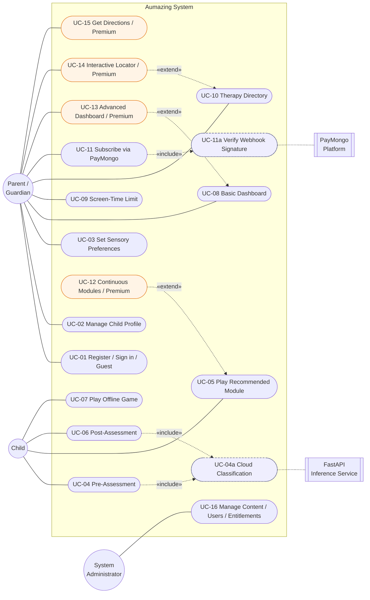
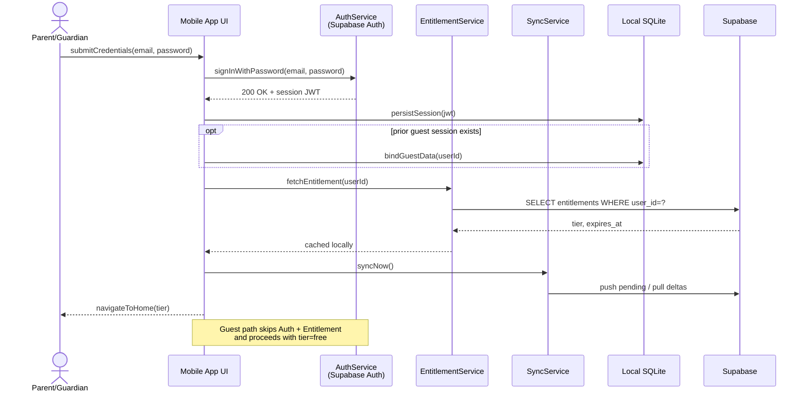
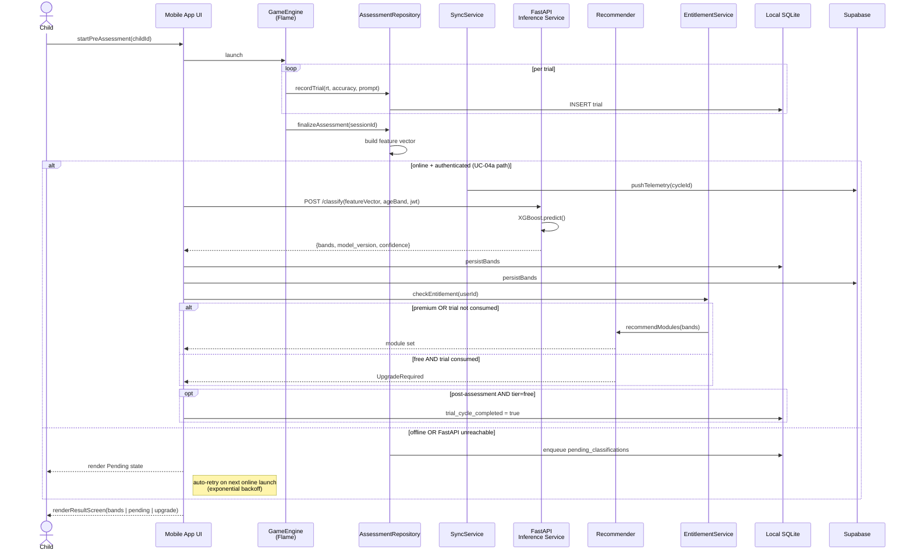
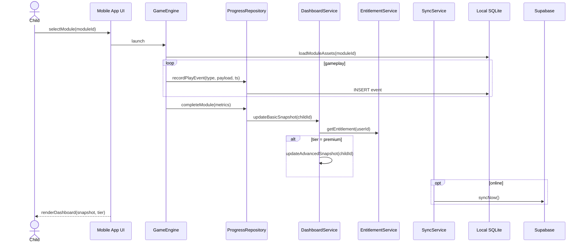
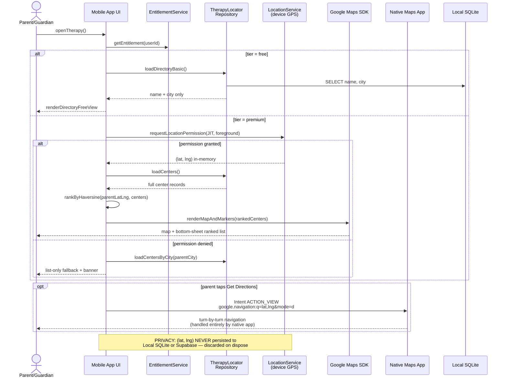
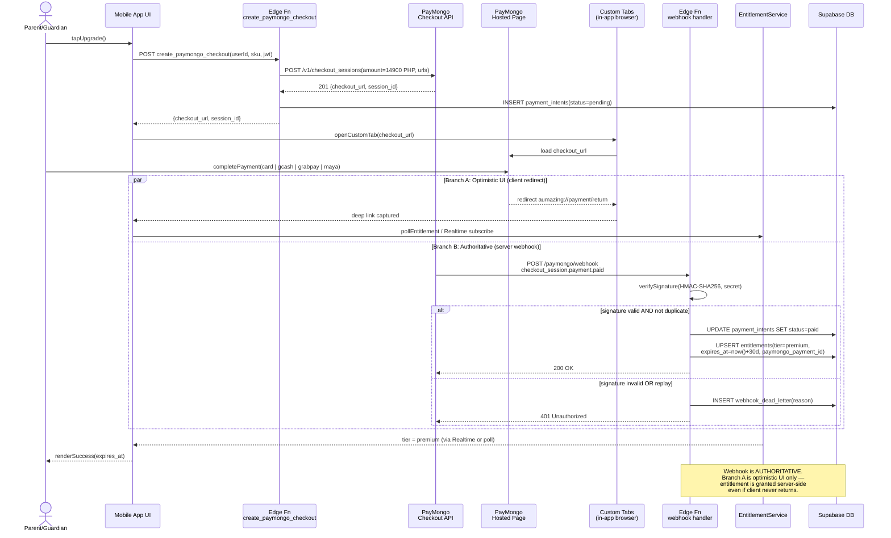
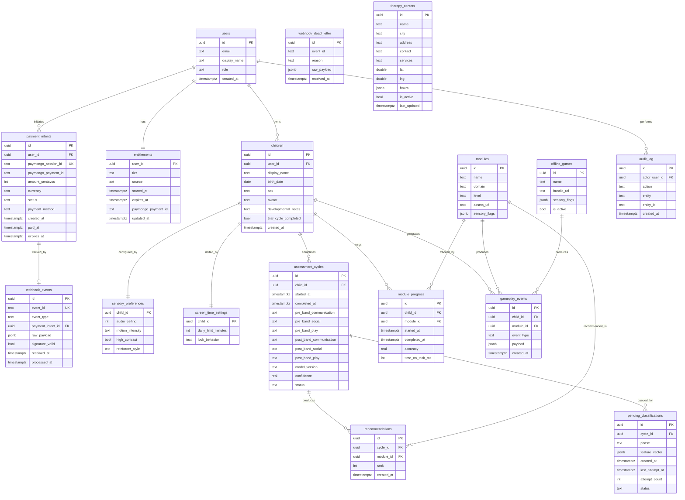

# Manuscript Revision 2 — Chapter 4 (Paste-Ready)

> **How to use this file:** Each section below is labeled
> `### REPLACE 4.x.y — <Section Title>` or `### NEW 4.x.y — <Section Title>`.
> For `REPLACE`, find the matching subsection heading in the **Revision1** tab,
> delete the current body, and paste the block under the heading. For `NEW`,
> insert the block (heading + body) at the indicated location.
> Do not paste the `### REPLACE …` / `### NEW …` line itself.
>
> **Scope lock (v2.1, May 2026):** Specialist portal, Jitsi/video calls,
> booking, in-app messaging, **Google Play Billing**, and **on-device
> ONNX inference** are removed. The Therapy Access flow is replaced by
> the **Freemium Therapy Locator** (Google Maps SDK + Haversine +
> native-map navigation hand-off). Subscriptions are processed via
> **PayMongo** (webhook-verified). Assessment results are generated by a
> **cloud FastAPI/XGBoost service** and therefore require internet at
> finalization. Free = one trial assessment cycle, unlimited offline
> games, Basic Dashboard, view-only Directory.

---

## CHAPTER IV — SYSTEM DESIGN

### REPLACE 4.1 — Use Case Diagram (introductory paragraph)

The use case diagram below presents the interactions between the system
and its **three actors**: the **Parent/Guardian** (with a free/premium
tier distinction), the **Child** (who interacts directly with gameplay
screens during assessments and learning modules under parent
supervision), and the **System Administrator** (who manages content,
therapy-center records, and entitlements through the web portal). The
diagram highlights which use cases are **gated behind a Premium
subscription**, which require **internet connectivity** for completion,
and which remain **fully offline-capable**. Use cases for video
consultation, appointment booking, in-app messaging, and specialist
case review have been removed from the system in this revision and are
not depicted.

The **Child is retained as a UML actor** because the Child directly
interacts with the gameplay UI during assessment trials and learning
modules; the Child's inputs are the primary data source for the
XGBoost feature vector and therefore cross the system boundary, even
though the Parent/Guardian initiates and supervises the session.

**Use cases to render in the diagram (Figure 4.1):**

| # | Use case | Actor | Tier | Connectivity |
|---|---|---|---|---|
| UC-01 | Register / Sign in / Continue as Guest | Parent/Guardian | Free | Online for sign-in; Guest works offline |
| UC-02 | Manage Child Profile | Parent/Guardian | Free | Offline-capable (syncs when online) |
| UC-03 | Set Sensory Preferences | Parent/Guardian | Free | Offline-capable |
| UC-04 | Take Gamified Pre-Assessment | Child | Free (1 cycle) | Gameplay offline; **result requires internet** |
| UC-04a | Sync Telemetry & Request Cloud Classification *(included by UC-04, UC-06)* | *(internal)* | — | Online required |
| UC-05 | Play Recommended Learning Module | Child | Free (trial) / Premium (continuous) | Cached assets; new recommendations require internet |
| UC-06 | Take Gamified Post-Assessment | Child | Free (1 cycle) | Gameplay offline; **result requires internet** |
| UC-07 | Play Offline Game | Child | Free (always) | Fully offline |
| UC-08 | View Basic Dashboard | Parent/Guardian | Free | Offline-capable |
| UC-09 | Configure Screen-Time Limit | Parent/Guardian | Free | Offline-capable |
| UC-10 | View Therapy Directory (name + city) | Parent/Guardian | Free | Cached after first sync |
| UC-11 | **Subscribe to Premium Monthly via PayMongo** | Parent/Guardian | All | **Online required** |
| UC-11a | Verify PayMongo Webhook Signature *(included by UC-11)* | *(internal)* | — | Server-side |
| UC-12 | Receive Continuous Personalized Modules | Parent/Guardian / Child | Premium | Online required |
| UC-13 | View Advanced Dashboard | Parent/Guardian | Premium | Offline-capable (snapshots cached) |
| UC-14 | Use Interactive Therapy Locator (map + GPS Haversine) | Parent/Guardian | Premium | Map tiles online; ranking offline-capable |
| UC-15 | Get Directions (native-map Intent hand-off) | Parent/Guardian | Premium | Hands off to native maps app |
| UC-16 | Manage Modules / Games / Centers / Users / Entitlements | System Administrator | Admin | Online required |

**Relationships to render:**

- `<<extend>>`: UC-12 extends UC-05; UC-13 extends UC-08; UC-14 extends UC-10.
- `<<include>>`: UC-04 and UC-06 both include **UC-04a** (cloud
  classification) — render as a single shared bubble inside the system
  boundary.
- `<<include>>`: UC-11 includes **UC-11a** (webhook signature
  verification) — render as an internal bubble; the **PayMongo
  platform** appears as an external system, not as an actor.

**Boundary guards (annotate on the diagram):**

- Premium gate: `[entitlement.tier='premium' AND now() < expires_at]`
  controls UC-12, UC-13, UC-14, UC-15.
- Trial-consumption gate:
  `[child.trial_cycle_completed=false OR entitlement.tier='premium']`
  controls UC-05's recommendation refresh.
- Privacy guard on UC-14: GPS fix is in-memory only; no persistence
  path to SQLite or Supabase (annotate with a «privacy» stereotype).

**Figure 4.1 — Use Case Diagram**

*Legend:* ellipse ○ = actor; rounded box = use case; dashed arrows =
`<<include>>` / `<<extend>>` relationships; orange = Premium-gated
use cases; dashed-border boxes = internal (included) use cases. The
PayMongo platform and FastAPI inference service are external systems,
not actors.

---

### REPLACE 4.1.1 — Use Case Description

The following narrative descriptions accompany the use cases listed
above. Each entry follows the standard format: **Actor**, **Pre-condition**,
**Main flow**, **Alternative flow**, **Post-condition**. Retain the
prior descriptions for UC-01, UC-02, UC-03, UC-07, UC-08, UC-09, UC-10,
UC-13, and UC-16. Remove any prior descriptions for video consultation,
booking, in-app messaging, or specialist case review.

**UC-04 — Take Gamified Pre-Assessment.**
*Actor:* Child (with Parent/Guardian supervising).
*Pre-condition:* a child profile exists; for free-tier users,
`children.trial_cycle_completed = false`.
*Main flow:* (1) Parent/Guardian launches the pre-assessment for the
selected child. (2) The Flame `GameEngine` presents a sequence of
gamified items targeting communication, social, and play domains.
(3) The Child responds; the engine logs per-trial telemetry (response
time, accuracy, prompt level) to local SQLite via
`AssessmentRepository`. (4) On the final item, the engine calls
`finalizeAssessment(sessionId)`, producing a feature vector persisted
locally. (5) The system invokes **UC-04a** to obtain skill bands from
the cloud. (6) On classification success, the result screen renders
the bands and routes to UC-05.
*Alternative flow A (offline at finalization):* the feature vector is
queued in `pending_classifications`; the result screen displays a
non-blocking *"Result will be ready when you reconnect"* banner. UC-04a
is retried automatically on next online launch.
*Alternative flow B (child quits early):* partial session is saved with
`status='incomplete'`; the cycle remains open and may be resumed.
*Post-condition:* a `pre_assessment` record exists locally; on
successful UC-04a, skill bands are persisted and a recommendation set
is generated.

**UC-04a — Sync Telemetry & Request Cloud Classification** *(included
by UC-04 and UC-06; internal use case behind the system boundary).*
*Actor:* none — render as an included bubble.
*Pre-condition:* feature vector finalized; device online; user
authenticated; valid session JWT.
*Main flow:* (1) `SyncService` pushes pending telemetry rows for the
cycle to Supabase (FIFO). (2) The mobile app calls `POST /classify` on
the **FastAPI inference service**, passing the feature vector and child
age band, authenticated with the Supabase session JWT. (3) The FastAPI
service runs the **XGBoost** classifier and returns
`{ band_communication, band_social, band_play, model_version, confidence }`.
(4) The app persists the bands to local SQLite and to Supabase
`assessment_cycles`. (5) The `Recommender` is invoked with the bands
to produce the cycle's module set (subject to the entitlement gate in
UC-05).
*Alternative flow A (offline / network error):* the request is queued;
retries use exponential backoff.
*Alternative flow B (model service 5xx):* the cycle is **not** consumed;
the app surfaces a *"We couldn't generate the report — please try
again"* message.
*Alternative flow C (low confidence below threshold):* per risk **R-01**,
the system falls back to the rule-based recommender and flags the cycle
`model_version='fallback'`.
*Post-condition:* skill bands are stored locally and remotely; the
cycle advances to module recommendation. Raw GPS data is never part of
this payload — telemetry contains gameplay metrics only.

**UC-05 — Play Recommended Learning Module.**
*Actor:* Child.
*Pre-condition:* a recommendation set exists for the active cycle.
*Main flow:* the Child plays a recommended module; gameplay events are
logged; on completion, `module_progress` is updated and the dashboard
snapshot is recomputed.
*Alternative flow (Free tier, trial consumed):* when
`entitlement.tier='free' AND child.trial_cycle_completed=true`, the
recommender returns an `UpgradeRequired` payload. The screen shows the
**Upgrade to Continue Personalization** card; the offline games library
and previously delivered modules remain playable.
*Post-condition:* module completion recorded; Basic Dashboard updated;
if Premium, Advanced Dashboard also updated.

**UC-06 — Take Gamified Post-Assessment.**
*Actor:* Child (with Parent/Guardian).
*Pre-condition:* a pre-assessment exists for the active cycle and at
least one recommended module is complete.
*Main flow:* mirrors UC-04 (steps 1–5) but writes to `post_assessment`.
On successful UC-04a, the system also sets
`children.trial_cycle_completed = true` for free-tier children, closing
their trial.
*Alternative flow:* identical offline/error handling as UC-04.
*Post-condition:* post-assessment bands stored; for free users, the
trial is marked consumed and the next entry to UC-05 returns
`UpgradeRequired`.

**UC-11 — Subscribe to Premium Monthly (PayMongo).**
*Actor:* Parent/Guardian.
*Pre-condition:* parent is signed in (Guest accounts are upgraded to a
real account first); device online.
*Main flow:* (1) Parent taps **Upgrade** on the Paywall (§4.3.11).
(2) The mobile app calls a **Supabase Edge Function**
`create_paymongo_checkout(user_id, sku='premium_monthly')`. (3) The
Edge Function calls the **PayMongo Checkout Sessions API** server-side
using the PayMongo secret key and returns a `checkout_url` and
`checkout_session_id`; a pending row is written to `payment_intents`.
(4) The mobile app opens the PayMongo-hosted checkout in an Android
Custom Tab. (5) Parent completes payment on the PayMongo page (card,
GCash, GrabPay, or Maya). (6) PayMongo redirects the parent back to
the app via a deep link `aumazing://payment/return?session_id=…`.
(7) Concurrently and authoritatively, PayMongo POSTs a
`checkout_session.payment.paid` event to **UC-11a** (the webhook
endpoint). (8) UC-11a verifies the signature, marks
`payment_intents.status='paid'`, and upserts
`entitlements(user_id, tier='premium', source='paymongo_monthly', started_at, expires_at = now() + 30 days, paymongo_payment_id)`.
(9) The mobile app, on returning from the deep link, polls
`entitlements` (or subscribes to a Supabase Realtime channel) until
`tier='premium'` is observed, then routes to a success screen.
*Alternative flow A (parent cancels on PayMongo):* deep link returns
with no paid event; `payment_intents.status` stays `pending` and is
reaped after 24 h; no entitlement is granted.
*Alternative flow B (deep link missed but webhook arrived):*
entitlement is still granted server-side; the app observes Premium on
next foreground refresh.
*Alternative flow C (webhook arrives but client never returns):*
entitlement is granted regardless; offline parents see Premium unlock
at next launch.
*Post-condition:* `entitlements` row reflects Premium with a 30-day
window; UC-12, UC-13, UC-14, UC-15 are unlocked.

**UC-11a — Verify PayMongo Webhook Signature** *(included by UC-11;
internal).*
*Actor:* none — render as an included bubble inside the system
boundary; the **PayMongo platform** may be shown as an external system,
not as an actor.
*Pre-condition:* a PayMongo webhook event arrives at the Supabase Edge
Function endpoint.
*Main flow:* (1) the endpoint reads the `Paymongo-Signature` header
(timestamped HMAC-SHA256). (2) It recomputes HMAC over the raw request
body using the PayMongo webhook secret (a Supabase secret, never
shipped to the client). (3) It rejects requests where the signature
mismatches or the timestamp is older than 5 minutes (replay protection).
(4) For `checkout_session.payment.paid`, it idempotently updates
`payment_intents` and upserts `entitlements`, deduplicating on
`webhook_events.event_id`. (5) For `payment.failed` or
`payment.refunded`, it leaves entitlements unchanged or schedules a
downgrade respectively. (6) The endpoint always returns `200` after
processing to prevent retry storms; failures are logged to
`webhook_dead_letter`.
*Alternative flow A (signature invalid):* returns `401`; event is
discarded; logged for audit.
*Alternative flow B (duplicate event):* idempotency on `event.id`
prevents double-grant; returns `200` with no change.
*Post-condition:* verified events mutate entitlements atomically;
invalid events are rejected and logged.

**UC-14 — Use Interactive Therapy Locator.**
*Actor:* Parent/Guardian.
*Pre-condition:* active Premium entitlement.
*Main flow:* (1) Parent opens the Locator screen (§4.3.12). (2) The
system requests foreground-only location permission **just-in-time**
with a rationale dialog. (3) On grant, `LocationService` retrieves a
single GPS fix `(lat, lng)`; the fix is held **only in memory**.
(4) `TherapyLocatorRepository` loads cached `therapy_centers` from
local SQLite. (5) The system computes Haversine distances
`d = 2R · asin(√(sin²(Δφ/2) + cos φ₁ · cos φ₂ · sin²(Δλ/2)))` and
sorts ascending. (6) The Google Maps SDK renders a map centered on the
parent's fix with markers for the top-N centers; the bottom sheet lists
them with distance in km.
*Alternative flow A (permission denied):* the screen falls back to a
city-filtered list with a non-blocking banner explaining how to enable
location later.
*Alternative flow B (offline, no map tiles):* the list view renders
from cached centers using the parent's last known city; the map widget
shows a *Map unavailable offline* placeholder.
*Post-condition:* no rows are written. **Critical privacy invariant:**
the parent's `(lat, lng)` is never written to local SQLite, never
transmitted to Supabase, never logged. It is discarded when the screen
is disposed.

**UC-15 — Get Directions (Native-Map Hand-off).**
*Actor:* Parent/Guardian.
*Pre-condition:* Premium entitlement; a center is selected.
*Main flow:* (1) Parent taps **Get Directions**. (2) The app constructs
an Android `Intent.ACTION_VIEW` with URI
`google.navigation:q=<lat>,<lng>&mode=d`. (3) `startActivity()` launches
the device's default maps application. (4) Routing, voice guidance,
and turn-by-turn navigation occur **entirely in the native maps app**.
(5) Parent returns via back-press; the Locator state is preserved.
*Alternative flow (no maps app installed):* the system catches
`ActivityNotFoundException` and falls back to a
`geo:<lat>,<lng>?q=<lat>,<lng>(<center_name>)` URI; if that also fails,
it shows the address as plain text with a **Copy address** button.
*Post-condition:* no state change in Aumazing. Aumazing does not
compute routes, store routes, or render its own navigation UI.

---

### REPLACE 4.2 — Sequence Diagram (introductory paragraph)

This section presents **five** sequence diagrams that describe the
end-to-end interactions for the system's most important flows: (1) user
registration and login with entitlement resolution, (2) gamified
assessment with **cloud-required** result generation, (3) learning
activity and progress tracking with a Premium-only Advanced Dashboard
branch, (4) the **Freemium Therapy Locator** with just-in-time GPS,
Haversine ranking, and native-map hand-off, and (5) **PayMongo
subscription purchase** with webhook-based entitlement granting. The
previous *Therapy Access* sequence (video consultation and booking) and
any Google Play Billing sequence have been removed.

---

### REPLACE 4.2.1 — Sequence Diagram for User Registration and Login

**Lifelines:** Parent · Mobile App UI · AuthService (Supabase Auth) ·
EntitlementService · SyncService · Local SQLite.

**Messages (in order):**

1. `submitCredentials(email, password)` — Parent → Mobile App UI.
2. `signInWithPassword(email, password)` — Mobile App UI → AuthService.
3. `200 OK + session JWT` — AuthService → Mobile App UI.
4. `persistSession(jwt)` — Mobile App UI → Local SQLite (secure storage).
5. `bindGuestData(userId)` — Mobile App UI → Local SQLite *(only if a
   prior guest session exists)*.
6. `fetchEntitlement(userId)` — Mobile App UI → EntitlementService →
   Supabase `entitlements` table; result cached locally.
7. `syncNow()` — Mobile App UI → SyncService → Supabase
   *(pushes pending writes; pull deltas)*.
8. `navigateToHome(tier)` — Mobile App UI returns to the parent with
   the resolved tier (`free` or `premium`).

**Guest path (alt frame):** steps 2, 3, 6, and 7 are skipped; the system
calls `createLocalProfile()` and proceeds with `tier = free`.

Validation self-messages on the Mobile App UI lifeline are reserved for
form validation only.

**Figure 4.2 — Sequence Diagram: User Registration and Login**

---

### REPLACE 4.2.2 — Sequence Diagram for Gamified Assessment and Module Recommendation

**Lifelines:** Child · Mobile App UI · GameEngine (Flame) ·
AssessmentRepository · SyncService · **FastAPI Inference Service
(cloud)** · Recommender · EntitlementService · Local SQLite · Supabase.

**Messages:**

1. `startPreAssessment(childId)` — Child → Mobile App UI → GameEngine.
2. **loop** per trial: `recordTrial(responseTimeMs, accuracy, promptLevel)`
   — GameEngine → AssessmentRepository → Local SQLite.
3. `finalizeAssessment(sessionId)` — GameEngine →
   AssessmentRepository; feature vector produced locally.
4. **alt [online + authenticated]** *(UC-04a path)*:
   - `pushTelemetry(cycleId)` — SyncService → Supabase.
   - `POST /classify(featureVector, ageBand, jwt)` — Mobile App UI →
     **FastAPI Inference Service**.
   - FastAPI runs `XGBoost.predict()` (self-message).
   - `200 { bands, model_version, confidence }` — FastAPI → Mobile App
     UI.
   - `persistBands(cycleId, bands)` — Mobile App UI → Local SQLite +
     Supabase.
   - `checkEntitlement(userId)` — Mobile App UI → EntitlementService.
     - **alt [tier='premium' OR trial not consumed]:**
       `recommendModules(bands, parentFocus)` — Recommender returns the
       module set.
     - **alt [tier='free' AND trial consumed]:** `recommendModules`
       returns `UpgradeRequired`; offline games remain accessible.
   - **opt [post-assessment AND tier='free']:**
     `markTrialConsumed(childId)` — sets
     `children.trial_cycle_completed = true`.
5. **alt [offline OR FastAPI unreachable]:**
   - `enqueuePending(featureVector)` — AssessmentRepository → Local
     SQLite (`pending_classifications`).
   - `renderResultPending()` — Mobile App UI → Child/Parent (*"Result
     will be ready when you reconnect"*).
   - On next online launch, an automatic retry of step 4 occurs.
6. `renderResultScreen(bands | pending | upgrade)` — Mobile App UI →
   Child/Parent.

**Diagram annotation:** place a note over the FastAPI lifeline reading
*"XGBoost classifier — internet required for result generation (NFR-03
carve-out)."*

**Figure 4.3 — Sequence Diagram: Gamified Assessment + Cloud Classification**

---

### REPLACE 4.2.3 — Sequence Diagram for Learning Activity and Progress Tracking

**Lifelines:** Child · Mobile App UI · GameEngine · ProgressRepository ·
DashboardService · Local SQLite · Supabase.

**Messages:**

1. `selectModule(moduleId)` — Child → Mobile App UI → GameEngine.
2. `loadModuleAssets(moduleId)` — GameEngine → Local SQLite (cached
   assets).
3. Loop: `recordPlayEvent(eventType, payload, timestamp)` — GameEngine
   → ProgressRepository → Local SQLite.
4. `completeModule(moduleId, completionMetrics)` — GameEngine →
   ProgressRepository.
5. `updateDashboardSnapshot(childId)` — ProgressRepository →
   DashboardService; recomputes the **Basic Dashboard** snapshot
   (latest cycle summary).
6. **alt [tier = premium]**: `updateAdvancedSnapshot(childId)` — also
   recomputes the **Advanced Dashboard** (trend lines, per-domain
   skill-band history).
7. `syncNow()` — SyncService → Supabase *(if online)*.
8. `renderDashboard(snapshot)` — Mobile App UI → Parent.

**Figure 4.4 — Sequence Diagram: Learning Activity & Progress Tracking**

---

### REPLACE 4.2.4 — Sequence Diagram for Therapy Locator (replaces *Therapy Access*)

> **Heading change:** rename **4.2.4 Sequence Diagram for Therapy
> Access** to **4.2.4 Sequence Diagram for Freemium Therapy Locator**.

This diagram replaces the prior tele-health sequence. It shows how the
parent reaches therapy-center information under the freemium model,
including the entitlement gate, the just-in-time location permission,
the Haversine ranking, and the native-map navigation hand-off.

**Lifelines:** Parent · Mobile App UI · EntitlementService ·
TherapyLocatorRepository · LocationService (device GPS) · Google Maps
SDK · Native Maps App · Local SQLite · Supabase.

**Messages:**

1. `openTherapy()` — Parent → Mobile App UI.
2. `getEntitlement(userId)` — Mobile App UI → EntitlementService.
3. **alt [tier = free]**:
   - `loadDirectoryBasic()` — TherapyLocatorRepository → Local SQLite
     (or Supabase if cache empty); returns *name + city only*.
   - `renderDirectoryFreeView(list)` — Mobile App UI → Parent.
   - `tapUpgrade()` (optional) → routes to `Subscribe to Premium`
     flow (UC-11).
4. **alt [tier = premium]**:
   - `requestLocationPermission(foreground, justInTime)` — Mobile App
     UI → LocationService.
   - **alt [permission granted]**:
     - `getCurrentFix()` — LocationService → Mobile App UI; returns
       `(lat, lng)` *(not persisted)*.
     - `loadCenters()` — TherapyLocatorRepository → Local SQLite /
       Supabase; returns full center records.
     - `rankByHaversine(parentLatLng, centers)` — Mobile App UI;
       sorts ascending by `d = 2R · asin(√(sin²(Δφ/2) + cos φ₁ · cos
       φ₂ · sin²(Δλ/2)))`.
     - `renderMapAndList(rankedCenters)` — Mobile App UI → Google
       Maps SDK (markers) + list view.
   - **alt [permission denied]**:
     - `loadCentersByCity(parentCity)` — TherapyLocatorRepository.
     - `renderListOnly(centers)` — non-blocking banner explains the
       fallback.
5. **opt [parent taps Get Directions on a center]**:
   - `startActivity(Intent.ACTION_VIEW, "google.navigation:q=lat,lng&mode=d")`
     — Mobile App UI → Native Maps App.
   - Routing and turn-by-turn occur entirely in the Native Maps App;
     control returns to Aumazing on back-press.

**Privacy note rendered on the diagram:** the Parent's `(lat, lng)`
fix is held only in memory for the duration of the screen and is **not**
written to Local SQLite or Supabase. Draw a dashed «destroy» mark on
the LocationService lifeline at screen-dispose to make this visible.

**Figure 4.5 — Sequence Diagram: Freemium Therapy Locator**

---

### NEW 4.2.5 — Sequence Diagram for PayMongo Subscription Purchase

This diagram captures the tri-party interaction between the mobile
client, the Supabase Edge Functions (checkout-creation and
webhook-handler), and the PayMongo platform. It replaces any prior
Google Play Billing sequence.

**Lifelines:** Parent/Guardian · Mobile App UI · Supabase Edge Function
`create_paymongo_checkout` · **PayMongo Checkout API** · PayMongo Hosted
Page · Custom Tabs (in-app browser) · **Webhook Endpoint (Supabase Edge
Function)** · EntitlementService · Supabase DB.

**Messages:**

1. `tapUpgrade()` — Parent → Mobile App UI (from Paywall §4.3.11).
2. `POST /create_paymongo_checkout(user_id, sku='premium_monthly', jwt)`
   — Mobile App UI → Edge Function `create_paymongo_checkout`.
3. `POST /v1/checkout_sessions(amount=14900, currency='PHP', line_items, success_url, cancel_url)`
   — Edge Function → **PayMongo Checkout API** (server-side, secret
   key).
4. `201 { checkout_url, session_id }` — PayMongo → Edge Function.
5. `INSERT payment_intents(user_id, session_id, status='pending')` —
   Edge Function → Supabase DB.
6. `200 { checkout_url, session_id }` — Edge Function → Mobile App UI.
7. `openCustomTab(checkout_url)` — Mobile App UI → Custom Tabs.
8. `completePayment(card | gcash | grabpay | maya)` — Parent → PayMongo
   Hosted Page.
9. **par** *(two parallel branches that converge):*
   - **Branch A — Client redirect (optimistic UI):**
     - `redirect(aumazing://payment/return?session_id=…)` — PayMongo
       Hosted Page → Custom Tabs → Mobile App UI.
     - `pollEntitlement(userId)` (or subscribe to Realtime) — Mobile
       App UI → EntitlementService (loop with backoff).
   - **Branch B — Server webhook (authoritative):**
     - `POST /paymongo/webhook { event: checkout_session.payment.paid, … }`
       — PayMongo → Webhook Endpoint.
     - `verifySignature(headers, rawBody, webhook_secret)` — Webhook
       Endpoint (self-message).
     - **alt [signature valid AND not duplicate]:**
       - `UPDATE payment_intents SET status='paid'` — Webhook Endpoint
         → Supabase DB.
       - `UPSERT entitlements(user_id, tier='premium', source='paymongo_monthly', expires_at=now()+30d, paymongo_payment_id)`
         — Webhook Endpoint → Supabase DB.
       - `200 OK` — Webhook Endpoint → PayMongo.
     - **alt [signature invalid OR replay]:**
       - `INSERT webhook_dead_letter(event_id, reason)` — Webhook
         Endpoint → Supabase DB.
       - `401 Unauthorized` — Webhook Endpoint → PayMongo.
10. `entitlementUpdated(tier='premium')` — EntitlementService → Mobile
    App UI (via Realtime or poll result).
11. `renderSuccess(expires_at)` — Mobile App UI → Parent.

**alt [Parent cancels on PayMongo page]:** Branch B never fires
`payment.paid`; `payment_intents` row is reaped by a scheduled job
after 24 h. Branch A returns with no observable entitlement change.

**Annotations:** mark Branch B as **«authoritative»** and Branch A as
**«optimistic UI»**. The webhook secret is annotated as *"never shipped
to client; stored as Supabase secret."*

**Figure 4.6 — Sequence Diagram: PayMongo Subscription Purchase**

---

### REPLACE 4.3 — Prototype (introductory paragraph)

The prototype is organized into two platforms: the **Mobile Application
Prototype** (Parent and Child) and the **Web Platform Prototype**
(Administrator only — the prior Specialist portal has been removed).
Each screen is designed around three ASD-aligned principles drawn from
TEACCH and ABA literature: (1) *predictability* through consistent
layout and transitions, (2) *low sensory load* through soft palettes and
minimal motion, and (3) *large, forgiving touch targets* (≥ 64 dp) with
icons paired with short text. Screens that gate Premium features
explicitly show their entitlement state to keep the freemium model
transparent. Screens that depend on internet connectivity (assessment
result generation, PayMongo checkout, map tile loading) display
non-blocking status banners when offline so the parent always
understands why a feature is or is not available.

---

### REPLACE 4.3.1 — Splash Screen and Welcome Interface

On launch, the splash screen displays the Aumazing logo against a soft,
desaturated background and fades to the welcome screen over 1.5 seconds.
No user action is required, which establishes a predictable entry ritual
so the child is not startled. The welcome screen presents three large
options — **Sign In**, **Create Account**, **Continue as Guest** —
together with a one-line privacy reassurance ("no personal data leaves
your device until you sign up"). This screen anchors the offline-first
flow: guest data is cached locally and later bound to the account if
the parent chooses to register.

---

### REPLACE 4.3.2 — Login and Registration Screen

The login screen supports email/password sign-in and Google sign-in,
each with large fields, inline validation, and plain-language error
messages. Registration uses the same visual language and asks only for
the parent's email, password, and display name. After authentication,
the system fetches the parent's entitlement record, performs a guest
data bind if applicable, and routes the parent to the home screen with
the correct tier resolved. There is no specialist or therapist
registration path in this revision.

---

### REPLACE 4.3.3 — Child Profile Management Screen

The parent enters display name, birth date, sex, avatar, and **optional**
developmental notes. The avatar grid uses high-contrast,
non-photorealistic characters to support recognition without triggering
face-processing difficulties common in ASD. Developmental notes are
labeled clearly as *parent-reported context, not a clinical diagnosis*.
This profile seeds the AI recommender with the child's age band and
baseline context. Multiple children are supported per parent account.

---

### REPLACE 4.3.4 — Sensory Preferences Screen

The parent configures sensory preferences for each child: audio volume
ceiling, motion intensity (Reduced / Standard), high-contrast mode, and
preferred reinforcer style (visual stars / soft chime). Defaults err on
the conservative side (low motion, low audio). These preferences are
read by the GameEngine on every session and override module-level
defaults so the child experiences a consistent sensory profile across
all activities.

---

### REPLACE 4.3.5 — Gamified Pre-Assessment Screen

The pre-assessment is presented as a sequence of short, gamified items
that look and feel like play rather than a test. Items target three
domains — communication, social, and play — and adapt difficulty within
session. The screen shows minimal chrome: a progress bar, a calm
background, and the current item. Per-trial response time, accuracy,
and prompt level are silently logged into local SQLite, then aggregated
into a feature vector. **On completion, the system uploads the feature
vector to the cloud FastAPI/XGBoost service and renders the result
screen with the child's skill bands per domain.** If the device is
offline at finalization, the result screen shows a non-blocking *"Result
will be ready when you reconnect"* banner and the bands appear
automatically once the device next syncs successfully. The child sees
a celebratory but low-intensity reward regardless of whether the report
is ready.

---

### REPLACE 4.3.6 — Learning Module Screen

The learning module screen lists the recommended modules for the active
cycle, each shown as a large card with an illustration, a one-word
focus label (e.g., *Match*, *Sort*, *Greet*), and an estimated duration.
**Free users** see modules from their single trial cycle; once the
post-assessment for that cycle has been completed, the screen shows an
**Upgrade to Continue Personalization** card in the recommended slot,
while the offline games library remains fully accessible from the same
screen. **Premium users** receive a fresh recommendation set after every
completed assessment cycle, with no upgrade prompt.

---

### REPLACE 4.3.7 — Pre-Assessment Gameplay Activity Screen

*(Heading typo "Pre-Asessment" should be corrected to
"Pre-Assessment".)*

This screen renders an individual gameplay activity within the
assessment. Controls are large, centered, and fixed in position across
items to maintain predictability. Audio cues are short and respect the
sensory preferences. Errors are not penalized visually; the child simply
receives a gentle re-prompt. All telemetry (response time, prompts
needed, error type) is captured by the GameEngine and persisted via the
AssessmentRepository.

---

### REPLACE 4.3.8 — Parent Dashboard Screen

The Parent Dashboard has **two modes** that map directly to the
freemium tiers:

- **Basic Dashboard (Free).** Shows the latest cycle summary: overall
  skill band, modules completed, total time on task, and screen-time
  usage for the day. A single sparkline summarizes the most recent
  seven sessions.
- **Advanced Dashboard (Premium).** Adds per-domain trend lines
  (communication, social, play) across all completed cycles, a
  skill-band history timeline, and a *Strengths and Gaps* panel that
  highlights modules with rising or stalling performance. A subtle
  **Premium** badge is shown at the top to make the entitlement state
  legible.

For Free users, a single inline upsell card invites them to "See your
child's progress over time" — tapping it routes to the paywall (see
4.3.10).

---

### REPLACE 4.3.9 — Screen-Time Management Screen

The parent sets a daily limit per child (e.g., 30 minutes) and chooses
whether locked time triggers a calming "rest" screen or a hard exit.
When the limit is reached during a session, the GameEngine completes
the current trial, plays a soft transition, and locks further play
until the next day. This feature is always free because it directly
supports child wellbeing.

---

### NEW 4.3.10 — Therapy Directory Screen (Free)

*Insert after 4.3.9.*

The free Therapy Directory presents an alphabetized list of therapy
centers, each row showing only the **center name** and the **city** in
which it operates. Tapping a row reveals a single bottom-sheet card
with the same two fields and a clearly labeled **Unlock Full Locator**
button. No address, contact number, services list, or map is shown at
this tier. The screen's role is twofold: it satisfies parents who only
need to know that providers exist nearby, and it serves as the most
contextually relevant entry point to the paywall.

---

### NEW 4.3.11 — Premium Paywall Screen *(PayMongo)*

*Insert after 4.3.10.*

The paywall presents a single SKU — **Premium Monthly (₱149/month)** —
with a concise three-bullet value summary: continuous personalized
modules, the Interactive Therapy Locator, and the Advanced Dashboard.
A *What's still free* footer reassures the parent that offline games,
screen-time controls, the Basic Dashboard, and the trial assessment
cycle remain free. Tapping **Upgrade** invokes a Supabase Edge Function
that creates a **PayMongo Checkout Session** and returns a hosted
checkout URL; the URL opens in an Android Custom Tab so the parent
never types card details inside Aumazing. PayMongo's hosted page
supports **card, GCash, GrabPay, and Maya**. After payment, PayMongo
redirects to the deep link `aumazing://payment/return` while
concurrently posting an authoritative `checkout_session.payment.paid`
webhook to the system; the app subscribes to a Supabase Realtime
channel on the `entitlements` row and shows a success state as soon as
`tier='premium'` is observed. If the parent closes the tab without
paying, the screen returns to its idle state with no entitlement
change. **Restore Subscription** is available for parents who reinstall
— it triggers a server-side lookup against `paymongo_payment_id` rather
than a Play Store restore.

---

### NEW 4.3.12 — Interactive Therapy Locator Screen (Premium)

*Insert after 4.3.11.*

The Interactive Therapy Locator presents an in-app Google Map (Google
Maps SDK for Android) centered on the parent's current GPS fix, with
markers for each therapy center sorted by ascending Haversine distance.
A bottom sheet shows the same centers as a scrollable ranked list with
distance in kilometers. The location permission is requested
**just-in-time** the first time this screen is opened, with a clear
rationale dialog; if denied, the screen falls back to a city-filtered
list and shows a non-blocking banner explaining how to enable it later.
The parent's coordinates are **not persisted** to local storage or
Supabase.

---

### NEW 4.3.13 — Therapy Center Detail Screen (Premium)

*Insert after 4.3.12.*

Tapping a center marker or list row opens the center detail screen,
showing the center's full address, contact numbers, services offered,
operating hours, and a small embedded map preview. The primary action
is **Get Directions**, which launches the device's default maps
application via an Android Intent (`google.navigation:q=lat,lng&mode=d`)
for turn-by-turn navigation. Aumazing does not render its own routing.

---

### NEW 4.3.14 — Subscription Management Screen *(PayMongo)*

*Insert after 4.3.13.*

The subscription management screen surfaces the parent's current tier,
`started_at`, `expires_at`, and a masked payment-method label returned
by PayMongo (e.g., *"Card ending 4242"* or *"GCash"*). Because this
revision uses **renewal-per-checkout** (one PayMongo Checkout Session
per month, parent-initiated, surfaced 3 days before expiry) rather than
stored-credential auto-renewal, the screen shows a clear **Renew Now**
CTA that re-opens the same checkout flow as §4.3.11 with prefilled
details. **Cancel Subscription** simply means *"do not renew"* — the
entitlement remains valid until `expires_at`, then downgrades to Free at
the next launch's webhook reconciliation. A **Payment History** list
shows past `payment_intents` rows (date, amount, status). All Google
Play Store deep links are removed; this screen is wholly
Aumazing-controlled.

---

### NEW 4.3.15 — Web Platform Prototype: Administrator Portal

*Insert after 4.3.14. The prior Specialist Portal screens (case review,
consultation queue, video room) are removed and not reproduced.*

The Administrator Portal is the **only** web surface in this revision.
It comprises:

1. **Admin Sign-In.** Email/password with role check; non-admins are
   rejected.
2. **Module and Game Manager.** CRUD for assessment items, learning
   modules, and offline games, including sensory metadata fields.
3. **Therapy Center Manager.** CRUD for `therapy_centers` records:
   `name`, `city`, `address`, `contact`, `services`, `lat`, `lng`,
   `hours`, `is_active`, `last_updated`. Coordinates are validated and
   pinned on a small map widget.
4. **User & Entitlement Manager.** Lists parent accounts with their
   entitlement tier and `expires_at`; supports manual entitlement
   grants for validator testing (with a mandatory reason field that
   writes to `audit_log`).
5. **Payment Audit** *(NEW for PayMongo).* Lists `payment_intents` and
   `webhook_events` rows with status, masked payment method, and any
   `webhook_dead_letter` entries requiring administrator attention.
   Includes an idempotent **Replay Webhook** button for failed events.
6. **AI Service Health** *(NEW for cloud AI).* Surfaces the FastAPI
   inference service's latency, error rate, and `model_version`
   distribution across recent classifications, plus a count of
   `pending_classifications` queued on offline devices.
7. **Reports.** Aggregate KPIs (active users, trial-to-premium
   conversion rate, module completion rate, locator opens, PayMongo
   conversion funnel). No individual child data is exposed.

---

### NEW 4.3.16 — Assessment Result / Pending Screen

*Insert after 4.3.15.*

The Assessment Result screen displays the child's three skill bands
(communication, social, play) returned by the cloud XGBoost service,
alongside a recommended-modules preview drawn from the recommender
output. **When the device is offline at finalization,** the same screen
renders in a *Pending* state: each band slot shows a soft skeleton
placeholder, a single banner reads *"Your child's report is being
prepared and will appear here once you're back online — no need to
retake the assessment,"* and the **Modules** section is replaced with
a *Continue with Offline Games* card. As soon as the cloud
classification completes (UC-04a retry), the screen reactively swaps
the placeholders for the real bands without requiring re-navigation.
This screen is the visible justification for the system's
*"assessment generation requires internet"* design choice and should
be highlighted in the manuscript's screen-flow figure.

---

### REPLACE 4.4 — Entity Relationship Diagram (introductory paragraph + table)

The ERD reflects the v2.1 scope. **Removed entirely:** `consultations`,
`appointments`, `specialists`, `messages`, `video_sessions`. **Removed
from the v2 draft:** any `play_purchase_token` column on `entitlements`
(Google Play Billing is no longer in scope). **Added:** `payment_intents`,
`webhook_events`, `webhook_dead_letter` to support the PayMongo flow,
and `pending_classifications` to support the offline-tolerant cloud-AI
assessment flow. The schema now centers on parents, children,
assessment cycles, modules, gameplay events, therapy centers,
subscription entitlements, and PayMongo payment records.

**Entities to render in Figure 4.4 (cumulative table — bold rows are
new or changed):**

| Entity | Key attributes | Relationships |
|---|---|---|
| `users` | `id (PK)`, `email`, `display_name`, `role` (`parent` / `admin`), `created_at` | 1—N → `children`; 1—1 → `entitlements` |
| **`entitlements`** *(revised)* | `user_id (PK, FK)`, `tier` (`free` / `premium`), `source` (`trial` / `paymongo_monthly`), `started_at`, `expires_at`, **`paymongo_payment_id`** *(replaces `play_purchase_token`)*, `updated_at` | 1—1 ← `users`; 1—N ← `payment_intents` |
| **`payment_intents`** *(NEW)* | `id (PK)`, `user_id (FK)`, `paymongo_session_id` *(unique)*, `paymongo_payment_id` *(nullable until paid)*, `amount_centavos`, `currency`, `status` (`pending` / `paid` / `failed` / `expired`), `payment_method` *(masked)*, `created_at`, `paid_at`, `expires_at` | N—1 → `users`; 1—1 → `webhook_events` |
| **`webhook_events`** *(NEW)* | `id (PK)`, `event_id` *(unique idempotency key)*, `event_type`, `payment_intent_id (FK, nullable)`, `raw_payload (jsonb)`, `signature_valid (bool)`, `received_at`, `processed_at` | N—1 → `payment_intents` |
| **`webhook_dead_letter`** *(NEW)* | `id (PK)`, `event_id`, `reason`, `raw_payload (jsonb)`, `received_at` | (admin observability) |
| `children` | `id (PK)`, `user_id (FK)`, `display_name`, `birth_date`, `sex`, `avatar`, `developmental_notes`, **`trial_cycle_completed (bool)`**, `created_at` | N—1 → `users`; 1—N → `assessment_cycles`, `module_progress`, `gameplay_events` |
| `sensory_preferences` | `child_id (PK, FK)`, `audio_ceiling`, `motion_intensity`, `high_contrast`, `reinforcer_style` | 1—1 ← `children` |
| **`assessment_cycles`** *(revised)* | `id (PK)`, `child_id (FK)`, `started_at`, `completed_at`, `pre_band_*`, `post_band_*`, **`model_version`**, **`confidence`**, `status` | N—1 → `children`; 1—N → `recommendations`; 1—N ← `pending_classifications` |
| **`pending_classifications`** *(NEW)* | `id (PK)`, `cycle_id (FK)`, `phase` (`pre` / `post`), `feature_vector (jsonb)`, `created_at`, `last_attempt_at`, `attempt_count`, `status` (`queued` / `submitted` / `failed`) | N—1 → `assessment_cycles` |
| `modules` | `id (PK)`, `name`, `domain`, `level`, `assets_uri`, `sensory_flags` | 1—N → `module_progress`, `recommendations` |
| `recommendations` | `id (PK)`, `cycle_id (FK)`, `module_id (FK)`, `rank`, `created_at` | N—1 → `assessment_cycles`, `modules` |
| `module_progress` | `id (PK)`, `child_id (FK)`, `module_id (FK)`, `started_at`, `completed_at`, `accuracy`, `time_on_task_ms` | N—1 → `children`, `modules` |
| `gameplay_events` | `id (PK)`, `child_id (FK)`, `module_id (FK, nullable)`, `event_type`, `payload (jsonb)`, `created_at` | N—1 → `children`, `modules` |
| `offline_games` | `id (PK)`, `name`, `bundle_uri`, `sensory_flags`, `is_active` | 1—N → `gameplay_events` |
| `therapy_centers` | `id (PK)`, `name`, `city`, `address`, `contact`, `services`, `lat`, `lng`, `hours`, `is_active`, `last_updated` | (referenced by Locator, no FK) |
| `screen_time_settings` | `child_id (PK, FK)`, `daily_limit_minutes`, `lock_behavior` | 1—1 ← `children` |
| `audit_log` | `id (PK)`, `actor_user_id (FK)`, `action`, `entity`, `entity_id`, `created_at` | (admin observability) |

> **Removed entities (do not depict):** `consultations`, `appointments`,
> `specialists`, `messages`, `video_sessions`.
> **Removed columns:** `entitlements.play_purchase_token`.

**Diagram-rendering notes:**

- Mark `payment_intents`, `webhook_events`, and `webhook_dead_letter`
  as a logical cluster labeled **"PayMongo Subsystem"**.
- Mark `pending_classifications` with a stereotype «offline-queue» and
  annotate *"drained by the FastAPI inference service when connectivity
  returns."*
- **Privacy invariant on the diagram:** add a footnote — *"No entity
  stores parent or child geolocation. The `lat`/`lng` columns on
  `therapy_centers` are administrator-curated facility coordinates
  only."*
- RLS markers (◆) on every table containing `user_id` / `child_id` to
  make the security posture visible.

**Figure 4.7 — Entity Relationship Diagram**

*Notes:* `therapy_centers` has no FK relationships — it is referenced
by the Locator in-app via cached coordinates only. The PayMongo
Subsystem cluster (`payment_intents`, `webhook_events`,
`webhook_dead_letter`) is shown alongside `entitlements`.
`pending_classifications` is the offline-queue drained by the FastAPI
inference service. **No entity stores parent or child geolocation.**

---

### REPLACE 4.5 — Data Dictionary (only the changed/new tables; keep prior entries for unchanged tables)

**`entitlements`** *(revised — drop `play_purchase_token`, add `paymongo_payment_id`)*

| Column | Type | Notes |
|---|---|---|
| `user_id` | `uuid` | PK, FK → `users.id` |
| `tier` | `text` | `free` (default) or `premium` |
| `source` | `text` | `trial` or `paymongo_monthly` |
| `started_at` | `timestamptz` | |
| `expires_at` | `timestamptz` | NULL for free; honored offline |
| `paymongo_payment_id` | `text` | last successful PayMongo payment reference |
| `updated_at` | `timestamptz` | sync metadata |

**`payment_intents`** *(NEW)*

| Column | Type | Notes |
|---|---|---|
| `id` | `uuid` | PK |
| `user_id` | `uuid` | FK → `users.id` |
| `paymongo_session_id` | `text` | unique; from PayMongo Checkout API |
| `paymongo_payment_id` | `text` | nullable until paid |
| `amount_centavos` | `integer` | e.g., 14900 for ₱149.00 |
| `currency` | `text` | `PHP` |
| `status` | `text` | `pending` / `paid` / `failed` / `expired` |
| `payment_method` | `text` | masked label (e.g., `card_4242`, `gcash`) |
| `created_at` | `timestamptz` | |
| `paid_at` | `timestamptz` | nullable |
| `expires_at` | `timestamptz` | session-level expiry from PayMongo |

**`webhook_events`** *(NEW)*

| Column | Type | Notes |
|---|---|---|
| `id` | `uuid` | PK |
| `event_id` | `text` | unique; PayMongo event ID — idempotency key |
| `event_type` | `text` | e.g., `checkout_session.payment.paid` |
| `payment_intent_id` | `uuid` | FK → `payment_intents.id`, nullable |
| `raw_payload` | `jsonb` | verbatim webhook body (minus secrets) |
| `signature_valid` | `boolean` | result of HMAC verification |
| `received_at` | `timestamptz` | |
| `processed_at` | `timestamptz` | |

**`webhook_dead_letter`** *(NEW)*

| Column | Type | Notes |
|---|---|---|
| `id` | `uuid` | PK |
| `event_id` | `text` | |
| `reason` | `text` | `signature_invalid` / `replay` / `unknown_session` / … |
| `raw_payload` | `jsonb` | |
| `received_at` | `timestamptz` | |

**`assessment_cycles`** *(revised — add `model_version`, `confidence`)*

| Column | Type | Notes |
|---|---|---|
| `model_version` | `text` | XGBoost model version returned by FastAPI; or `fallback` |
| `confidence` | `real` | classifier confidence; below threshold triggers rule-based fallback |
| *(other columns unchanged)* | | |

**`pending_classifications`** *(NEW)*

| Column | Type | Notes |
|---|---|---|
| `id` | `uuid` | PK |
| `cycle_id` | `uuid` | FK → `assessment_cycles.id` |
| `phase` | `text` | `pre` or `post` |
| `feature_vector` | `jsonb` | computed locally; never overwritten |
| `created_at` | `timestamptz` | |
| `last_attempt_at` | `timestamptz` | |
| `attempt_count` | `integer` | bounded; backoff schedule applies |
| `status` | `text` | `queued` / `submitted` / `failed` |

**`therapy_centers`** *(revised)*

| Column | Type | Notes |
|---|---|---|
| `id` | `uuid` | PK |
| `name` | `text` | required, indexed |
| `city` | `text` | required (visible at Free tier) |
| `address` | `text` | Premium-visible |
| `contact` | `text` | Premium-visible |
| `services` | `text[]` | Premium-visible |
| `lat` | `double precision` | Premium-only computation |
| `lng` | `double precision` | Premium-only computation |
| `hours` | `jsonb` | weekday → open/close |
| `is_active` | `boolean` | soft delete |
| `last_updated` | `timestamptz` | shown to parent for trust |

**`children`** *(revised)*

| Column | Type | Notes |
|---|---|---|
| `trial_cycle_completed` | `boolean` | gates the Free recommender after trial post-assessment |
| *(other columns unchanged)* | | |

> **Removed dictionary entries:** `consultations`, `appointments`,
> `specialists`, `messages`, `video_sessions`. **Removed column:**
> `entitlements.play_purchase_token`.

---

### REPLACE 4.6 — Offline-First Sync Architecture

Aumazing follows a strict **local-first** pattern: every parent- or
child-driven write goes to local SQLite first and is synchronized to
Supabase only when the device is online and the user is authenticated.
Two flows are deliberate exceptions to local-first because they require
server authority: **assessment result generation** (cloud XGBoost) and
**PayMongo entitlement granting** (server-verified webhooks).

**Pattern (unchanged from v2):**

1. Every repository writes to SQLite with a `pending = true` flag and
   an `updated_at` timestamp.
2. The `SyncService` watches connectivity and authentication; on
   transition to *online + authenticated*, it pushes pending rows in
   FIFO order, then pulls deltas using `updated_at` watermarks.
3. Conflicts are resolved with **last-write-wins** per row using
   `updated_at`.
4. Guest data (created before sign-up) is migrated by a one-shot
   `bindGuestData(userId)` routine on the first authenticated launch.

**Tier-aware and online-required rules (revised for v2.1):**

- **Entitlement freshness via PayMongo** *(replaces Play Billing
  freshness).* On every cold start that reaches the network,
  `EntitlementService` (a) resolves the latest authoritative
  `entitlements` row from Supabase (kept current by the PayMongo
  webhook handler), and (b) reconciles it against any unprocessed rows
  in `webhook_events` to surface late-arriving paid events. While
  offline, the client honors the cached `expires_at` and treats the
  local row as the source of truth.
- **Cloud-required assessment classification.** The XGBoost classifier
  runs **only** in the FastAPI inference service. The
  `pending_classifications` queue makes the gameplay UX offline-tolerant
  even though result generation is not: feature vectors are persisted
  locally at finalization, and `SyncService` retries `POST /classify`
  with exponential backoff (initial 30 s, doubled per failure, capped
  at 6 h, max 12 attempts before surfacing an admin alert). Successful
  classifications write `assessment_cycles.{post|pre}_band_*`,
  `model_version`, and `confidence`, then mark the queue row
  `status='submitted'`.
- **Locator data caching.** `therapy_centers` is pulled in full to
  local SQLite on first authenticated sign-in and refreshed
  opportunistically. This lets the Locator render rankings without an
  active network connection (only Google Maps **tile rendering**
  requires network — list view continues to work offline).
- **Location coordinates are never written to local or remote storage
  (NFR-04).** The parent's `(lat, lng)` lives only in memory for the
  duration of the Locator screen and is discarded on screen-dispose.
  No table in the schema has columns for parent or child coordinates;
  this is enforced by absence-of-column rather than by RLS, which is a
  stronger guarantee.
- **Receipt re-verification on lapse.** When `now() > expires_at`, the
  next online sync triggers `EntitlementService.reconcile()`: if no
  matching `payment_intents.status='paid'` row exists for a fresh
  30-day window, the cached `tier` is downgraded to `free` and the UI
  re-renders accordingly. Local data (children, sessions, modules,
  dashboards) is preserved across downgrades; only premium-gated views
  become inaccessible.
- **Webhook idempotency.** PayMongo webhooks are deduplicated by
  `webhook_events.event_id` (unique constraint). A retried delivery
  for an already-processed event returns `200` without mutating
  `entitlements`, ensuring renewal events cannot accidentally
  double-extend `expires_at`.

**Failure-mode summary:**

| Failure | User-visible result | Recovery |
|---|---|---|
| Offline at assessment finalization | Result screen shows *Pending* state; gameplay preserved | Auto-retry on reconnect; UC-04a queue |
| FastAPI 5xx | *Pending* state with backoff | Auto-retry; admin sees error in §4.3.15 AI Service Health |
| Classifier confidence < threshold | Result renders with `model_version='fallback'` flag | Adviser-reviewed; rule-based recommender fills in |
| PayMongo webhook never arrives | App keeps polling `entitlements`; no Premium granted | Parent re-attempts purchase; admin can replay from §4.3.15 Payment Audit |
| Webhook signature invalid | `webhook_dead_letter` row written; no entitlement change | Admin investigation only |
| GPS denied on Locator | City-filtered list with non-blocking banner | Re-prompt on next screen open |
| Subscription `expires_at` reached offline | Premium views remain visible until next online launch | Reconciled on reconnect; graceful downgrade |

---

## Summary of Chapter 4 changes

- **Scope lock v2.1:** PayMongo replaces Google Play Billing; cloud
  FastAPI/XGBoost replaces on-device ONNX; three actors retained
  (Parent/Guardian, Child, System Administrator).
- **Use cases:** removed video / booking / specialist; added UC-11
  Subscribe via PayMongo, UC-11a Webhook Verification, UC-04a Cloud
  Classification, UC-12 Continuous Personalization, UC-13 Advanced
  Dashboard, UC-14 Locator, UC-15 Get Directions. Connectivity column
  added to the use-case table.
- **Sequence diagrams:** five total. Replaced *Therapy Access* with
  *Freemium Therapy Locator*; rewrote *Assessment* around the cloud
  FastAPI call with offline-queue branch; added §4.2.5 *PayMongo
  Subscription Purchase* with parallel client-redirect / authoritative
  webhook branches.
- **Prototype:** retained 11 screens; revised §§4.3.5 (cloud-result
  hint), 4.3.11 (PayMongo paywall), 4.3.14 (PayMongo subscription
  management), 4.3.15 (admin portal extended with Payment Audit and AI
  Service Health); added §4.3.16 *Assessment Result / Pending* screen.
- **ERD / Data Dictionary:** dropped `consultations`, `appointments`,
  `specialists`, `messages`, `video_sessions`, and
  `entitlements.play_purchase_token`. Added `payment_intents`,
  `webhook_events`, `webhook_dead_letter`, `pending_classifications`;
  added `model_version` and `confidence` to `assessment_cycles`;
  retained `trial_cycle_completed` on `children`.
- **Sync architecture:** PayMongo entitlement freshness; cloud-required
  classification with `pending_classifications` queue and exponential
  backoff; webhook idempotency; explicit no-persist rule for GPS
  coordinates; failure-mode table.
- **Open follow-ups:** Chapter 3 still references Play Billing and
  ONNX (FR-09, FR-16, §3.3.1, §3.6, §3.9) and must be re-aligned in a
  follow-up pass. PayMongo subscription model is **renewal-per-checkout**;
  switch to auto-renewing requires a 6th sequence diagram and §4.3.14
  rewrite.
