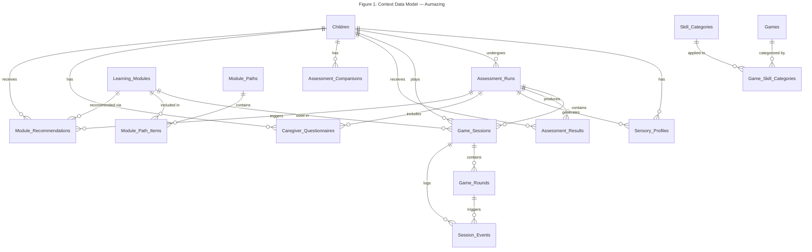

# Figure 1: Context Data Model — Aumazing

## Overview

This Entity Relationship Diagram shows the **context-level data model** for the Aumazing educational app for children with autism. It displays only entity names and their relationships with cardinality — no attributes are shown. This view is useful for understanding the high-level structure and how the 16 Supabase (remote) entities relate to each other.

> **Note:** Only Supabase (remote/canonical) tables are represented. SQLite local tables are offline mirrors and are not included as separate entities.

---

---

## Legend & Conventions

| Symbol | Meaning |
|--------|---------|
| `\|\|` | Exactly one (mandatory) |
| `o{` | Zero or many (optional) |
| `\|\|--o{` | One-to-many relationship |
| Entity box | A Supabase remote table |

### Key Observations

- **Children** is the central entity, connected to most other entities either directly or through **Assessment_Runs**.
- **Assessment_Runs** acts as a hub for assessment-related data: it links to **Game_Sessions**, **Assessment_Results**, **Sensory_Profiles**, **Caregiver_Questionnaires**, and **Module_Recommendations**.
- **Game_Sessions** capture gameplay data and are linked to both **Game_Rounds** and **Session_Events** for granular tracking.
- **Learning_Modules** connect to the curriculum structure via **Module_Path_Items** and to recommendations via **Module_Recommendations**.
- **Games** and **Skill_Categories** are linked through the junction table **Game_Skill_Categories**.
- **Module_Paths** organize learning modules into ordered sequences via **Module_Path_Items**.
