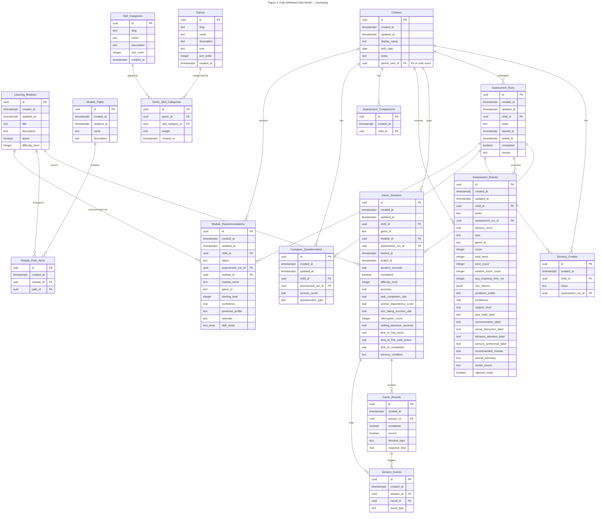

# Figure 3: Fully Attributed Data Model — Aumazing

## Overview

This Entity Relationship Diagram shows the **fully attributed data model** for the Aumazing educational app for children with autism. Every entity includes **all columns** with their data types and PK/FK markers. This is the most detailed view, suitable for implementation reference and database documentation.

> **Note:** Only Supabase (remote/canonical) tables are represented. SQLite local tables are offline mirrors and are not included as separate entities.

---

---

## Legend & Conventions

| Symbol | Meaning |
|--------|---------|
| `PK` | Primary Key — uniquely identifies each row |
| `FK` | Foreign Key — references a PK in another entity |
| `\|\|--o{` | One-to-many relationship |

### Data Type Reference

| Type | Description |
|------|-------------|
| `uuid` | Universally Unique Identifier (v4) |
| `timestamptz` | Timestamp with time zone |
| `text` | Variable-length string |
| `date` | Calendar date (no time component) |
| `boolean` | True/false value |
| `integer` | 32-bit signed integer |
| `real` | Single-precision floating-point number |
| `jsonb` | Binary JSON for flexible/nested data |
| `text_array` | Array of text values (PostgreSQL `text[]`) |

### Entity Descriptions

| Entity | Purpose | Row Count Expectation |
|--------|---------|-----------------------|
| **Children** | Core entity representing each child user in the system | Low (tens to hundreds) |
| **Sensory_Profiles** | Stores sensory profile snapshots generated per assessment run | Low–Medium |
| **Learning_Modules** | Defines available learning modules/games in the curriculum | Low (reference data) |
| **Module_Paths** | Named sequences of learning modules for structured progression | Low (reference data) |
| **Module_Path_Items** | Junction table linking modules to paths with ordering | Low (reference data) |
| **Assessment_Runs** | Represents a complete assessment session for a child | Medium |
| **Game_Sessions** | Individual game play sessions with rich behavioral metrics | High |
| **Game_Rounds** | Individual rounds within a game session | Very High |
| **Session_Events** | Granular event log for each session/round interaction | Very High |
| **Assessment_Results** | ML-generated assessment outcomes with scores and labels | Medium |
| **Assessment_Comparisons** | Tracks comparisons between assessment runs over time | Low–Medium |
| **Caregiver_Questionnaires** | Caregiver-submitted questionnaire responses per assessment | Medium |
| **Module_Recommendations** | AI-generated module recommendations based on assessment results | Medium |
| **Games** | Reference table of all available games | Low (reference data) |
| **Skill_Categories** | Reference table of skill categories for game classification | Low (reference data) |
| **Game_Skill_Categories** | Junction table mapping games to skill categories with weights | Low (reference data) |

### Notable Design Patterns

1. **Behavioral Metrics on Game_Sessions**: The `Game_Sessions` entity is the richest, containing 22 columns including detailed behavioral metrics (`prompt_dependency_score`, `turn_taking_success_rate`, `waiting_tolerance_seconds`, etc.) that feed into the ML assessment pipeline.

2. **ML Pipeline Outputs on Assessment_Results**: Contains both raw scores and ML-predicted labels (`predicted_profile`, `confidence`, `support_level`) along with domain-specific labels for play skills, communication, social interaction, behavior/attention, and sensory preferences.

3. **Dual Timestamp Pattern**: Most entities use `created_at` / `updated_at` for audit tracking. Some entities (like `Assessment_Runs` and `Game_Sessions`) also have domain-specific timestamps (`started_at` / `ended_at`).

4. **Junction Tables**: `Module_Path_Items` and `Game_Skill_Categories` serve as many-to-many bridge tables with additional metadata (`weight` on Game_Skill_Categories).

5. **External FK**: `Children.parent_user_id` references `auth.users` in Supabase Auth, which is outside this schema but enforces that each child belongs to an authenticated parent/caregiver.
