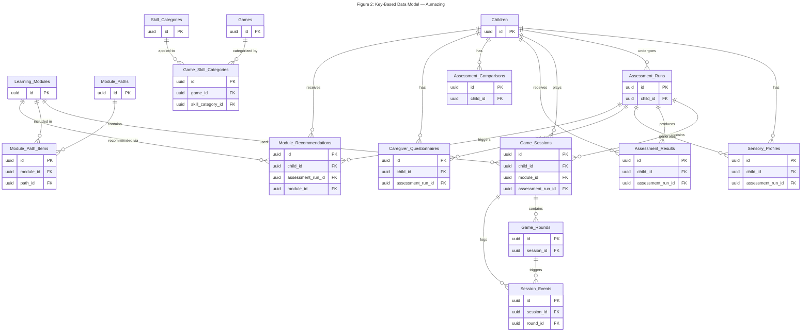

# Figure 2: Key-Based Data Model — Aumazing

## Overview

This Entity Relationship Diagram shows the **key-based data model** for the Aumazing educational app for children with autism. Each entity displays only its **Primary Key (PK)** and **Foreign Key (FK)** attributes, making it easy to trace referential integrity across the schema without the noise of non-key columns.

> **Note:** Only Supabase (remote/canonical) tables are represented. SQLite local tables are offline mirrors and are not included as separate entities.

---

---

## Legend & Conventions

| Symbol | Meaning |
|--------|---------|
| `PK` | Primary Key — uniquely identifies each row |
| `FK` | Foreign Key — references a PK in another entity |
| `uuid` | Universally Unique Identifier type |
| `\|\|--o{` | One-to-many relationship |

### Foreign Key Reference Map

| Entity | FK Column | References |
|--------|-----------|------------|
| **Sensory_Profiles** | `child_id` | Children.id |
| **Sensory_Profiles** | `assessment_run_id` | Assessment_Runs.id |
| **Assessment_Runs** | `child_id` | Children.id |
| **Game_Sessions** | `child_id` | Children.id |
| **Game_Sessions** | `module_id` | Learning_Modules.id |
| **Game_Sessions** | `assessment_run_id` | Assessment_Runs.id |
| **Game_Rounds** | `session_id` | Game_Sessions.id |
| **Session_Events** | `session_id` | Game_Sessions.id |
| **Session_Events** | `round_id` | Game_Rounds.id |
| **Assessment_Results** | `child_id` | Children.id |
| **Assessment_Results** | `assessment_run_id` | Assessment_Runs.id |
| **Assessment_Comparisons** | `child_id` | Children.id |
| **Caregiver_Questionnaires** | `child_id` | Children.id |
| **Caregiver_Questionnaires** | `assessment_run_id` | Assessment_Runs.id |
| **Module_Recommendations** | `child_id` | Children.id |
| **Module_Recommendations** | `assessment_run_id` | Assessment_Runs.id |
| **Module_Recommendations** | `module_id` | Learning_Modules.id |
| **Module_Path_Items** | `module_id` | Learning_Modules.id |
| **Module_Path_Items** | `path_id` | Module_Paths.id |
| **Game_Skill_Categories** | `game_id` | Games.id |
| **Game_Skill_Categories** | `skill_category_id` | Skill_Categories.id |

### Key Observations

- All primary keys use `uuid` type for globally unique identification across Supabase and offline SQLite mirrors.
- **Module_Path_Items** and **Game_Skill_Categories** serve as junction/bridge tables linking two parent entities.
- **Game_Sessions** has three foreign keys, connecting it to **Children**, **Learning_Modules**, and **Assessment_Runs**.
- **Module_Recommendations** also has three foreign keys, tying recommendations to a specific child, assessment run, and learning module.
