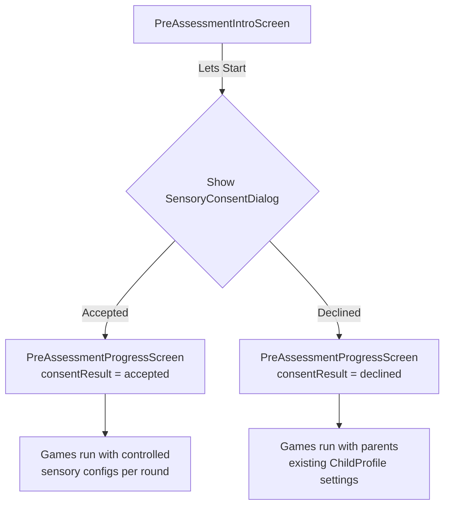
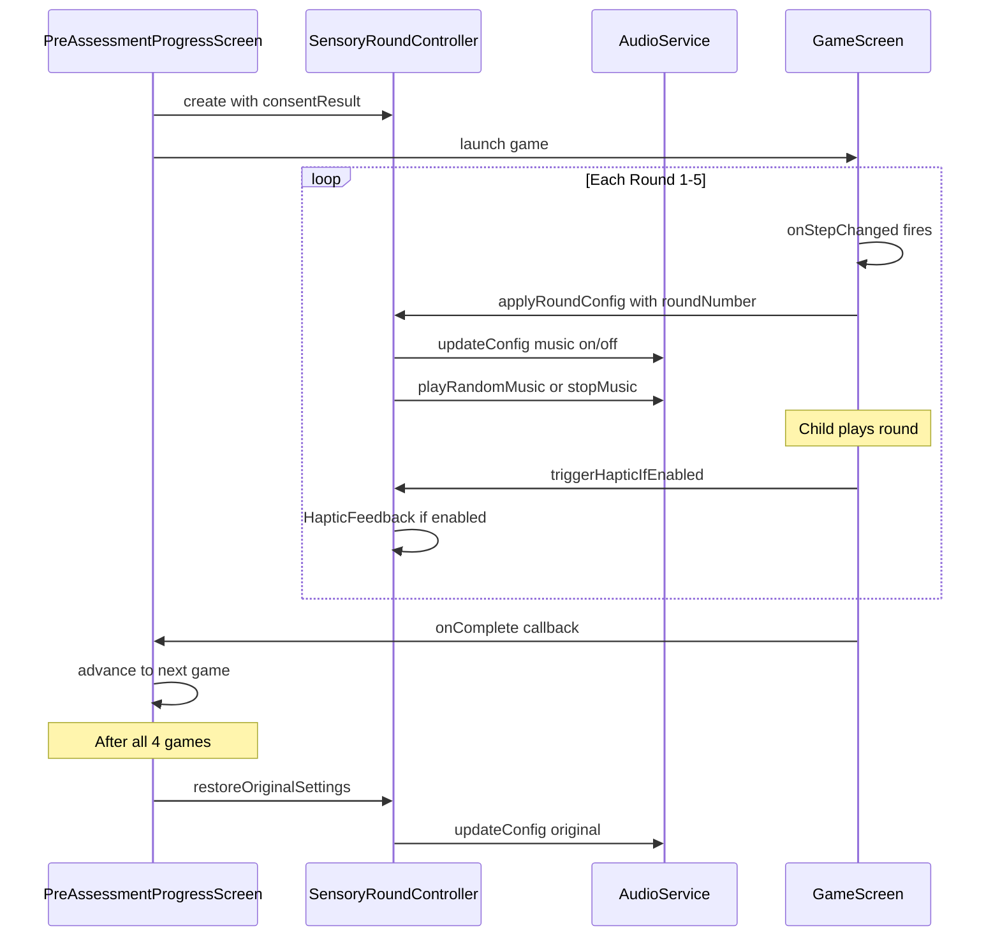
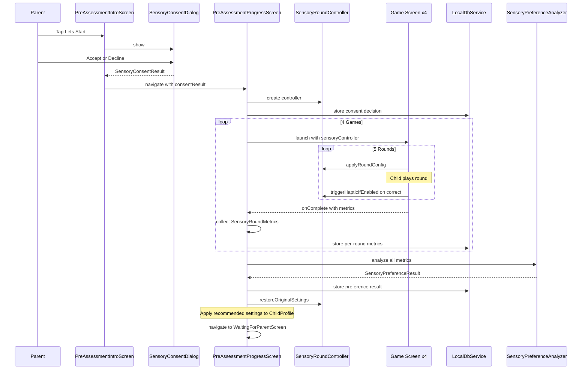

# Pre-Assessment Sensory Round System — Design Document

**Date:** 2026-04-23
**Status:** Draft
**Author:** Architecture Mode

---

## 1. Overview

The Pre-Assessment Sensory Round System adds structured sensory configuration testing to the existing 4-game pre-assessment flow. Each game's 5 rounds will use different combinations of background music and haptic feedback to determine which sensory environment helps the child perform best. A 5th round per game focuses on attention/behavior observation.

### Goals

- Determine the child's optimal sensory configuration through objective performance data
- Respect parent autonomy via a consent flow (parent can opt out)
- Minimize changes to existing Flame game code (changes happen in Flutter wrapper screens)
- Maintain compatibility with practice mode, post-assessment mode, and offline-first architecture

### Non-Goals

- Changing the Flame game internals (game_core package)
- Modifying the number of games or their order
- Clinical diagnosis or medical recommendations

---

## 2. Current Architecture Summary

### Pre-Assessment Flow

```
PreAssessmentIntroScreen
  -> SensoryPreferencesScreen (if not set)
  -> PreAssessmentProgressScreen (orchestrator)
    -> CopyMeScreen (5 rounds)
    -> DoWhatISayScreen (5 rounds)
    -> MyTurnYourTurnScreen (5 rounds)
    -> MatchItScreen (5 rounds)
  -> WaitingForParentScreen
  -> PreAssessmentResultScreen
```

### Key Existing Components

| Component | Location | Role |
|-----------|----------|------|
| [`PreAssessmentProgressScreen`](apps/main_app/lib/features/pre_assessment/pre_assessment_progress_screen.dart) | pre_assessment/ | Orchestrates sequential game flow |
| [`CopyMeScreen`](apps/main_app/lib/features/games/copy_me/copy_me_screen.dart) | games/copy_me/ | Flutter wrapper for CopyMeGame |
| [`AudioService`](packages/shared_audio/lib/src/audio_service.dart) | shared_audio | Music + SFX playback |
| [`AudioConfig`](packages/shared_audio/lib/src/audio_config.dart) | shared_audio | Immutable audio settings |
| [`ChildProvider`](apps/main_app/lib/providers/child_provider.dart) | providers/ | Child profile + comfort settings |
| [`GameRoundMetrics`](packages/game_core/lib/src/analytics/models/game_round_metrics.dart) | game_core/analytics | Per-round analytics model |
| [`LocalDbService`](apps/main_app/lib/core/services/local_db_service.dart) | core/services/ | SQLite offline-first DB v6 |
| [`ScoringService`](apps/main_app/lib/services/scoring_service.dart) | services/ | Generates SupportProfile from results |

---

## 3. Sensory Round Configuration

### 3.1 `SensoryRoundConfig` Model

**File:** `apps/main_app/lib/model/sensory_round_config.dart`

```dart
/// Defines the sensory environment for a single game round.
///
/// Used during pre-assessment to systematically test different
/// combinations of background music and haptic feedback.
class SensoryRoundConfig {
  final int roundNumber;
  final bool musicEnabled;
  final bool hapticEnabled;
  final SensoryRoundPurpose purpose;
  final String description;

  const SensoryRoundConfig({
    required this.roundNumber,
    required this.musicEnabled,
    required this.hapticEnabled,
    required this.purpose,
    required this.description,
  });

  Map<String, dynamic> toMap() => {
    'round_number': roundNumber,
    'music_enabled': musicEnabled,
    'haptic_enabled': hapticEnabled,
    'purpose': purpose.name,
    'description': description,
  };

  factory SensoryRoundConfig.fromMap(Map<String, dynamic> map) =>
    SensoryRoundConfig(
      roundNumber: map['round_number'] as int,
      musicEnabled: map['music_enabled'] as bool,
      hapticEnabled: map['haptic_enabled'] as bool,
      purpose: SensoryRoundPurpose.values.byName(map['purpose'] as String),
      description: map['description'] as String,
    );
}

/// The purpose/category of a sensory round.
enum SensoryRoundPurpose {
  musicOnly,
  hapticOnly,
  baseline,
  combined,
  attention,
}
```

### 3.2 Predefined Round Configurations

```dart
/// The fixed sensory round configurations for pre-assessment.
/// These are constant and identical across all 4 games.
class SensoryRoundConfigs {
  static const List<SensoryRoundConfig> preAssessmentRounds = [
    SensoryRoundConfig(
      roundNumber: 1,
      musicEnabled: true,
      hapticEnabled: false,
      purpose: SensoryRoundPurpose.musicOnly,
      description: 'Music ON, Haptic OFF',
    ),
    SensoryRoundConfig(
      roundNumber: 2,
      musicEnabled: false,
      hapticEnabled: true,
      purpose: SensoryRoundPurpose.hapticOnly,
      description: 'Music OFF, Haptic ON',
    ),
    SensoryRoundConfig(
      roundNumber: 3,
      musicEnabled: false,
      hapticEnabled: false,
      purpose: SensoryRoundPurpose.baseline,
      description: 'Music OFF, Haptic OFF',
    ),
    SensoryRoundConfig(
      roundNumber: 4,
      musicEnabled: true,
      hapticEnabled: true,
      purpose: SensoryRoundPurpose.combined,
      description: 'Music ON, Haptic ON',
    ),
    SensoryRoundConfig(
      roundNumber: 5,
      musicEnabled: false,
      hapticEnabled: false,
      purpose: SensoryRoundPurpose.attention,
      description: 'Attention observation round',
    ),
  ];
}
```

---

## 4. Parent Consent Flow

### 4.1 `SensoryConsentDialog` Widget

**File:** `apps/main_app/lib/features/pre_assessment/sensory_consent_dialog.dart`

A modal dialog shown **before** the pre-assessment games begin. It replaces the current [`SensoryPreferencesScreen`](apps/main_app/lib/features/pre_assessment/sensory_preferences_screen.dart) navigation step in the pre-assessment flow.

#### Visual Layout

```
+---------------------------------------------------+
|  Sensory Preference Testing                        |
|                                                    |
|  During the pre-assessment, we will test           |
|  different sensory settings across rounds:         |
|                                                    |
|  Music icon  Background music ON/OFF               |
|  Vibration icon  Haptic feedback ON/OFF            |
|                                                    |
|  This helps us find the best learning              |
|  environment for your child.                       |
|                                                    |
|  +-------------+  +---------------------------+    |
|  |  No Thanks  |  |  Yes, Test Preferences    |    |
|  +-------------+  +---------------------------+    |
|                                                    |
|  No Thanks = use your current settings             |
+---------------------------------------------------+
```

#### Behavior

| Action | Result |
|--------|--------|
| **Accept** | `SensoryConsentResult.accepted` — Run 5-round sensory testing with controlled configs |
| **Decline** | `SensoryConsentResult.declined` — Use parent's existing [`ChildProfile`](apps/main_app/lib/model/child_profile.dart) settings for ALL rounds |

#### Data Model

```dart
enum SensoryConsentResult {
  accepted,
  declined,
}
```

#### Static Show Method

```dart
class SensoryConsentDialog {
  static Future<SensoryConsentResult> show(BuildContext context) async {
    final result = await showDialog<SensoryConsentResult>(
      context: context,
      barrierDismissible: false,
      builder: (ctx) => const _SensoryConsentDialogContent(),
    );
    return result ?? SensoryConsentResult.declined;
  }
}
```

### 4.2 Integration into Pre-Assessment Flow

The consent dialog is shown from [`PreAssessmentIntroScreen`](apps/main_app/lib/features/pre_assessment/pre_assessment_intro_screen.dart:104) when the user taps "Let's Start!":



**Key change:** [`PreAssessmentIntroScreen`](apps/main_app/lib/features/pre_assessment/pre_assessment_intro_screen.dart) no longer navigates to [`SensoryPreferencesScreen`](apps/main_app/lib/features/pre_assessment/sensory_preferences_screen.dart) first. Instead, it shows `SensoryConsentDialog` inline, then navigates directly to [`PreAssessmentProgressScreen`](apps/main_app/lib/features/pre_assessment/pre_assessment_progress_screen.dart) with the consent result.

The existing [`SensoryPreferencesScreen`](apps/main_app/lib/features/pre_assessment/sensory_preferences_screen.dart) remains available from the settings/profile area for manual preference changes, but is no longer part of the pre-assessment flow.

---

## 5. `SensoryRoundController`

**File:** `apps/main_app/lib/services/sensory_round_controller.dart`

A service that manages the active sensory configuration for the current round and applies it to [`AudioService`](packages/shared_audio/lib/src/audio_service.dart) and haptic feedback.

### 5.1 Class Design

```dart
/// Controls sensory settings for each pre-assessment round.
///
/// When consent is accepted, applies the predefined SensoryRoundConfig
/// for each round. When declined, uses the parents existing settings
/// from ChildProfile for all rounds.
class SensoryRoundController {
  final AudioService _audioService;
  final ChildProvider _childProvider;
  final SensoryConsentResult _consentResult;

  /// The original AudioConfig before sensory testing began.
  /// Restored after pre-assessment completes.
  final AudioConfig _originalAudioConfig;

  /// The original vibration setting from ChildProfile.
  final bool _originalVibrationEnabled;

  /// Current active round config (null if not in a round).
  SensoryRoundConfig? _activeConfig;

  SensoryRoundController({
    required AudioService audioService,
    required ChildProvider childProvider,
    required SensoryConsentResult consentResult,
  }) : _audioService = audioService,
       _childProvider = childProvider,
       _consentResult = consentResult,
       _originalAudioConfig = audioService.config,
       _originalVibrationEnabled = childProvider.vibrationEnabled;

  /// Whether sensory testing is active (consent was accepted).
  bool get isSensoryTestingActive =>
      _consentResult == SensoryConsentResult.accepted;

  /// The currently active sensory config.
  SensoryRoundConfig? get activeConfig => _activeConfig;

  /// Whether haptic feedback should fire for the current round.
  bool get hapticEnabled {
    if (!isSensoryTestingActive) {
      return _originalVibrationEnabled;
    }
    return _activeConfig?.hapticEnabled ?? false;
  }

  /// Apply the sensory configuration for a specific round.
  ///
  /// Called by the game wrapper screen at the start of each round
  /// via the onStepChanged callback.
  void applyRoundConfig(int roundNumber) {
    if (!isSensoryTestingActive) {
      _activeConfig = null;
      return;
    }

    final configs = SensoryRoundConfigs.preAssessmentRounds;
    if (roundNumber < 1 || roundNumber > configs.length) return;

    _activeConfig = configs[roundNumber - 1];

    // Apply music setting
    _audioService.updateConfig(
      _originalAudioConfig.copyWith(
        musicEnabled: _activeConfig!.musicEnabled,
      ),
    );

    // Control music playback
    if (_activeConfig!.musicEnabled) {
      _audioService.playRandomMusic(['bg_music.ogg', 'bg_music1.ogg']);
    } else {
      _audioService.stopMusic();
    }
  }

  /// Trigger haptic feedback if enabled for the current round.
  /// Called by game wrapper screens on correct answers.
  void triggerHapticIfEnabled() {
    if (hapticEnabled) {
      HapticFeedback.mediumImpact();
    }
  }

  /// Restore original audio/haptic settings after pre-assessment.
  void restoreOriginalSettings() {
    _audioService.updateConfig(_originalAudioConfig);
    _activeConfig = null;
  }

  void dispose() {
    restoreOriginalSettings();
  }
}
```

### 5.2 Lifecycle



### 5.3 Provider Integration

The `SensoryRoundController` is **not** a `ChangeNotifier`. It is created in [`PreAssessmentProgressScreen`](apps/main_app/lib/features/pre_assessment/pre_assessment_progress_screen.dart) and passed to game screens. This avoids adding a new provider to the widget tree and keeps the scope limited to pre-assessment.

```dart
// In PreAssessmentProgressScreen.initState():
_sensoryController = SensoryRoundController(
  audioService: context.read<AudioService>(),
  childProvider: context.read<ChildProvider>(),
  consentResult: widget.consentResult,
);
```

Game screens receive it as a constructor parameter:

```dart
CopyMeScreen(
  sensoryController: _sensoryController,
  onComplete: (score, total, errors, time) => ...,
)
```

---

## 6. Sensory Round Metrics

### 6.1 `SensoryRoundMetrics` Model

**File:** `apps/main_app/lib/model/sensory_round_metrics.dart`

Extends the per-round data with sensory-specific context. This wraps the existing [`GameRoundMetrics`](packages/game_core/lib/src/analytics/models/game_round_metrics.dart) data rather than modifying it.

```dart
/// Captures per-round metrics with sensory configuration context.
///
/// Wraps the existing GameRoundMetrics from game_core with
/// additional sensory testing metadata.
class SensoryRoundMetrics {
  final String id;
  final String assessmentRunId;
  final String gameId;
  final int roundNumber;
  final SensoryRoundConfig sensoryConfig;

  // -- Performance Metrics --
  final double accuracy;
  final int correctCount;
  final int errorCount;
  final int avgResponseTimeMs;
  final int totalResponseTimeMs;
  final double timeToFirstTouch;
  final double timeToFirstValidAction;
  final double timeToCompletion;

  // -- Engagement Metrics --
  final int tapCount;
  final int idleTimeSeconds;
  final int randomTouchCount;
  final int offTaskActionCount;

  // -- Assistance Metrics --
  final int hintCount;
  final int promptCount;
  final int retryCount;

  // -- Round 5 Attention Metrics --
  final bool isAttentionRound;
  final AttentionMetrics? attentionMetrics;

  final DateTime completedAt;

  const SensoryRoundMetrics({ /* all fields required */ });

  /// Creates from a GameRoundMetrics + sensory config.
  factory SensoryRoundMetrics.fromGameRound({
    required String id,
    required String assessmentRunId,
    required String gameId,
    required GameRoundMetrics gameRound,
    required SensoryRoundConfig sensoryConfig,
    AttentionMetrics? attentionMetrics,
  }) {
    return SensoryRoundMetrics(
      id: id,
      assessmentRunId: assessmentRunId,
      gameId: gameId,
      roundNumber: gameRound.roundNumber,
      sensoryConfig: sensoryConfig,
      accuracy: gameRound.accuracy,
      correctCount: gameRound.correctCount,
      errorCount: gameRound.wrongCount,
      avgResponseTimeMs: gameRound.totalInteractions > 0
          ? (gameRound.timeToCompletion * 1000 ~/
              gameRound.totalInteractions)
          : 0,
      totalResponseTimeMs: (gameRound.timeToCompletion * 1000).round(),
      timeToFirstTouch: gameRound.timeToFirstTouch,
      timeToFirstValidAction: gameRound.timeToFirstValidAction,
      timeToCompletion: gameRound.timeToCompletion,
      tapCount: gameRound.totalInteractions + gameRound.randomTouchCount,
      idleTimeSeconds: gameRound.idleTimeSeconds,
      randomTouchCount: gameRound.randomTouchCount,
      offTaskActionCount: gameRound.offTaskActionCount,
      hintCount: gameRound.hintCount,
      promptCount: gameRound.promptCount,
      retryCount: gameRound.retryCount,
      isAttentionRound:
          sensoryConfig.purpose == SensoryRoundPurpose.attention,
      attentionMetrics: attentionMetrics,
      completedAt: DateTime.now(),
    );
  }

  Map<String, dynamic> toMap() => { /* full serialization */ };
  factory SensoryRoundMetrics.fromMap(Map<String, dynamic> map) => /* ... */;
}
```

### 6.2 `AttentionMetrics` Model

**File:** `apps/main_app/lib/model/attention_metrics.dart`

```dart
/// Behavioral indicators tracked during Round 5 (attention round).
class AttentionMetrics {
  /// Time in seconds the child maintained focus on the game area.
  /// Measured by continuous interaction without idle gaps > 3s.
  final double focusDurationSeconds;

  /// Number of times the child went idle for > 3 seconds.
  final int attentionBreakCount;

  /// Whether the child responded to the initial instruction
  /// within a reasonable time (< 5 seconds).
  final bool respondedToInstruction;

  /// Time from instruction to first valid action (seconds).
  final double instructionResponseTime;

  /// Number of taps during non-interactive phases
  /// (e.g., during demo/instruction display).
  final int prematureTapCount;

  /// Whether the child completed the round without
  /// needing additional prompts.
  final bool completedWithoutPrompts;

  /// Ratio of on-task to total interactions.
  /// Higher = more focused gameplay.
  final double onTaskRatio;

  /// Whether the child showed consistent response patterns
  /// (low variance in response times).
  final bool consistentResponsePattern;

  /// Standard deviation of response times within the round.
  final double responseTimeStdDev;

  /// Game-specific behavioral indicators.
  /// e.g., for MyTurnYourTurn: early_taps during buddy turn
  final Map<String, dynamic> gameSpecificBehaviors;

  const AttentionMetrics({
    required this.focusDurationSeconds,
    required this.attentionBreakCount,
    required this.respondedToInstruction,
    required this.instructionResponseTime,
    required this.prematureTapCount,
    required this.completedWithoutPrompts,
    required this.onTaskRatio,
    required this.consistentResponsePattern,
    required this.responseTimeStdDev,
    this.gameSpecificBehaviors = const {},
  });

  Map<String, dynamic> toMap() => { /* serialization */ };
  factory AttentionMetrics.fromMap(Map<String, dynamic> map) => /* ... */;
}
```

---

## 7. `SensoryPreferenceAnalyzer`

**File:** `apps/main_app/lib/services/sensory_preference_analyzer.dart`

Analyzes metrics across all rounds and games to determine the optimal sensory profile.

### 7.1 Analysis Algorithm

```dart
/// Analyzes per-round sensory metrics across all games to determine
/// the childs optimal sensory configuration.
class SensoryPreferenceAnalyzer {
  const SensoryPreferenceAnalyzer();

  /// Analyzes all sensory round metrics and returns the recommended
  /// sensory profile.
  SensoryPreferenceResult analyze(List<SensoryRoundMetrics> allMetrics) {
    // 1. Group by purpose (excluding attention rounds)
    final grouped = _groupByPurpose(allMetrics);

    // 2. Compute composite score per configuration
    final scores = <SensoryRoundPurpose, double>{};
    for (final entry in grouped.entries) {
      scores[entry.key] = _computeCompositeScore(entry.value);
    }

    // 3. Determine best configuration
    final bestPurpose = _selectBest(scores);

    // 4. Analyze attention round data
    final attentionSummary = _analyzeAttention(
      allMetrics.where((m) => m.isAttentionRound).toList(),
    );

    // 5. Build result
    return SensoryPreferenceResult(
      recommendedMusicEnabled:
          bestPurpose == SensoryRoundPurpose.musicOnly ||
          bestPurpose == SensoryRoundPurpose.combined,
      recommendedHapticEnabled:
          bestPurpose == SensoryRoundPurpose.hapticOnly ||
          bestPurpose == SensoryRoundPurpose.combined,
      bestPurpose: bestPurpose,
      configScores: scores,
      attentionSummary: attentionSummary,
      confidence: _computeConfidence(scores),
      analyzedAt: DateTime.now(),
    );
  }
}
```

### 7.2 Composite Score Formula

Each sensory configuration receives a composite score (higher = better performance):

```
score = (accuracy * 0.40)
      + (responseTimeScore * 0.25)
      + (engagementScore * 0.20)
      + (consistencyScore * 0.15)
```

| Component | Weight | Calculation |
|-----------|--------|-------------|
| **Accuracy** | 40% | Average accuracy across all games for this config |
| **Response Time** | 25% | Inverse normalized: 1.0 for < 1s, 0.0 for > 10s |
| **Engagement** | 20% | `1.0 - idleRatio - randomTouchRatio * 0.5` |
| **Consistency** | 15% | `1.0 - coefficientOfVariation` of response times |

### 7.3 Confidence Calculation

Confidence is based on the margin between the best and second-best scores:

```dart
double _computeConfidence(Map<SensoryRoundPurpose, double> scores) {
  if (scores.length < 2) return 0.5;
  final sorted = scores.values.toList()..sort((a, b) => b.compareTo(a));
  final margin = sorted[0] - sorted[1];
  return (0.5 + margin * 5.0).clamp(0.0, 1.0);
}
```

### 7.4 `SensoryPreferenceResult` Model

```dart
class SensoryPreferenceResult {
  final bool recommendedMusicEnabled;
  final bool recommendedHapticEnabled;
  final SensoryRoundPurpose bestPurpose;
  final Map<SensoryRoundPurpose, double> configScores;
  final AttentionSummary attentionSummary;
  final double confidence;
  final DateTime analyzedAt;

  const SensoryPreferenceResult({ /* ... */ });

  Map<String, dynamic> toMap() => { /* serialization */ };
}

class AttentionSummary {
  final double avgFocusDuration;
  final double avgAttentionBreaks;
  final double instructionResponseRate;
  final double avgOnTaskRatio;
  /// One of: short, moderate, sustained
  final String attentionLevel;

  const AttentionSummary({ /* ... */ });
}
```

---

## 8. Integration Points

### 8.1 Changes to `PreAssessmentIntroScreen`

**File:** [`apps/main_app/lib/features/pre_assessment/pre_assessment_intro_screen.dart`](apps/main_app/lib/features/pre_assessment/pre_assessment_intro_screen.dart)

**Changes:**
1. Remove navigation to [`SensoryPreferencesScreen`](apps/main_app/lib/features/pre_assessment/sensory_preferences_screen.dart) from the pre-assessment flow
2. Show `SensoryConsentDialog` when "Let's Start!" is tapped
3. Pass `consentResult` to [`PreAssessmentProgressScreen`](apps/main_app/lib/features/pre_assessment/pre_assessment_progress_screen.dart)

```dart
// BEFORE (line 104-119):
onPressed: () {
  if (prefsAlreadySet) {
    Navigator.of(context).pushReplacement(
      MaterialPageRoute(
        builder: (_) => const PreAssessmentProgressScreen(),
      ),
    );
  } else {
    Navigator.of(context).pushReplacement(
      MaterialPageRoute(
        builder: (_) => const SensoryPreferencesScreen(),
      ),
    );
  }
}

// AFTER:
onPressed: () async {
  final consent = await SensoryConsentDialog.show(context);
  if (!context.mounted) return;
  Navigator.of(context).pushReplacement(
    MaterialPageRoute(
      builder: (_) => PreAssessmentProgressScreen(
        consentResult: consent,
      ),
    ),
  );
}
```

### 8.2 Changes to `PreAssessmentProgressScreen`

**File:** [`apps/main_app/lib/features/pre_assessment/pre_assessment_progress_screen.dart`](apps/main_app/lib/features/pre_assessment/pre_assessment_progress_screen.dart)

**Changes:**
1. Accept `consentResult` parameter
2. Create `SensoryRoundController` in [`initState()`](apps/main_app/lib/features/pre_assessment/pre_assessment_progress_screen.dart:38)
3. Pass controller to game screens in [`_launchGame()`](apps/main_app/lib/features/pre_assessment/pre_assessment_progress_screen.dart:290)
4. Collect `SensoryRoundMetrics` from game completion callbacks
5. Run `SensoryPreferenceAnalyzer` in [`_finishAssessment()`](apps/main_app/lib/features/pre_assessment/pre_assessment_progress_screen.dart:139)
6. Store consent decision and analysis results
7. Dispose controller and restore settings on completion

```dart
class PreAssessmentProgressScreen extends StatefulWidget {
  final SensoryConsentResult consentResult;

  const PreAssessmentProgressScreen({
    super.key,
    required this.consentResult,
  });
  // ...
}

class _PreAssessmentProgressScreenState
    extends State<PreAssessmentProgressScreen> {
  late final SensoryRoundController _sensoryController;
  final List<SensoryRoundMetrics> _sensoryMetrics = [];

  @override
  void initState() {
    super.initState();
    _sensoryController = SensoryRoundController(
      audioService: context.read<AudioService>(),
      childProvider: context.read<ChildProvider>(),
      consentResult: widget.consentResult,
    );
  }

  @override
  void dispose() {
    _sensoryController.dispose();
    super.dispose();
  }

  // In _launchGame():
  case 'copy_me':
    screen = CopyMeScreen(
      sensoryController: _sensoryController,
      onComplete: (score, total, errors, time) =>
          _onGameComplete(gameId, score, total, errors, time),
    );

  // In _finishAssessment():
  if (_sensoryController.isSensoryTestingActive) {
    const analyzer = SensoryPreferenceAnalyzer();
    final result = analyzer.analyze(_sensoryMetrics);
    await _storeSensoryPreferenceResult(result);
  }
}
```

### 8.3 Changes to Game Screens

**Files:**
- [`apps/main_app/lib/features/games/copy_me/copy_me_screen.dart`](apps/main_app/lib/features/games/copy_me/copy_me_screen.dart)
- [`apps/main_app/lib/features/games/do_what_i_say/do_what_i_say_screen.dart`](apps/main_app/lib/features/games/do_what_i_say/do_what_i_say_screen.dart)
- [`apps/main_app/lib/features/games/my_turn_your_turn/my_turn_your_turn_screen.dart`](apps/main_app/lib/features/games/my_turn_your_turn/my_turn_your_turn_screen.dart)
- [`apps/main_app/lib/features/games/match_it/match_it_screen.dart`](apps/main_app/lib/features/games/match_it/match_it_screen.dart)

**Changes (identical pattern for all 4 screens):**

1. Add optional `sensoryController` parameter
2. Hook into `onStepChanged` to apply sensory config per round
3. No changes to the Flame game instances themselves

```dart
class CopyMeScreen extends StatefulWidget {
  const CopyMeScreen({
    super.key,
    this.assessmentContext = 'pre_assessment',
    this.sensoryController,  // NEW
    this.onComplete,
  });

  final String assessmentContext;
  final SensoryRoundController? sensoryController;  // NEW
  final void Function(int, int, int, int)? onComplete;
  // ...
}

// In initState(), modify onStepChanged:
_game = CopyMeGame(
  totalRounds: _totalRounds,
  childId: childId,
  onStepChanged: (step) {
    setState(() => _currentStep = step);
    // Apply sensory config for this round (1-indexed)
    widget.sensoryController?.applyRoundConfig(step + 1);
  },
  // ...
);
```

**Important:** The `sensoryController` parameter is **optional** (`SensoryRoundController?`). When `null` (practice mode, post-assessment), no sensory switching occurs and the game behaves exactly as it does today. This ensures zero impact on non-pre-assessment flows.

### 8.4 Changes to `ScoringService`

**File:** [`apps/main_app/lib/services/scoring_service.dart`](apps/main_app/lib/services/scoring_service.dart)

**Changes:**
1. Accept optional `SensoryPreferenceResult` in [`generateProfile()`](apps/main_app/lib/services/scoring_service.dart:9)
2. Use analyzed sensory preferences instead of raw parent settings for sensory notes

```dart
SupportProfile generateProfile({
  required List<AssessmentResult> results,
  required Map<String, dynamic> sensorySettings,
  SensoryPreferenceResult? sensoryPreference,  // NEW
}) {
  // ... existing logic ...

  // UPDATED: Sensory Notes section
  final sensoryNotes = <String>[];
  if (sensoryPreference != null) {
    // Use analyzed preferences
    if (!sensoryPreference.recommendedMusicEnabled) {
      sensoryNotes.add('performs better without music');
    }
    if (sensoryPreference.recommendedHapticEnabled) {
      sensoryNotes.add('benefits from haptic feedback');
    }
    if (sensoryPreference.confidence < 0.6) {
      sensoryNotes.add('no strong sensory preference detected');
    }
  } else {
    // Fallback to parent settings (existing logic)
    if (sensorySettings['music_enabled'] == false) {
      sensoryNotes.add('prefers no music');
    }
    // ...
  }
}
```

### 8.5 Impact Summary

| Component | Change Type | Risk |
|-----------|-------------|------|
| [`PreAssessmentIntroScreen`](apps/main_app/lib/features/pre_assessment/pre_assessment_intro_screen.dart) | Modify navigation flow | Low — replaces one navigation path |
| [`PreAssessmentProgressScreen`](apps/main_app/lib/features/pre_assessment/pre_assessment_progress_screen.dart) | Add controller + metrics collection | Medium — core orchestrator changes |
| [`CopyMeScreen`](apps/main_app/lib/features/games/copy_me/copy_me_screen.dart) | Add optional parameter + hook | Low — additive, null-safe |
| [`DoWhatISayScreen`](apps/main_app/lib/features/games/do_what_i_say/do_what_i_say_screen.dart) | Add optional parameter + hook | Low — additive, null-safe |
| [`MyTurnYourTurnScreen`](apps/main_app/lib/features/games/my_turn_your_turn/my_turn_your_turn_screen.dart) | Add optional parameter + hook | Low — additive, null-safe |
| [`MatchItScreen`](apps/main_app/lib/features/games/match_it/match_it_screen.dart) | Add optional parameter + hook | Low — additive, null-safe |
| [`ScoringService`](apps/main_app/lib/services/scoring_service.dart) | Add optional parameter | Low — backward compatible |
| [`LocalDbService`](apps/main_app/lib/core/services/local_db_service.dart) | Add new tables + migration | Medium — DB schema change |
| game_core package | **No changes** | None |
| shared_audio package | **No changes** | None |

---

## 9. Database Schema Changes

### 9.1 New Tables

All new tables follow the existing offline-first pattern with sync metadata columns from [`LocalDbService`](apps/main_app/lib/core/services/local_db_service.dart:120).

#### `sensory_consent_local`

Stores the parent's consent decision for each pre-assessment run.

```sql
CREATE TABLE sensory_consent_local (
  id TEXT PRIMARY KEY,
  child_id TEXT NOT NULL,
  assessment_run_id TEXT NOT NULL,
  consent_result TEXT NOT NULL,  -- 'accepted' or 'declined'
  consented_at TEXT NOT NULL,
  -- sync metadata
  sync_status TEXT NOT NULL DEFAULT 'pending',
  last_synced_at TEXT,
  deleted_at TEXT,
  updated_at TEXT NOT NULL,
  local_created_at TEXT NOT NULL,
  owner_id TEXT,
  FOREIGN KEY (child_id) REFERENCES children_local(id),
  FOREIGN KEY (assessment_run_id) REFERENCES assessment_runs_local(id)
);

CREATE INDEX idx_sensory_consent_child
  ON sensory_consent_local(child_id);
CREATE INDEX idx_sensory_consent_sync
  ON sensory_consent_local(sync_status);
```

#### `sensory_round_metrics_local`

Stores per-round sensory metrics for each game in a pre-assessment.

```sql
CREATE TABLE sensory_round_metrics_local (
  id TEXT PRIMARY KEY,
  assessment_run_id TEXT NOT NULL,
  game_id TEXT NOT NULL,
  round_number INTEGER NOT NULL,
  -- sensory config
  music_enabled INTEGER NOT NULL,
  haptic_enabled INTEGER NOT NULL,
  sensory_purpose TEXT NOT NULL,
  -- performance
  accuracy REAL NOT NULL,
  correct_count INTEGER NOT NULL,
  error_count INTEGER NOT NULL,
  avg_response_time_ms INTEGER NOT NULL,
  total_response_time_ms INTEGER NOT NULL,
  time_to_first_touch REAL,
  time_to_first_valid_action REAL,
  time_to_completion REAL,
  -- engagement
  tap_count INTEGER NOT NULL DEFAULT 0,
  idle_time_seconds INTEGER NOT NULL DEFAULT 0,
  random_touch_count INTEGER NOT NULL DEFAULT 0,
  off_task_action_count INTEGER NOT NULL DEFAULT 0,
  -- assistance
  hint_count INTEGER NOT NULL DEFAULT 0,
  prompt_count INTEGER NOT NULL DEFAULT 0,
  retry_count INTEGER NOT NULL DEFAULT 0,
  -- attention (round 5 only)
  is_attention_round INTEGER NOT NULL DEFAULT 0,
  attention_metrics TEXT,  -- JSON blob for AttentionMetrics
  completed_at TEXT NOT NULL,
  -- sync metadata
  sync_status TEXT NOT NULL DEFAULT 'pending',
  last_synced_at TEXT,
  deleted_at TEXT,
  updated_at TEXT NOT NULL,
  local_created_at TEXT NOT NULL,
  owner_id TEXT,
  FOREIGN KEY (assessment_run_id) REFERENCES assessment_runs_local(id)
);

CREATE INDEX idx_sensory_rounds_assessment
  ON sensory_round_metrics_local(assessment_run_id);
CREATE INDEX idx_sensory_rounds_game
  ON sensory_round_metrics_local(game_id);
CREATE INDEX idx_sensory_rounds_sync
  ON sensory_round_metrics_local(sync_status);
```

#### `sensory_preferences_local`

Stores the analyzed sensory preference result.

```sql
CREATE TABLE sensory_preferences_local (
  id TEXT PRIMARY KEY,
  child_id TEXT NOT NULL,
  assessment_run_id TEXT NOT NULL,
  recommended_music_enabled INTEGER NOT NULL,
  recommended_haptic_enabled INTEGER NOT NULL,
  best_purpose TEXT NOT NULL,
  config_scores TEXT NOT NULL,  -- JSON map of purpose -> score
  confidence REAL NOT NULL,
  -- attention summary
  attention_level TEXT,
  avg_focus_duration REAL,
  avg_attention_breaks REAL,
  instruction_response_rate REAL,
  avg_on_task_ratio REAL,
  analyzed_at TEXT NOT NULL,
  -- sync metadata
  sync_status TEXT NOT NULL DEFAULT 'pending',
  last_synced_at TEXT,
  deleted_at TEXT,
  updated_at TEXT NOT NULL,
  local_created_at TEXT NOT NULL,
  owner_id TEXT,
  FOREIGN KEY (child_id) REFERENCES children_local(id),
  FOREIGN KEY (assessment_run_id) REFERENCES assessment_runs_local(id)
);

CREATE INDEX idx_sensory_prefs_child
  ON sensory_preferences_local(child_id);
CREATE INDEX idx_sensory_prefs_sync
  ON sensory_preferences_local(sync_status);
```

### 9.2 Migration (v6 to v7)

**File:** [`apps/main_app/lib/core/services/local_db_service.dart`](apps/main_app/lib/core/services/local_db_service.dart:404)

```dart
// Bump _dbVersion from 6 to 7
static const _dbVersion = 7;

// In _onUpgrade():
if (oldVersion < 7) {
  // Create sensory consent table
  await db.execute('''
    CREATE TABLE sensory_consent_local ( /* ... */ )
  ''');
  // Create sensory round metrics table
  await db.execute('''
    CREATE TABLE sensory_round_metrics_local ( /* ... */ )
  ''');
  // Create sensory preferences table
  await db.execute('''
    CREATE TABLE sensory_preferences_local ( /* ... */ )
  ''');
  // Create all indexes
  // ...
  debugPrint('[LocalDbService] Added sensory round system tables');
}
```

### 9.3 Updates to `LocalTables` and `SyncOrder`

**File:** [`apps/main_app/lib/core/sync/sync_status.dart`](apps/main_app/lib/core/sync/sync_status.dart:142)

```dart
class LocalTables {
  // ... existing tables ...
  static const String sensoryConsent = 'sensory_consent_local';          // NEW
  static const String sensoryRoundMetrics = 'sensory_round_metrics_local'; // NEW
  static const String sensoryPreferences = 'sensory_preferences_local';  // NEW
}

class RemoteTables {
  // ... existing tables ...
  static const String sensoryConsent = 'sensory_consent';          // NEW
  static const String sensoryRoundMetrics = 'sensory_round_metrics'; // NEW
  static const String sensoryPreferences = 'sensory_preferences';  // NEW
}

class SyncOrder {
  static const List<String> dependencyOrder = [
    LocalTables.children,
    LocalTables.assessmentRuns,
    LocalTables.sensoryConsent,        // NEW - depends on assessment_runs
    LocalTables.gameSessions,
    LocalTables.gameRounds,
    LocalTables.sessionEvents,
    LocalTables.sensoryRoundMetrics,   // NEW - depends on assessment_runs
    LocalTables.caregiverQuestionnaires,
    LocalTables.assessmentResults,
    LocalTables.sensoryPreferences,    // NEW - depends on assessment_runs
    LocalTables.moduleRecommendations,
    LocalTables.assessmentComparisons,
  ];
}
```

### 9.4 Supabase Remote Tables

Corresponding Supabase tables should mirror the local schema (without sync metadata columns, using Supabase-native types):

| Local Table | Remote Table | Notes |
|-------------|-------------|-------|
| `sensory_consent_local` | `sensory_consent` | `consent_result` as text enum |
| `sensory_round_metrics_local` | `sensory_round_metrics` | `attention_metrics` as JSONB |
| `sensory_preferences_local` | `sensory_preferences` | `config_scores` as JSONB |

---

## 10. Round 5 Attention Tracking

### 10.1 What to Track

Round 5 is a standard gameplay round (same game mechanics) but with all sensory stimulation OFF. The purpose is to observe the child's natural attention and behavioral patterns without sensory aids.

#### Behavioral Indicators

| Indicator | How Measured | What It Reveals |
|-----------|-------------|-----------------|
| **Focus Duration** | Continuous interaction time without idle gaps > 3s | Sustained attention capacity |
| **Attention Breaks** | Count of idle periods > 3s | Attention fragmentation |
| **Instruction Response** | Time from instruction display to first valid action | Receptive processing speed |
| **Premature Taps** | Taps during demo/instruction phases | Impulse control |
| **Completion Without Prompts** | Whether additional prompts were needed | Independent task execution |
| **On-Task Ratio** | Valid interactions / total interactions | Task focus vs. exploration |
| **Response Consistency** | Standard deviation of per-item response times | Processing stability |

#### Game-Specific Behaviors

| Game | Specific Indicator | Measurement |
|------|-------------------|-------------|
| **Copy Me** | Sequence recall accuracy | Correct position count in sequence |
| **Do What I Say** | Instruction following | Correct action on first attempt |
| **My Turn Your Turn** | Turn-taking compliance | Taps during buddy's turn (early_taps) |
| **Match It** | Visual scanning pattern | Time to first correct match vs. errors |

### 10.2 How to Collect

Attention metrics are derived from the existing [`GameRoundMetrics`](packages/game_core/lib/src/analytics/models/game_round_metrics.dart) fields — **no changes to game_core needed**:

```dart
AttentionMetrics _buildAttentionMetrics(GameRoundMetrics round) {
  // Focus duration: round duration minus idle time
  final focusDuration = round.timeToCompletion -
      round.idleTimeSeconds.toDouble();

  // Attention breaks: estimated from idle time
  // (idle > 3s counted as a break; approximate from total idle)
  final attentionBreaks = round.idleTimeSeconds ~/ 3;

  // Instruction response
  final respondedToInstruction = round.timeToFirstValidAction < 5.0;

  // On-task ratio
  final totalActions = round.totalInteractions +
      round.randomTouchCount + round.offTaskActionCount;
  final onTaskRatio = totalActions > 0
      ? round.totalInteractions / totalActions
      : 0.0;

  return AttentionMetrics(
    focusDurationSeconds: focusDuration.clamp(0.0, double.infinity),
    attentionBreakCount: attentionBreaks,
    respondedToInstruction: respondedToInstruction,
    instructionResponseTime: round.timeToFirstValidAction,
    prematureTapCount: round.randomTouchCount,
    completedWithoutPrompts: round.promptCount == 0,
    onTaskRatio: onTaskRatio,
    consistentResponsePattern: false, // computed separately
    responseTimeStdDev: 0.0, // computed from per-item times
    gameSpecificBehaviors: round.gameSpecificData,
  );
}
```

### 10.3 Attention Level Classification

```dart
String _classifyAttentionLevel(AttentionSummary summary) {
  // Weighted score based on attention indicators
  double score = 0.0;

  // Focus duration: > 20s sustained = good
  if (summary.avgFocusDuration > 20) score += 0.3;
  else if (summary.avgFocusDuration > 10) score += 0.15;

  // Few attention breaks
  if (summary.avgAttentionBreaks < 1) score += 0.25;
  else if (summary.avgAttentionBreaks < 3) score += 0.1;

  // Responded to instructions
  score += summary.instructionResponseRate * 0.25;

  // High on-task ratio
  score += summary.avgOnTaskRatio * 0.2;

  if (score >= 0.7) return 'sustained';
  if (score >= 0.4) return 'moderate';
  return 'short';
}
```

---

## 11. Complete Data Flow

### 11.1 End-to-End Sequence



### 11.2 Data Storage Timeline

| When | What is Stored | Table |
|------|---------------|-------|
| Before games start | Consent decision | `sensory_consent_local` |
| After each game completes | 5x SensoryRoundMetrics | `sensory_round_metrics_local` |
| After all 4 games complete | SensoryPreferenceResult | `sensory_preferences_local` |
| After analysis | Updated ChildProfile settings | `children_local` (existing) |

---

## 12. New Files Summary

| File | Type | Description |
|------|------|-------------|
| `apps/main_app/lib/model/sensory_round_config.dart` | Model | Round config + purpose enum + predefined configs |
| `apps/main_app/lib/model/sensory_round_metrics.dart` | Model | Per-round metrics with sensory context |
| `apps/main_app/lib/model/attention_metrics.dart` | Model | Round 5 behavioral indicators |
| `apps/main_app/lib/model/sensory_preference_result.dart` | Model | Analysis result + attention summary |
| `apps/main_app/lib/services/sensory_round_controller.dart` | Service | Manages per-round audio/haptic switching |
| `apps/main_app/lib/services/sensory_preference_analyzer.dart` | Service | Analyzes metrics to determine optimal config |
| `apps/main_app/lib/features/pre_assessment/sensory_consent_dialog.dart` | Widget | Parent consent dialog |

---

## 13. Modified Files Summary

| File | Changes |
|------|---------|
| [`pre_assessment_intro_screen.dart`](apps/main_app/lib/features/pre_assessment/pre_assessment_intro_screen.dart) | Show consent dialog, pass result to progress screen |
| [`pre_assessment_progress_screen.dart`](apps/main_app/lib/features/pre_assessment/pre_assessment_progress_screen.dart) | Accept consent, create controller, collect metrics, run analyzer |
| [`copy_me_screen.dart`](apps/main_app/lib/features/games/copy_me/copy_me_screen.dart) | Add optional `sensoryController`, hook `onStepChanged` |
| [`do_what_i_say_screen.dart`](apps/main_app/lib/features/games/do_what_i_say/do_what_i_say_screen.dart) | Add optional `sensoryController`, hook `onStepChanged` |
| [`my_turn_your_turn_screen.dart`](apps/main_app/lib/features/games/my_turn_your_turn/my_turn_your_turn_screen.dart) | Add optional `sensoryController`, hook `onStepChanged` |
| [`match_it_screen.dart`](apps/main_app/lib/features/games/match_it/match_it_screen.dart) | Add optional `sensoryController`, hook `onStepChanged` |
| [`scoring_service.dart`](apps/main_app/lib/services/scoring_service.dart) | Accept optional `SensoryPreferenceResult` |
| [`local_db_service.dart`](apps/main_app/lib/core/services/local_db_service.dart) | Add 3 new tables, bump to v7, add CRUD methods |
| [`sync_status.dart`](apps/main_app/lib/core/sync/sync_status.dart) | Add table constants to `LocalTables`, `RemoteTables`, `SyncOrder` |

---

## 14. Implementation Checklist

- [ ] Create `SensoryRoundConfig` model with `SensoryRoundPurpose` enum and `SensoryRoundConfigs` constants
- [ ] Create `AttentionMetrics` model
- [ ] Create `SensoryRoundMetrics` model with `fromGameRound()` factory
- [ ] Create `SensoryPreferenceResult` and `AttentionSummary` models
- [ ] Create `SensoryConsentDialog` widget with accept/decline flow
- [ ] Create `SensoryRoundController` service
- [ ] Create `SensoryPreferenceAnalyzer` service with composite scoring
- [ ] Add DB migration v7 with 3 new tables to `LocalDbService`
- [ ] Update `LocalTables`, `RemoteTables`, `SyncOrder` constants
- [ ] Add CRUD methods to `LocalDbService` for new tables
- [ ] Modify `PreAssessmentIntroScreen` to show consent dialog
- [ ] Modify `PreAssessmentProgressScreen` to accept consent, create controller, collect metrics
- [ ] Modify `CopyMeScreen` to accept optional `sensoryController`
- [ ] Modify `DoWhatISayScreen` to accept optional `sensoryController`
- [ ] Modify `MyTurnYourTurnScreen` to accept optional `sensoryController`
- [ ] Modify `MatchItScreen` to accept optional `sensoryController`
- [ ] Modify `ScoringService` to accept optional `SensoryPreferenceResult`
- [ ] Create Supabase migration for remote tables
- [ ] Update `SyncService` to handle new tables
- [ ] Add unit tests for `SensoryPreferenceAnalyzer`
- [ ] Add widget tests for `SensoryConsentDialog`
- [ ] Add integration test for full sensory round flow