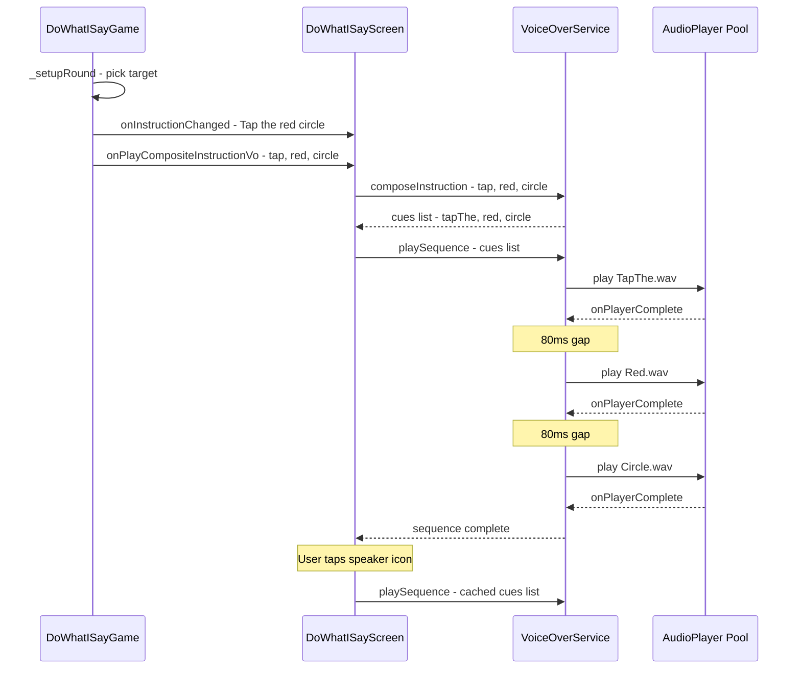

# Composite Voice-Over Playback Design

**Date:** 2026-04-24
**Status:** Draft
**Scope:** `shared_audio` · `game_core` · `main_app` · `game_lab`

---

## 1. Problem Statement

The **Do What I Say** game generates text instructions like *"Tap the red circle"* but currently plays only generic voice-over cues (`listenCarefully`, `listen`). The game needs to **speak the actual instruction** by composing individual audio clips in sequence:

```
TapThe.wav → Red.wav → Circle.wav
```

Voice-over assets for Dynamic verbs, Colors, and Shapes already exist in [`packages/assets/audio/Voice_Over/`](packages/assets/audio/Voice_Over/) but are not yet integrated into the [`VoiceOverService`](packages/shared_audio/lib/src/voice_over_service.dart:407) or registered in its enum system.

---

## 2. Current Architecture

### 2.1 Asset Layout

Source assets live in `packages/assets/audio/Voice_Over/` with human-friendly folder names:

| Folder | Files | Purpose |
|--------|-------|---------|
| `Dynamic/` | `TapThe.wav`, `DragThe.wav`, `DropThe.wav` | Action verb phrases |
| `Colors/` | `Red.wav`, `Blue.wav`, `Green.wav`, `Yellow.wav`, `Purple.wav`, `Orange.wav` + 9 more | Color word clips |
| `Shapes/` | `Circle.wav`, `Star.wav`, `Triangle.wav`, `Diamond.wav` + 3 more | Shape word clips |

Runtime assets are copied into [`packages/shared_audio/assets/audio/voice_over/<snake_case>/`](packages/shared_audio/assets/audio/voice_over/) following the existing convention.

### 2.2 VoiceOverService

- [`VoiceOverCategory`](packages/shared_audio/lib/src/voice_over_service.dart:7) enum — 8 categories today, no `dynamic`/`shapes`/`colors`
- [`VoiceOverCue`](packages/shared_audio/lib/src/voice_over_service.dart:22) enum — ~90 cues, each mapped to a `.wav` path in [`_cueAssetPaths`](packages/shared_audio/lib/src/voice_over_service.dart:235)
- [`play()`](packages/shared_audio/lib/src/voice_over_service.dart:518) — plays a single cue using a 3-player pool with 300ms debounce
- [`playRandom()`](packages/shared_audio/lib/src/voice_over_service.dart:564) — picks a random cue from a category
- **No sequential/composite playback capability**

### 2.3 Do What I Say Game

- [`DoWhatISayGame`](packages/game_core/lib/src/games/do_what_i_say/do_what_i_say_game.dart:15) generates instructions at [line 181](packages/game_core/lib/src/games/do_what_i_say/do_what_i_say_game.dart:181): `'Tap the ${target.colorName} ${target.shapeType}'`
- Uses callback pattern: [`onPlayListenVo`](packages/game_core/lib/src/games/do_what_i_say/do_what_i_say_game.dart:38), [`onPlayInstructionVo`](packages/game_core/lib/src/games/do_what_i_say/do_what_i_say_game.dart:34)
- Screen wires callbacks in [`DoWhatISayScreen`](apps/main_app/lib/features/games/do_what_i_say/do_what_i_say_screen.dart:79)
- Colors used: `red`, `blue`, `green`, `yellow`, `purple`, `orange`
- Shapes used: `circle`, `star`, `triangle`, `diamond`

### 2.4 Callback Architecture

The game core fires `VoidCallback?` events; the screen layer translates them into service calls. This keeps `game_core` free of audio dependencies:

```
DoWhatISayGame                    DoWhatISayScreen
  onPlayCorrectVo?.call() ──────► _voiceOverService.playCorrectPraise()
  onPlayListenVo?.call()  ──────► _voiceOverService.play(VoiceOverCue.listenCarefully)
```

---

## 3. Design Decisions

### 3.1 Asset Organization — Copy into `shared_audio`

**Decision:** Copy the Dynamic/Colors/Shapes `.wav` files into `packages/shared_audio/assets/audio/voice_over/` following the existing snake_case convention.

**Rationale:**
- All existing voice-over assets already live in `shared_audio` — the [`_assetPrefix`](packages/shared_audio/lib/src/voice_over_service.dart:409) is hardcoded to `packages/shared_audio/assets/audio`
- The [`pubspec.yaml`](packages/shared_audio/pubspec.yaml:20) declares asset directories under this path
- Referencing `packages/assets/` would require a cross-package asset dependency, which Flutter does not support natively
- `packages/assets/` serves as the **source-of-truth master library**; `shared_audio` holds the **runtime copies**

**New directories:**
```
packages/shared_audio/assets/audio/voice_over/
  dynamic/
    TapThe.wav
    DragThe.wav
    DropThe.wav
  colors/
    Red.wav
    Blue.wav
    Green.wav
    Yellow.wav
    Purple.wav
    Orange.wav
  shapes/
    Circle.wav
    Star.wav
    Triangle.wav
    Diamond.wav
```

> **Note:** Only the clips needed by current games are copied. Additional color/shape clips can be added later as games expand.

### 3.2 New Enum Values

Add three new categories and their cues to the existing enums:

```dart
// ── VoiceOverCategory additions ──
enum VoiceOverCategory {
  // ... existing 8 categories ...
  dynamic,    // Action verb phrases: "Tap the", "Drag the", "Drop the"
  colors,     // Color word clips: "Red", "Blue", etc.
  shapes,     // Shape word clips: "Circle", "Star", etc.
}
```

```dart
// ── VoiceOverCue additions ──
enum VoiceOverCue {
  // ... existing ~90 cues ...

  // ── Dynamic ──
  tapThe,
  dragThe,
  dropThe,

  // ── Colors ──
  red,
  blue,
  green,
  yellow,
  purple,
  orange,

  // ── Shapes ──
  circle,
  star,
  triangle,
  diamond,
}
```

With corresponding entries in [`_cueCategories`](packages/shared_audio/lib/src/voice_over_service.dart:128) and [`_cueAssetPaths`](packages/shared_audio/lib/src/voice_over_service.dart:235):

```dart
// _cueCategories additions
VoiceOverCue.tapThe: VoiceOverCategory.dynamic,
VoiceOverCue.dragThe: VoiceOverCategory.dynamic,
VoiceOverCue.dropThe: VoiceOverCategory.dynamic,

VoiceOverCue.red: VoiceOverCategory.colors,
VoiceOverCue.blue: VoiceOverCategory.colors,
// ... etc.

VoiceOverCue.circle: VoiceOverCategory.shapes,
VoiceOverCue.star: VoiceOverCategory.shapes,
// ... etc.

// _cueAssetPaths additions
VoiceOverCue.tapThe: 'voice_over/dynamic/TapThe.wav',
VoiceOverCue.dragThe: 'voice_over/dynamic/DragThe.wav',
VoiceOverCue.dropThe: 'voice_over/dynamic/DropThe.wav',

VoiceOverCue.red: 'voice_over/colors/Red.wav',
VoiceOverCue.blue: 'voice_over/colors/Blue.wav',
// ... etc.

VoiceOverCue.circle: 'voice_over/shapes/Circle.wav',
VoiceOverCue.star: 'voice_over/shapes/Star.wav',
// ... etc.
```

### 3.3 Sequential Playback — `playSequence()`

Add a new method to [`VoiceOverService`](packages/shared_audio/lib/src/voice_over_service.dart:407) that plays a list of cues one after another:

```dart
/// Play a sequence of voice-over cues one after another.
///
/// Each cue plays to completion before the next begins, with an
/// optional [gap] of silence between clips for natural pacing.
///
/// Returns a [Future] that completes when the entire sequence has
/// finished playing, or immediately if playback is disabled.
///
/// If [stop] is called during sequence playback, the remaining
/// cues are cancelled.
///
/// Example:
/// ```dart
/// await voiceOver.playSequence([
///   VoiceOverCue.tapThe,
///   VoiceOverCue.red,
///   VoiceOverCue.circle,
/// ]);
/// ```
Future<void> playSequence(
  List<VoiceOverCue> cues, {
  Duration gap = const Duration(milliseconds: 80),
}) async {
  if (!_enabled || cues.isEmpty) return;

  _isPlayingSequence = true;

  for (int i = 0; i < cues.length; i++) {
    if (!_isPlayingSequence || !_enabled) break;

    final cue = cues[i];
    final relativePath = _cueAssetPaths[cue];
    if (relativePath == null) {
      debugPrint('[VoiceOverService] ✖ No asset for: ${cue.name}');
      continue;
    }

    final assetPath = '$_assetPrefix/$relativePath';
    final player = _getAvailablePlayer();

    try {
      // Stop any currently playing cue
      for (final p in _players) {
        if (p.state == PlayerState.playing) p.stop();
      }

      player.setReleaseMode(ReleaseMode.stop);
      await player.setVolume(_volume);

      debugPrint(
        '[VoiceOverService] 🗣 Sequence [${i + 1}/${cues.length}]: ${cue.name}',
      );

      await player.play(AssetSource(assetPath));

      // Wait for this clip to finish before playing the next
      await player.onPlayerComplete.first;

      // Insert gap between clips (not after the last one)
      if (i < cues.length - 1 && gap > Duration.zero) {
        await Future.delayed(gap);
      }
    } catch (e) {
      debugPrint('[VoiceOverService] ✖ Sequence error "${cue.name}": $e');
    }
  }

  _isPlayingSequence = false;
  _lastPlayTime = DateTime.now(); // Reset debounce after sequence
}
```

**Key design points:**

| Concern | Approach |
|---------|----------|
| **Completion detection** | `await player.onPlayerComplete.first` — listens for the `audioplayers` completion event |
| **Inter-clip gap** | Default 80ms gap for natural speech pacing; configurable per call |
| **Cancellation** | `_isPlayingSequence` flag checked before each clip; [`stop()`](packages/shared_audio/lib/src/voice_over_service.dart:595) sets it to `false` |
| **Debounce bypass** | `playSequence` does NOT use the 300ms debounce — it manages its own timing internally |
| **Player pool reuse** | Uses the same [`_getAvailablePlayer()`](packages/shared_audio/lib/src/voice_over_service.dart:495) pool mechanism |

**State additions to `VoiceOverService`:**

```dart
/// Whether a sequence is currently being played.
bool _isPlayingSequence = false;

/// Whether a composite sequence is in progress.
bool get isPlayingSequence => _isPlayingSequence;
```

**Updated `stop()` method:**

```dart
Future<void> stop() async {
  _isPlayingSequence = false; // Cancel any in-progress sequence
  for (final player in _players) {
    await player.stop();
  }
}
```

### 3.4 Instruction Composer — Helper for Game Integration

Add a static helper that maps game instruction data to a cue sequence. This lives in `VoiceOverService` as a convenience method:

```dart
/// Compose a voice-over cue sequence for a game instruction.
///
/// Maps an action verb, color name, and shape type to the
/// corresponding [VoiceOverCue] values.
///
/// Returns null if any component cannot be mapped.
///
/// Example:
/// ```dart
/// final cues = VoiceOverService.composeInstruction(
///   action: 'tap',
///   color: 'red',
///   shape: 'circle',
/// );
/// // Returns [VoiceOverCue.tapThe, VoiceOverCue.red, VoiceOverCue.circle]
/// ```
static List<VoiceOverCue>? composeInstruction({
  required String action,
  required String color,
  required String shape,
}) {
  final actionCue = _actionToCue[action.toLowerCase()];
  final colorCue = _colorToCue[color.toLowerCase()];
  final shapeCue = _shapeToCue[shape.toLowerCase()];

  if (actionCue == null || colorCue == null || shapeCue == null) {
    debugPrint(
      '[VoiceOverService] ✖ Cannot compose: '
      'action=$action color=$color shape=$shape',
    );
    return null;
  }

  return [actionCue, colorCue, shapeCue];
}

static const _actionToCue = {
  'tap': VoiceOverCue.tapThe,
  'drag': VoiceOverCue.dragThe,
  'drop': VoiceOverCue.dropThe,
};

static const _colorToCue = {
  'red': VoiceOverCue.red,
  'blue': VoiceOverCue.blue,
  'green': VoiceOverCue.green,
  'yellow': VoiceOverCue.yellow,
  'purple': VoiceOverCue.purple,
  'orange': VoiceOverCue.orange,
};

static const _shapeToCue = {
  'circle': VoiceOverCue.circle,
  'star': VoiceOverCue.star,
  'triangle': VoiceOverCue.triangle,
  'diamond': VoiceOverCue.diamond,
};
```

---

## 4. Game Integration

### 4.1 Game Core Changes — New Callback

Add a new callback to [`DoWhatISayGame`](packages/game_core/lib/src/games/do_what_i_say/do_what_i_say_game.dart:15) that passes the instruction components to the screen layer:

```dart
/// Called when a new instruction is generated, providing the action,
/// color, and shape for composite voice-over playback.
final void Function(String action, String color, String shape)?
    onPlayCompositeInstructionVo;
```

In [`_setupRound()`](packages/game_core/lib/src/games/do_what_i_say/do_what_i_say_game.dart:125), fire this callback instead of `onPlayListenVo`:

```dart
// Current (line 185):
onPlayListenVo?.call();

// New:
onPlayCompositeInstructionVo?.call('tap', target.colorName, target.shapeType);
```

### 4.2 Screen Layer Changes

In [`DoWhatISayScreen`](apps/main_app/lib/features/games/do_what_i_say/do_what_i_say_screen.dart:79), wire the new callback:

```dart
_game = DoWhatISayGame(
  // ... existing callbacks ...

  // Replace onPlayListenVo with composite instruction VO
  onPlayCompositeInstructionVo: (action, color, shape) {
    final cues = VoiceOverService.composeInstruction(
      action: action,
      color: color,
      shape: shape,
    );
    if (cues != null) {
      _voiceOverService.playSequence(cues);
    }
  },
);
```

Wire the [`VoiceOverPromptBubble`](packages/shared_ui/lib/src/widgets/voice_over_prompt_bubble.dart:14) speaker-tap to replay the composite instruction:

```dart
VoiceOverPromptBubble(
  text: _instruction,
  isVisible: !_gameComplete,
  onPlayVoiceOver: () {
    // Replay the current composite instruction
    if (_currentInstructionCues != null) {
      _voiceOverService.playSequence(_currentInstructionCues!);
    }
  },
  autoPlayOnAppear: false, // Game controls when VO plays
),
```

This requires storing the current cue sequence in the screen state:

```dart
List<VoiceOverCue>? _currentInstructionCues;
```

### 4.3 Sequence Flow Diagram



---

## 5. Reusability for Other Games

### 5.1 Match It

[`MatchItGame`](packages/game_core/lib/src/games/match_it/match_it_game.dart:34) currently uses shape labels like `'Gold Star'`, `'Blue Circle'`. It could add a composite VO callback for instructions like *"Match the blue circle"*:

```dart
// Future: MatchItGame could add
onPlayCompositeInstructionVo?.call('match', 'blue', 'circle');
```

This would require a `MatchThe.wav` clip in the Dynamic category — a future asset addition.

### 5.2 Copy Me

[`CopyMeShapeType`](packages/game_core/lib/src/games/copy_me/components/sequence_shape.dart:12) uses `circle`, `star`, `heart`, `diamond`. The shape cues can be reused for announcing sequence items:

```dart
// Future: "Tap the star" during demo phase
await voiceOver.playSequence([VoiceOverCue.tapThe, VoiceOverCue.star]);
```

### 5.3 Extension Pattern

The `composeInstruction` helper and `playSequence` method are game-agnostic. Any game can:

1. Call `VoiceOverService.composeInstruction()` with its instruction components
2. Call `playSequence()` with any arbitrary list of `VoiceOverCue` values
3. Mix composite cues with existing single cues — e.g., play a praise cue after a sequence

---

## 6. Edge Cases and Error Handling

| Scenario | Behavior |
|----------|----------|
| **VO disabled mid-sequence** | `_enabled` check before each clip; remaining clips skipped |
| **`stop()` called mid-sequence** | `_isPlayingSequence = false`; loop exits cleanly |
| **New sequence requested while one is playing** | Call `stop()` first, then start new sequence |
| **Missing asset file** | `debugPrint` warning; skip that clip, continue sequence |
| **Unknown color/shape string** | `composeInstruction` returns `null`; caller falls back to generic VO |
| **App backgrounded during sequence** | AudioPlayer handles pause/resume natively; sequence resumes on foreground |
| **Rapid instruction changes** | New `onPlayCompositeInstructionVo` call triggers `stop()` + new `playSequence()` |

---

## 7. Implementation Checklist

### 7.1 Asset Setup
- [ ] Create `packages/shared_audio/assets/audio/voice_over/dynamic/` directory
- [ ] Create `packages/shared_audio/assets/audio/voice_over/colors/` directory
- [ ] Create `packages/shared_audio/assets/audio/voice_over/shapes/` directory
- [ ] Copy `TapThe.wav`, `DragThe.wav`, `DropThe.wav` from `packages/assets/audio/Voice_Over/Dynamic/`
- [ ] Copy `Red.wav`, `Blue.wav`, `Green.wav`, `Yellow.wav`, `Purple.wav`, `Orange.wav` from `packages/assets/audio/Voice_Over/Colors/`
- [ ] Copy `Circle.wav`, `Star.wav`, `Triangle.wav`, `Diamond.wav` from `packages/assets/audio/Voice_Over/Shapes/`
- [ ] Add new asset directories to [`packages/shared_audio/pubspec.yaml`](packages/shared_audio/pubspec.yaml:20) flutter assets section

### 7.2 VoiceOverService Enums
- [ ] Add `dynamic`, `colors`, `shapes` to [`VoiceOverCategory`](packages/shared_audio/lib/src/voice_over_service.dart:7)
- [ ] Add `tapThe`, `dragThe`, `dropThe` cues to [`VoiceOverCue`](packages/shared_audio/lib/src/voice_over_service.dart:22)
- [ ] Add `red`, `blue`, `green`, `yellow`, `purple`, `orange` color cues
- [ ] Add `circle`, `star`, `triangle`, `diamond` shape cues
- [ ] Add entries to [`_cueCategories`](packages/shared_audio/lib/src/voice_over_service.dart:128) map
- [ ] Add entries to [`_cueAssetPaths`](packages/shared_audio/lib/src/voice_over_service.dart:235) map

### 7.3 VoiceOverService Sequential Playback
- [ ] Add `_isPlayingSequence` state field and `isPlayingSequence` getter
- [ ] Implement `playSequence()` method with completion-awaiting and gap timing
- [ ] Update `stop()` to cancel in-progress sequences
- [ ] Add static `composeInstruction()` helper with action/color/shape lookup maps

### 7.4 Game Core Integration
- [ ] Add `onPlayCompositeInstructionVo` callback to [`DoWhatISayGame`](packages/game_core/lib/src/games/do_what_i_say/do_what_i_say_game.dart:15) constructor
- [ ] Fire `onPlayCompositeInstructionVo` in [`_setupRound()`](packages/game_core/lib/src/games/do_what_i_say/do_what_i_say_game.dart:125) with action, color, shape
- [ ] Keep `onPlayListenVo` as fallback for backward compatibility

### 7.5 Screen Layer Integration
- [ ] Add `_currentInstructionCues` state to [`DoWhatISayScreen`](apps/main_app/lib/features/games/do_what_i_say/do_what_i_say_screen.dart:43)
- [ ] Wire `onPlayCompositeInstructionVo` callback in screen's `initState`
- [ ] Wire [`VoiceOverPromptBubble.onPlayVoiceOver`](packages/shared_ui/lib/src/widgets/voice_over_prompt_bubble.dart:29) to replay cached sequence
- [ ] Set `autoPlayOnAppear: false` since game controls VO timing

### 7.6 Game Lab / Testing
- [ ] Add Dynamic/Colors/Shapes categories to [`AudioTesterScreen`](apps/game_lab/lib/screens/audio_tester_screen.dart:15) category selector
- [ ] Add a "Test Sequence" button to play a sample composite instruction
- [ ] Update `_getCueCategory()` helper to handle new cue names

---

## 8. Files Modified

| File | Change |
|------|--------|
| `packages/shared_audio/pubspec.yaml` | Add 3 new asset directories |
| `packages/shared_audio/lib/src/voice_over_service.dart` | New categories, cues, `playSequence()`, `composeInstruction()` |
| `packages/game_core/lib/src/games/do_what_i_say/do_what_i_say_game.dart` | New `onPlayCompositeInstructionVo` callback |
| `apps/main_app/lib/features/games/do_what_i_say/do_what_i_say_screen.dart` | Wire composite VO, cache cues, replay on speaker tap |
| `apps/game_lab/lib/screens/audio_tester_screen.dart` | New categories in tester UI |

**New files/directories:**
- `packages/shared_audio/assets/audio/voice_over/dynamic/*.wav`
- `packages/shared_audio/assets/audio/voice_over/colors/*.wav`
- `packages/shared_audio/assets/audio/voice_over/shapes/*.wav`
