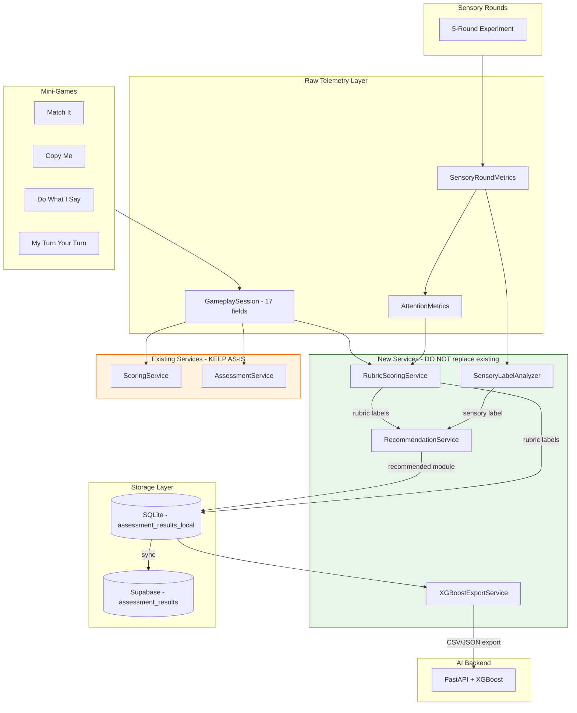
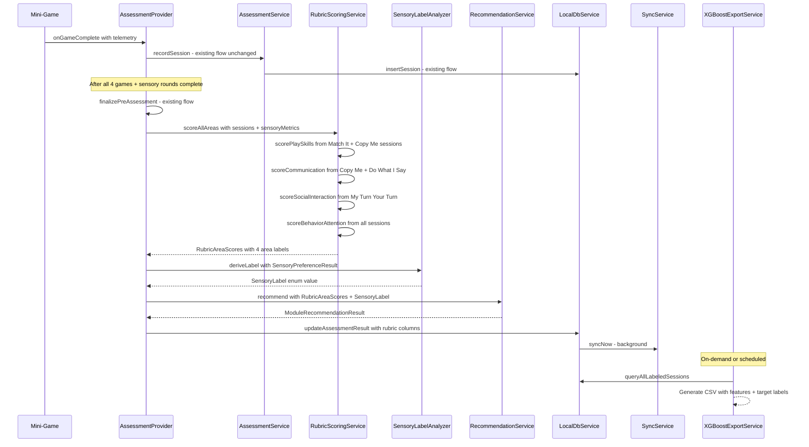

# Rubric Scoring & XGBoost-Ready Telemetry Flow

**Date:** 2026-04-24  
**Status:** Draft  
**Author:** Architecture Mode  

> **⚠️ IMPORTANT DISCLAIMER**  
> This system does **NOT** diagnose autism or any medical condition. It classifies
> **game-based performance levels** to personalize a child's learning path within
> the Aumazing app. Labels like "Needs Support" refer exclusively to in-app
> skill areas and recommended modules — they are **not clinical assessments**.
> Parents/caregivers should consult qualified professionals for developmental
> evaluations.

---

## 1. Overview

### What This System Does

The Rubric Scoring system adds a **structured, multi-area assessment layer** on
top of the existing pre-assessment flow. After a child completes the 4 mini-games
and 5 sensory rounds, the system:

1. **Converts raw telemetry** (accuracy, idle time, prompt counts, etc.) into
   **validated rubric labels** across 5 assessment areas.
2. **Derives sensory preferences** by comparing baseline performance against
   music-only, haptic-only, and combined conditions.
3. **Maps rubric labels to recommended modules** with sensory-aware settings.
4. **Persists labels** in both SQLite and Supabase for offline-first access.
5. **Exports XGBoost-ready rows** so the AI backend can train on rubric labels
   as supervised targets instead of unsupervised clusters.

### Why

The existing [`ScoringService`](apps/main_app/lib/services/scoring_service.dart)
uses coarse `strong/developing/emerging` labels based solely on accuracy. The new
system:

- Adds **per-area rubric thresholds** using multiple telemetry signals (accuracy,
  completion rate, prompt dependency, idle time, etc.).
- Produces **clinically-informed but non-diagnostic labels** aligned with
  developmental observation frameworks.
- Creates a **labeled dataset** for XGBoost supervised training, replacing the
  current synthetic training data.
- Keeps the existing `ScoringService` **untouched** for backward compatibility.

---

## 2. Architecture Diagram



---

## 3. Data Flow

### Step-by-Step: Game Completion to XGBoost Export



### Detailed Flow

1. **Game completes** — [`AssessmentProvider.recordGameSession()`](apps/main_app/lib/providers/assessment_provider.dart:79) stores a [`GameplaySession`](apps/main_app/lib/model/gameplay_session.dart:3) via existing [`AssessmentService`](apps/main_app/lib/services/assessment_service.dart:12). **No changes here.**

2. **All 4 games done** — [`AssessmentProvider.finalizePreAssessment()`](apps/main_app/lib/providers/assessment_provider.dart:112) creates [`AssessmentResult`](apps/main_app/lib/model/assessment_result.dart:2) records per game. **Existing flow preserved.**

3. **New: Rubric scoring** — After finalization, `AssessmentProvider` calls `RubricScoringService.scoreAllAreas()` with the collected `GameplaySession` list and `SensoryRoundMetrics` list.

4. **New: Sensory label** — `SensoryLabelAnalyzer` derives a human-readable sensory label from the existing [`SensoryPreferenceResult`](apps/main_app/lib/features/pre_assessment/sensory/sensory_preference_analyzer.dart:9).

5. **New: Recommendation** — `RecommendationService.recommend()` maps rubric labels + sensory label to a specific module with sensory-aware settings.

6. **New: Persist** — Rubric labels, sensory label, recommended module, and overall summary are written to new columns on `assessment_results_local` / `assessment_results`.

7. **New: XGBoost export** — `XGBoostExportService` queries labeled sessions and produces a feature matrix with rubric labels as target columns.

---

## 4. New File Locations

| # | File | Purpose |
|---|------|---------|
| 1 | `apps/main_app/lib/services/rubric_scoring_service.dart` | Converts telemetry into rubric labels for 5 areas |
| 2 | `apps/main_app/lib/services/rubric_labels.dart` | Enums and constants for all rubric label values |
| 3 | `apps/main_app/lib/services/sensory_label_analyzer.dart` | Derives sensory preference label string from SensoryPreferenceResult |
| 4 | `apps/main_app/lib/services/recommendation_service.dart` | Maps rubric labels to module recommendations |
| 5 | `apps/main_app/lib/services/xgboost_export_service.dart` | Generates XGBoost-ready CSV/JSON from labeled data |
| 6 | `apps/main_app/lib/model/rubric_result.dart` | Data class holding all 5 rubric labels + metadata |
| 7 | `apps/main_app/lib/model/module_recommendation_result.dart` | Data class for recommendation output |
| 8 | `supabase/migrations/20260425_rubric_scoring_columns.sql` | Supabase migration for new columns |

### Files to Modify (not replace)

| # | File | Change |
|---|------|--------|
| 1 | [`local_db_service.dart`](apps/main_app/lib/core/services/local_db_service.dart) | Bump `_dbVersion` to 11, add migration for new columns |
| 2 | [`assessment_provider.dart`](apps/main_app/lib/providers/assessment_provider.dart) | Add `RubricResult?` state, call new services after finalization |
| 3 | [`assessment_repository.dart`](apps/main_app/lib/core/repositories/assessment_repository.dart) | Add `saveRubricResult()` method |
| 4 | [`assessment_result.dart`](apps/main_app/lib/model/assessment_result.dart) | Add optional rubric label fields |
| 5 | [`gameplay_session.dart`](apps/main_app/lib/model/gameplay_session.dart) | Add new telemetry fields with defaults |

---

## 5. Interface Definitions

### 5.1 RubricLabels — Enums

```dart
// apps/main_app/lib/services/rubric_labels.dart

/// Labels for Play Skills, Communication, Social Interaction
enum PerformanceLabel {
  strength,
  emerging,
  needsSupport;

  String get displayName => switch (this) {
    strength => 'Strength',
    emerging => 'Emerging',
    needsSupport => 'Needs Support',
  };
}

/// Labels for Behavior/Attention
enum AttentionLabel {
  sustainedAttention,
  variableAttention,
  needsAttentionSupport;

  String get displayName => switch (this) {
    sustainedAttention => 'Sustained Attention',
    variableAttention => 'Variable Attention',
    needsAttentionSupport => 'Needs Attention Support',
  };
}

/// Labels for Sensory Preference
enum SensoryLabel {
  musicHelps,
  hapticHelps,
  musicAndHapticHelp,
  noSensorySupportNeeded,
  avoidMusic,
  avoidHaptic;

  String get displayName => switch (this) {
    musicHelps => 'Music Helps',
    hapticHelps => 'Haptic Helps',
    musicAndHapticHelp => 'Music and Haptic Help',
    noSensorySupportNeeded => 'No Sensory Support Needed',
    avoidMusic => 'Avoid Music',
    avoidHaptic => 'Avoid Haptic',
  };
}
```

### 5.2 RubricResult — Data Class

```dart
// apps/main_app/lib/model/rubric_result.dart

class RubricResult {
  final PerformanceLabel playSkills;
  final PerformanceLabel communication;
  final PerformanceLabel socialInteraction;
  final AttentionLabel behaviorAttention;
  final SensoryLabel sensoryPreference;
  final String recommendedModule;
  final String overallSummary;
  final String modelSource; // 'rubric_based' or 'xgboost_v1'
  final bool xgboostReady;
  final DateTime scoredAt;

  const RubricResult({
    required this.playSkills,
    required this.communication,
    required this.socialInteraction,
    required this.behaviorAttention,
    required this.sensoryPreference,
    required this.recommendedModule,
    required this.overallSummary,
    this.modelSource = 'rubric_based',
    this.xgboostReady = true,
    required this.scoredAt,
  });

  Map<String, dynamic> toMap() => {
    'play_skills_label': playSkills.name,
    'communication_label': communication.name,
    'social_interaction_label': socialInteraction.name,
    'behavior_attention_label': behaviorAttention.name,
    'sensory_preference_label': sensoryPreference.name,
    'recommended_module': recommendedModule,
    'overall_summary': overallSummary,
    'model_source': modelSource,
    'xgboost_ready': xgboostReady ? 1 : 0,
  };

  factory RubricResult.fromMap(Map<String, dynamic> map) => RubricResult(
    playSkills: PerformanceLabel.values.byName(map['play_skills_label']),
    communication: PerformanceLabel.values.byName(map['communication_label']),
    socialInteraction: PerformanceLabel.values.byName(map['social_interaction_label']),
    behaviorAttention: AttentionLabel.values.byName(map['behavior_attention_label']),
    sensoryPreference: SensoryLabel.values.byName(map['sensory_preference_label']),
    recommendedModule: map['recommended_module'] as String,
    overallSummary: map['overall_summary'] as String,
    modelSource: map['model_source'] as String? ?? 'rubric_based',
    xgboostReady: (map['xgboost_ready'] as int?) == 1,
    scoredAt: DateTime.now(),
  );
}
```

### 5.3 RubricScoringService

```dart
// apps/main_app/lib/services/rubric_scoring_service.dart

class RubricScoringService {
  const RubricScoringService();

  /// Score all 4 performance areas from gameplay sessions.
  /// Does NOT handle sensory — that comes from SensoryLabelAnalyzer.
  RubricAreaScores scoreAllAreas({
    required List<GameplaySession> sessions,
    required List<SensoryRoundMetrics> sensoryMetrics,
  });

  /// Individual area scorers (public for testing)
  PerformanceLabel scorePlaySkills(List<GameplaySession> sessions);
  PerformanceLabel scoreCommunication(List<GameplaySession> sessions);
  PerformanceLabel scoreSocialInteraction(List<GameplaySession> sessions);
  AttentionLabel scoreBehaviorAttention({
    required List<GameplaySession> sessions,
    required List<SensoryRoundMetrics> sensoryMetrics,
  });
}

/// Intermediate result before sensory label is added
class RubricAreaScores {
  final PerformanceLabel playSkills;
  final PerformanceLabel communication;
  final PerformanceLabel socialInteraction;
  final AttentionLabel behaviorAttention;

  const RubricAreaScores({
    required this.playSkills,
    required this.communication,
    required this.socialInteraction,
    required this.behaviorAttention,
  });
}
```

### 5.4 SensoryLabelAnalyzer

```dart
// apps/main_app/lib/services/sensory_label_analyzer.dart

class SensoryLabelAnalyzer {
  const SensoryLabelAnalyzer();

  /// Derive a sensory preference label from the existing
  /// SensoryPreferenceResult (produced by the existing analyzer).
  SensoryLabel deriveLabel(SensoryPreferenceResult result);
}
```

### 5.5 RecommendationService

```dart
// apps/main_app/lib/services/recommendation_service.dart

class RecommendationService {
  const RecommendationService();

  /// Generate a module recommendation from rubric scores + sensory label.
  ModuleRecommendationResult recommend({
    required RubricAreaScores scores,
    required SensoryLabel sensoryLabel,
  });
}
```

```dart
// apps/main_app/lib/model/module_recommendation_result.dart

class ModuleRecommendationResult {
  final String moduleId;
  final String moduleName;
  final String rationale;
  final bool musicEnabled;
  final bool hapticEnabled;
  final int startingLevel;

  const ModuleRecommendationResult({
    required this.moduleId,
    required this.moduleName,
    required this.rationale,
    required this.musicEnabled,
    required this.hapticEnabled,
    this.startingLevel = 1,
  });
}
```

### 5.6 XGBoostExportService

```dart
// apps/main_app/lib/services/xgboost_export_service.dart

class XGBoostExportService {
  final LocalDbService _localDb;

  XGBoostExportService({LocalDbService? localDb});

  /// Export all labeled assessment data as XGBoost-ready rows.
  /// Returns a list of maps where each map is one training row.
  Future<List<Map<String, dynamic>>> exportTrainingData({
    String? childId, // null = all children
  });

  /// Export as CSV string for file download.
  Future<String> exportAsCsv({String? childId});
}
```

---

## 6. Database Schema Changes

### 6.1 SQLite Migration (v10 to v11)

Add to [`LocalDbService._onUpgrade()`](apps/main_app/lib/core/services/local_db_service.dart:97) when `oldVersion < 11`:

```sql
-- New rubric columns on assessment_results_local
ALTER TABLE assessment_results_local ADD COLUMN play_skills_label TEXT;
ALTER TABLE assessment_results_local ADD COLUMN communication_label TEXT;
ALTER TABLE assessment_results_local ADD COLUMN social_interaction_label TEXT;
ALTER TABLE assessment_results_local ADD COLUMN behavior_attention_label TEXT;
ALTER TABLE assessment_results_local ADD COLUMN sensory_preference_label TEXT;
ALTER TABLE assessment_results_local ADD COLUMN recommended_module TEXT;
ALTER TABLE assessment_results_local ADD COLUMN overall_summary TEXT;
ALTER TABLE assessment_results_local ADD COLUMN model_source TEXT DEFAULT 'rubric_based';
ALTER TABLE assessment_results_local ADD COLUMN xgboost_ready INTEGER DEFAULT 1;

-- New telemetry columns on game_sessions_local
ALTER TABLE game_sessions_local ADD COLUMN task_completion_rate REAL;
ALTER TABLE game_sessions_local ADD COLUMN prompt_dependency_score REAL;
ALTER TABLE game_sessions_local ADD COLUMN turn_taking_success_rate REAL;
ALTER TABLE game_sessions_local ADD COLUMN interruption_count INTEGER;
ALTER TABLE game_sessions_local ADD COLUMN waiting_tolerance_seconds REAL;
ALTER TABLE game_sessions_local ADD COLUMN time_to_first_touch REAL;
ALTER TABLE game_sessions_local ADD COLUMN time_to_first_valid_action REAL;
ALTER TABLE game_sessions_local ADD COLUMN time_to_completion REAL;
ALTER TABLE game_sessions_local ADD COLUMN sensory_condition TEXT;
```

**Dart migration code pattern** (follows existing style in [`local_db_service.dart`](apps/main_app/lib/core/services/local_db_service.dart:706)):

```dart
if (oldVersion < 11) {
  // Rubric label columns on assessment_results_local
  await db.execute(
    'ALTER TABLE ${LocalTables.assessmentResults} ADD COLUMN play_skills_label TEXT',
  );
  await db.execute(
    'ALTER TABLE ${LocalTables.assessmentResults} ADD COLUMN communication_label TEXT',
  );
  await db.execute(
    'ALTER TABLE ${LocalTables.assessmentResults} ADD COLUMN social_interaction_label TEXT',
  );
  await db.execute(
    'ALTER TABLE ${LocalTables.assessmentResults} ADD COLUMN behavior_attention_label TEXT',
  );
  await db.execute(
    'ALTER TABLE ${LocalTables.assessmentResults} ADD COLUMN sensory_preference_label TEXT',
  );
  await db.execute(
    'ALTER TABLE ${LocalTables.assessmentResults} ADD COLUMN recommended_module TEXT',
  );
  await db.execute(
    'ALTER TABLE ${LocalTables.assessmentResults} ADD COLUMN overall_summary TEXT',
  );
  await db.execute(
    "ALTER TABLE ${LocalTables.assessmentResults} ADD COLUMN model_source TEXT DEFAULT 'rubric_based'",
  );
  await db.execute(
    'ALTER TABLE ${LocalTables.assessmentResults} ADD COLUMN xgboost_ready INTEGER DEFAULT 1',
  );

  // Extended telemetry columns on game_sessions_local
  await db.execute(
    'ALTER TABLE ${LocalTables.gameSessions} ADD COLUMN task_completion_rate REAL',
  );
  await db.execute(
    'ALTER TABLE ${LocalTables.gameSessions} ADD COLUMN prompt_dependency_score REAL',
  );
  await db.execute(
    'ALTER TABLE ${LocalTables.gameSessions} ADD COLUMN turn_taking_success_rate REAL',
  );
  await db.execute(
    'ALTER TABLE ${LocalTables.gameSessions} ADD COLUMN interruption_count INTEGER',
  );
  await db.execute(
    'ALTER TABLE ${LocalTables.gameSessions} ADD COLUMN waiting_tolerance_seconds REAL',
  );
  await db.execute(
    'ALTER TABLE ${LocalTables.gameSessions} ADD COLUMN time_to_first_touch REAL',
  );
  await db.execute(
    'ALTER TABLE ${LocalTables.gameSessions} ADD COLUMN time_to_first_valid_action REAL',
  );
  await db.execute(
    'ALTER TABLE ${LocalTables.gameSessions} ADD COLUMN time_to_completion REAL',
  );
  await db.execute(
    'ALTER TABLE ${LocalTables.gameSessions} ADD COLUMN sensory_condition TEXT',
  );
  debugPrint('[LocalDbService] Added rubric + telemetry columns (v11)');
}
```

### 6.2 Supabase Migration

File: `supabase/migrations/20260425_rubric_scoring_columns.sql`

```sql
-- ============================================================
-- Migration: Rubric Scoring & XGBoost-Ready Columns
-- Date: 2026-04-25
-- Description: Adds rubric label columns to assessment_results
--              and extended telemetry columns to game_sessions.
-- ============================================================

-- 1. Rubric label columns on assessment_results
ALTER TABLE assessment_results ADD COLUMN IF NOT EXISTS play_skills_label TEXT;
ALTER TABLE assessment_results ADD COLUMN IF NOT EXISTS communication_label TEXT;
ALTER TABLE assessment_results ADD COLUMN IF NOT EXISTS social_interaction_label TEXT;
ALTER TABLE assessment_results ADD COLUMN IF NOT EXISTS behavior_attention_label TEXT;
ALTER TABLE assessment_results ADD COLUMN IF NOT EXISTS sensory_preference_label TEXT;
ALTER TABLE assessment_results ADD COLUMN IF NOT EXISTS recommended_module TEXT;
ALTER TABLE assessment_results ADD COLUMN IF NOT EXISTS overall_summary TEXT;
ALTER TABLE assessment_results ADD COLUMN IF NOT EXISTS model_source TEXT DEFAULT 'rubric_based';
ALTER TABLE assessment_results ADD COLUMN IF NOT EXISTS xgboost_ready BOOLEAN DEFAULT true;

-- Check constraints for rubric labels
ALTER TABLE assessment_results ADD CONSTRAINT IF NOT EXISTS chk_play_skills_label
  CHECK (play_skills_label IS NULL OR play_skills_label IN
    ('strength', 'emerging', 'needsSupport'));

ALTER TABLE assessment_results ADD CONSTRAINT IF NOT EXISTS chk_communication_label
  CHECK (communication_label IS NULL OR communication_label IN
    ('strength', 'emerging', 'needsSupport'));

ALTER TABLE assessment_results ADD CONSTRAINT IF NOT EXISTS chk_social_interaction_label
  CHECK (social_interaction_label IS NULL OR social_interaction_label IN
    ('strength', 'emerging', 'needsSupport'));

ALTER TABLE assessment_results ADD CONSTRAINT IF NOT EXISTS chk_behavior_attention_label
  CHECK (behavior_attention_label IS NULL OR behavior_attention_label IN
    ('sustainedAttention', 'variableAttention', 'needsAttentionSupport'));

ALTER TABLE assessment_results ADD CONSTRAINT IF NOT EXISTS chk_sensory_preference_label
  CHECK (sensory_preference_label IS NULL OR sensory_preference_label IN
    ('musicHelps', 'hapticHelps', 'musicAndHapticHelp',
     'noSensorySupportNeeded', 'avoidMusic', 'avoidHaptic'));

ALTER TABLE assessment_results ADD CONSTRAINT IF NOT EXISTS chk_model_source
  CHECK (model_source IS NULL OR model_source IN
    ('rubric_based', 'xgboost_v1', 'xgboost_v2'));

-- 2. Extended telemetry columns on game_sessions
ALTER TABLE game_sessions ADD COLUMN IF NOT EXISTS task_completion_rate REAL;
ALTER TABLE game_sessions ADD COLUMN IF NOT EXISTS prompt_dependency_score REAL;
ALTER TABLE game_sessions ADD COLUMN IF NOT EXISTS turn_taking_success_rate REAL;
ALTER TABLE game_sessions ADD COLUMN IF NOT EXISTS interruption_count INTEGER;
ALTER TABLE game_sessions ADD COLUMN IF NOT EXISTS waiting_tolerance_seconds REAL;
ALTER TABLE game_sessions ADD COLUMN IF NOT EXISTS time_to_first_touch REAL;
ALTER TABLE game_sessions ADD COLUMN IF NOT EXISTS time_to_first_valid_action REAL;
ALTER TABLE game_sessions ADD COLUMN IF NOT EXISTS time_to_completion REAL;
ALTER TABLE game_sessions ADD COLUMN IF NOT EXISTS sensory_condition TEXT;

-- 3. Indexes for rubric queries
CREATE INDEX IF NOT EXISTS idx_assessment_results_rubric
  ON assessment_results (play_skills_label, communication_label,
    social_interaction_label, behavior_attention_label)
  WHERE xgboost_ready = true;

CREATE INDEX IF NOT EXISTS idx_assessment_results_model_source
  ON assessment_results (model_source) WHERE model_source IS NOT NULL;
```

### 6.3 Column Summary Table

#### assessment_results / assessment_results_local — New Columns

| Column | Type | Default | Description |
|--------|------|---------|-------------|
| `play_skills_label` | TEXT | NULL | `strength` / `emerging` / `needsSupport` |
| `communication_label` | TEXT | NULL | `strength` / `emerging` / `needsSupport` |
| `social_interaction_label` | TEXT | NULL | `strength` / `emerging` / `needsSupport` |
| `behavior_attention_label` | TEXT | NULL | `sustainedAttention` / `variableAttention` / `needsAttentionSupport` |
| `sensory_preference_label` | TEXT | NULL | One of 6 sensory labels |
| `recommended_module` | TEXT | NULL | Module ID string |
| `overall_summary` | TEXT | NULL | Human-readable summary paragraph |
| `model_source` | TEXT | `rubric_based` | `rubric_based` / `xgboost_v1` / `xgboost_v2` |
| `xgboost_ready` | BOOL/INT | true/1 | Whether this row is valid for XGBoost training |

#### game_sessions / game_sessions_local — New Columns

| Column | Type | Default | Description |
|--------|------|---------|-------------|
| `task_completion_rate` | REAL | NULL | Fraction of tasks completed, 0.0-1.0 |
| `prompt_dependency_score` | REAL | NULL | Ratio of prompts to total items, 0.0-1.0 |
| `turn_taking_success_rate` | REAL | NULL | Success rate for turn-taking games, 0.0-1.0 |
| `interruption_count` | INTEGER | NULL | Times child acted during AI/buddy turn |
| `waiting_tolerance_seconds` | REAL | NULL | Avg seconds child waited during buddy turn |
| `time_to_first_touch` | REAL | NULL | Seconds from stimulus to first screen touch |
| `time_to_first_valid_action` | REAL | NULL | Seconds from stimulus to first valid action |
| `time_to_completion` | REAL | NULL | Seconds from round start to completion |
| `sensory_condition` | TEXT | NULL | `musicOnly` / `hapticOnly` / `baseline` / `combined` / `attention` |

---

## 7. Rubric Scoring Logic

### 7.1 Game to Assessment Area Mapping

| Game | Play Skills | Communication | Social Interaction | Behavior/Attention |
|------|:-----------:|:-------------:|:------------------:|:------------------:|
| Match It | Primary | | | All games |
| Copy Me | Secondary | Primary | | All games |
| Do What I Say | | Primary | | All games |
| My Turn, Your Turn | | | Primary | All games |

This mapping aligns with the existing [`GameRegistry`](packages/game_core/lib/src/registry/game_registry.dart:59) categories, extended with Behavior/Attention as a cross-cutting concern.

### 7.2 Play Skills Rubric

**Source games:** Match It, Copy Me (via [`SkillCategory.playSkills`](packages/game_core/lib/src/registry/skill_category.dart:6))  
**Source fields from [`GameplaySession`](apps/main_app/lib/model/gameplay_session.dart:3):**
- `accuracy` = `score / totalItems`
- `task_completion_rate` (new field, or derived: sessions with score > 0 / total sessions)
- `promptCount`
- `retryCount`

| Label | Accuracy | Completion Rate | Prompt Count avg | Retry Count avg |
|-------|----------|-----------------|------------------|-----------------|
| **Strength** | >= 80% | >= 80% | <= 1 | <= 2 |
| **Emerging** | >= 50% OR | >= 50% | any | any |
| **Needs Support** | < 50% | < 50% | > 3 | > 4 |

**Scoring algorithm:**
```
accuracy = avg(score/totalItems) across Match It + Copy Me sessions
completionRate = count(sessions where score > 0) / count(sessions)
avgPrompts = avg(promptCount) across sessions
avgRetries = avg(retryCount) across sessions

IF accuracy >= 0.8 AND completionRate >= 0.8 AND avgPrompts <= 1 AND avgRetries <= 2:
  return Strength
ELSE IF accuracy >= 0.5 OR completionRate >= 0.5:
  return Emerging
ELSE:
  return Needs Support
```

### 7.3 Communication Rubric

**Source games:** Copy Me, Do What I Say (via [`SkillCategory.communication`](packages/game_core/lib/src/registry/skill_category.dart:4))  
**Source fields:**
- `accuracy` (instruction response accuracy)
- `promptCount` (prompt dependency)
- `prompt_dependency_score` (new: `promptCount / totalItems`)

| Label | Instruction Accuracy | Prompt Count avg | Prompt Dependency |
|-------|---------------------|------------------|-------------------|
| **Strength** | >= 80% | <= 1 | <= 0.15 |
| **Emerging** | 50-79% | 2-3 | 0.15-0.50 |
| **Needs Support** | < 50% | > 3 | > 0.50 |

**Scoring algorithm:**
```
accuracy = avg(score/totalItems) across Copy Me + Do What I Say sessions
avgPrompts = avg(promptCount) across sessions
promptDep = avg(promptCount / totalItems) across sessions

IF accuracy >= 0.8 AND avgPrompts <= 1:
  return Strength
ELSE IF accuracy >= 0.5 OR (accuracy < 0.5 AND avgPrompts <= 3):
  return Emerging
ELSE:
  return Needs Support
```

### 7.4 Social Interaction Rubric

**Source games:** My Turn, Your Turn (via [`SkillCategory.socialInteraction`](packages/game_core/lib/src/registry/skill_category.dart:5))
**Source fields:**
- `turn_taking_success_rate` (new field)
- `interruption_count` (new field — early taps during buddy turn)
- Fallback: `rawMetrics['early_taps']` from existing [`ScoringService`](apps/main_app/lib/services/scoring_service.dart:43)

| Label | Turn-Taking Success | Interruption Count |
|-------|--------------------|--------------------|
| **Strength** | >= 80% | <= 1 |
| **Emerging** | 50-79% | 2-3 |
| **Needs Support** | < 50% | > 3 |

**Scoring algorithm:**
```
// If new fields available:
turnTakingRate = avg(turn_taking_success_rate) across My Turn Your Turn sessions
interruptions = sum(interruption_count) across sessions

// Fallback to existing data:
turnTakingRate = avg(score/totalItems) across My Turn Your Turn sessions
interruptions = sum(rawMetrics early_taps) across sessions

IF turnTakingRate >= 0.8 AND interruptions <= 1:
  return Strength
ELSE IF turnTakingRate >= 0.5:
  return Emerging
ELSE:
  return Needs Support
```

### 7.5 Behavior/Attention Rubric

**Source:** All games + attention round (Round 5) from sensory experiment
**Source fields:**
- `idleTimeSeconds` — total idle time from [`GameplaySession`](apps/main_app/lib/model/gameplay_session.dart:30)
- `randomTouchCount` — off-target touches from [`GameplaySession`](apps/main_app/lib/model/gameplay_session.dart:34)
- `task_completion_rate` (derived)
- [`AttentionMetrics`](apps/main_app/lib/features/pre_assessment/sensory/attention_metrics.dart:9) from Round 5

| Label | Idle Time avg | Random Touches avg | Completion Rate | On-Task Ratio |
|-------|--------------|-------------------|-----------------|---------------|
| **Sustained Attention** | <= 5s | <= 2 | >= 80% | >= 0.8 |
| **Variable Attention** | 5-15s | 3-5 | 50-79% | 0.5-0.79 |
| **Needs Attention Support** | > 15s | > 5 | < 50% | < 0.5 |

**Scoring algorithm:**
```
avgIdle = avg(idleTimeSeconds) across ALL sessions
avgRandomTouches = avg(randomTouchCount) across ALL sessions
completionRate = count(sessions where score > 0) / count(sessions)

// If attention metrics available from Round 5:
onTaskRatio = attentionMetrics.onTaskRatio
// Else estimate:
onTaskRatio = completionRate

// Composite score (0.0 - 1.0):
attentionScore = (
  (1.0 - clamp(avgIdle / 30.0, 0, 1)) * 0.30 +
  (1.0 - clamp(avgRandomTouches / 10.0, 0, 1)) * 0.20 +
  completionRate * 0.25 +
  onTaskRatio * 0.25
)

IF attentionScore >= 0.7:
  return Sustained Attention
ELSE IF attentionScore >= 0.4:
  return Variable Attention
ELSE:
  return Needs Attention Support
```

---

## 8. Sensory Analysis Logic

### 8.1 How It Works

The existing [`SensoryPreferenceAnalyzer`](apps/main_app/lib/features/pre_assessment/sensory/sensory_preference_analyzer.dart:63) already computes a [`SensoryPreferenceResult`](apps/main_app/lib/features/pre_assessment/sensory/sensory_preference_analyzer.dart:9) with:
- `bestConfig` — the [`SensoryRoundPurpose`](apps/main_app/lib/features/pre_assessment/sensory/sensory_round_config.dart:2) that scored highest
- `configScores` — composite scores per condition
- `recommendedMusicEnabled` / `recommendedHapticEnabled`

The new `SensoryLabelAnalyzer` converts this into a `SensoryLabel` enum value.

### 8.2 Label Derivation Logic

```
baselineScore = configScores[baseline] ?? 0.0
musicScore    = configScores[musicOnly] ?? 0.0
hapticScore   = configScores[hapticOnly] ?? 0.0
combinedScore = configScores[combined] ?? 0.0

improvementThreshold = 0.10  // 10% improvement over baseline = "helps"
decreaseThreshold    = -0.05 // 5% decrease from baseline = "avoid"

musicDelta   = musicScore - baselineScore
hapticDelta  = hapticScore - baselineScore
combinedDelta = combinedScore - baselineScore
```

### 8.3 Decision Table

| Condition | Label |
|-----------|-------|
| `combinedDelta > improvementThreshold` AND both music/haptic individually help | `musicAndHapticHelp` |
| `musicDelta > improvementThreshold` AND `hapticDelta <= improvementThreshold` | `musicHelps` |
| `hapticDelta > improvementThreshold` AND `musicDelta <= improvementThreshold` | `hapticHelps` |
| `musicDelta < decreaseThreshold` (performance drops with music) | `avoidMusic` |
| `hapticDelta < decreaseThreshold` (performance drops with haptic) | `avoidHaptic` |
| No condition shows significant improvement or decrease | `noSensorySupportNeeded` |

### 8.4 Fallback When Sensory Experiment Was Declined

If the parent declined the sensory experiment (all rounds use parent settings via [`SensoryRoundConfig.parentDeclinedRounds()`](apps/main_app/lib/features/pre_assessment/sensory/sensory_round_config.dart:91)), there is no baseline comparison possible. In this case:

```
return noSensorySupportNeeded  // Default — no data to compare
```

---

## 9. Recommendation Mapping

### 9.1 Complete Decision Table

| Play Skills | Communication | Social Interaction | Behavior/Attention | Recommended Module |
|-------------|---------------|--------------------|--------------------|-------------------|
| any | needsSupport | any | any | Communication Starter Module |
| any | any | needsSupport | any | Turn-taking Starter Module |
| needsSupport | any | any | any | Play Skills Starter Module |
| any | any | any | needsAttentionSupport | Attention Support Module |
| needsSupport | needsSupport | any | any | Mixed Support Module |
| any | needsSupport | needsSupport | any | Mixed Support Module |
| needsSupport | any | needsSupport | any | Mixed Support Module |
| 2+ areas needsSupport | any | any | any | Mixed Support Module |
| all strength/emerging | all strength/emerging | all strength/emerging | sustained/variable | Advanced Practice Module |

### 9.2 Priority Order

When multiple areas need support, apply this priority:

1. **Multiple areas** (2+) need support → Mixed Support Module
2. **Communication** needs support → Communication Starter Module (highest single-area priority)
3. **Social Interaction** needs support → Turn-taking Starter Module
4. **Play Skills** needs support → Play Skills Starter Module
5. **Behavior/Attention** needs attention support → Attention Support Module
6. **All areas strong** → Advanced Practice Module

### 9.3 Sensory Settings Applied to Module

Regardless of which module is recommended, the sensory preference label determines the module's sensory settings:

| Sensory Label | Music Enabled | Haptic Enabled |
|---------------|:------------:|:--------------:|
| `musicHelps` | true | false |
| `hapticHelps` | false | true |
| `musicAndHapticHelp` | true | true |
| `noSensorySupportNeeded` | true | true |
| `avoidMusic` | false | true |
| `avoidHaptic` | true | false |

### 9.4 Module ID Mapping

| Module Name | Module ID | Aligns With AI Backend Profile |
|-------------|-----------|-------------------------------|
| Communication Starter Module | `module_communication_starter` | `communication_support` |
| Turn-taking Starter Module | `module_social_starter` | `social_support` |
| Play Skills Starter Module | `module_play_starter` | `play_support` |
| Attention Support Module | `module_attention_support` | `attention_support` |
| Mixed Support Module | `module_mixed_support` | `balanced_profile` |
| Advanced Practice Module | `module_advanced_practice` | `balanced_profile` |

---

## 10. XGBoost Export Format

### 10.1 Feature Columns (Input)

These align with the existing 12 features in [`feature_names.json`](ai_assessment/models/feature_names.json) plus new per-area metrics:

| # | Column Name | Type | Source |
|---|-------------|------|--------|
| 1 | `overall_accuracy` | float | avg(score/totalItems) across all sessions |
| 2 | `overall_avg_response_time` | float | avg response time in seconds |
| 3 | `overall_task_completion_rate` | float | sessions with score > 0 / total |
| 4 | `overall_retry_count` | float | avg retries across sessions |
| 5 | `overall_hint_count` | float | avg hints across sessions |
| 6 | `overall_prompt_dependency_score` | float | avg(promptCount/totalItems) |
| 7 | `overall_idle_time_seconds` | float | avg idle time |
| 8 | `overall_invalid_touch_count` | float | avg random touches |
| 9 | `copy_me_accuracy` | float | per-game accuracy |
| 10 | `match_it_accuracy` | float | per-game accuracy |
| 11 | `my_turn_your_turn_accuracy` | float | per-game accuracy |
| 12 | `do_what_i_say_accuracy` | float | per-game accuracy |
| 13 | `avg_idle_time_seconds` | float | mean idle across all sessions |
| 14 | `avg_random_touch_count` | float | mean random touches |
| 15 | `turn_taking_success_rate` | float | from My Turn Your Turn |
| 16 | `interruption_count` | int | from My Turn Your Turn |
| 17 | `on_task_ratio` | float | from attention round |
| 18 | `sensory_music_delta` | float | music score - baseline score |
| 19 | `sensory_haptic_delta` | float | haptic score - baseline score |
| 20 | `sensory_combined_delta` | float | combined score - baseline score |

### 10.2 Target Columns (Labels)

| # | Column Name | Type | Values |
|---|-------------|------|--------|
| 1 | `play_skills_label` | string | `strength` / `emerging` / `needsSupport` |
| 2 | `communication_label` | string | `strength` / `emerging` / `needsSupport` |
| 3 | `social_interaction_label` | string | `strength` / `emerging` / `needsSupport` |
| 4 | `behavior_attention_label` | string | `sustainedAttention` / `variableAttention` / `needsAttentionSupport` |
| 5 | `sensory_preference_label` | string | One of 6 sensory labels |
| 6 | `recommended_module` | string | Module ID |

### 10.3 Export Row Structure

Each row represents one child's complete pre-assessment. The export joins:
- All `game_sessions_local` rows for the child's pre-assessment context
- The `assessment_results_local` row with rubric labels
- The `sensory_round_metrics_local` rows for sensory deltas

```json
{
  "child_id": "uuid",
  "assessment_run_id": "uuid",
  "overall_accuracy": 0.72,
  "overall_avg_response_time": 3.1,
  "overall_task_completion_rate": 0.85,
  "overall_retry_count": 1.5,
  "overall_hint_count": 2.0,
  "overall_prompt_dependency_score": 0.25,
  "overall_idle_time_seconds": 8.3,
  "overall_invalid_touch_count": 3.0,
  "copy_me_accuracy": 0.75,
  "match_it_accuracy": 0.80,
  "my_turn_your_turn_accuracy": 0.60,
  "do_what_i_say_accuracy": 0.70,
  "avg_idle_time_seconds": 8.3,
  "avg_random_touch_count": 3.0,
  "turn_taking_success_rate": 0.60,
  "interruption_count": 2,
  "on_task_ratio": 0.75,
  "sensory_music_delta": 0.12,
  "sensory_haptic_delta": 0.03,
  "sensory_combined_delta": 0.15,
  "play_skills_label": "strength",
  "communication_label": "emerging",
  "social_interaction_label": "emerging",
  "behavior_attention_label": "variableAttention",
  "sensory_preference_label": "musicHelps",
  "recommended_module": "module_communication_starter"
}
```

---

## 11. Integration Points

### 11.1 AssessmentProvider Changes

Add to [`AssessmentProvider`](apps/main_app/lib/providers/assessment_provider.dart:13):

```dart
// New state fields
RubricResult? _rubricResult;
RubricResult? get rubricResult => _rubricResult;
bool get hasRubricResult => _rubricResult != null;

// New service instances
final RubricScoringService _rubricScoring = const RubricScoringService();
final SensoryLabelAnalyzer _sensoryLabelAnalyzer = const SensoryLabelAnalyzer();
final RecommendationService _recommendationService = const RecommendationService();
```

Modify [`finalizePreAssessment()`](apps/main_app/lib/providers/assessment_provider.dart:112) to add rubric scoring **after** existing logic:

```dart
Future<void> finalizePreAssessment(String childId) async {
  // ... existing code unchanged ...

  // NEW: Rubric scoring (after existing finalization)
  try {
    final sensoryMetrics = await _localDb.getSensoryRoundMetrics(childId: childId);

    // 1. Score all areas
    final areaScores = _rubricScoring.scoreAllAreas(
      sessions: _currentSessions,
      sensoryMetrics: sensoryMetrics,
    );

    // 2. Derive sensory label
    final sensoryResult = SensoryPreferenceAnalyzer().analyze(sensoryMetrics);
    final sensoryLabel = _sensoryLabelAnalyzer.deriveLabel(sensoryResult);

    // 3. Get recommendation
    final moduleRec = _recommendationService.recommend(
      scores: areaScores,
      sensoryLabel: sensoryLabel,
    );

    // 4. Build full rubric result
    _rubricResult = RubricResult(
      playSkills: areaScores.playSkills,
      communication: areaScores.communication,
      socialInteraction: areaScores.socialInteraction,
      behaviorAttention: areaScores.behaviorAttention,
      sensoryPreference: sensoryLabel,
      recommendedModule: moduleRec.moduleId,
      overallSummary: _buildSummary(areaScores, sensoryLabel, moduleRec),
      scoredAt: DateTime.now(),
    );

    // 5. Persist rubric labels to assessment results
    await _localDb.updateAssessmentResultRubric(
      childId: childId,
      rubricResult: _rubricResult!,
    );

    notifyListeners();
  } catch (e) {
    debugPrint('[AssessmentProvider] Rubric scoring error: $e');
    // Non-fatal — existing flow still works without rubric labels
  }
}
```

### 11.2 AssessmentRepository Changes

Add to [`AssessmentRepository`](apps/main_app/lib/core/repositories/assessment_repository.dart:20):

```dart
/// Save rubric scoring results for a child's assessment
Future<void> saveRubricResult({
  required String childId,
  required RubricResult rubricResult,
}) async {
  await _localDb.updateAssessmentResultRubric(
    childId: childId,
    rubricResult: rubricResult,
  );

  if (!_isGuestMode) {
    _syncService.syncNow();
  }
}
```

### 11.3 LocalDbService Changes

Add new method to [`LocalDbService`](apps/main_app/lib/core/services/local_db_service.dart:95):

```dart
/// Update the most recent assessment result for a child with rubric labels.
Future<void> updateAssessmentResultRubric({
  required String childId,
  required RubricResult rubricResult,
}) async {
  final db = await database;
  final now = DateTime.now().toIso8601String();

  // Update all pre-assessment results for this child with rubric data
  await db.update(
    LocalTables.assessmentResults,
    {
      ...rubricResult.toMap(),
      'updated_at': now,
      'sync_status': 'pending',
    },
    where: 'child_id = ? AND type = ? AND deleted_at IS NULL',
    whereArgs: [childId, 'pre'],
  );
}
```

### 11.4 AssessmentResult Model Changes

Add optional fields to [`AssessmentResult`](apps/main_app/lib/model/assessment_result.dart:2):

```dart
class AssessmentResult {
  // ... existing fields unchanged ...

  // New rubric fields (nullable for backward compatibility)
  final String? playSkillsLabel;
  final String? communicationLabel;
  final String? socialInteractionLabel;
  final String? behaviorAttentionLabel;
  final String? sensoryPreferenceLabel;
  final String? recommendedModule;
  final String? overallSummary;
  final String? modelSource;
  final bool? xgboostReady;

  // Update constructor, toMap, fromMap, toSupabase, fromSupabase
}
```

### 11.5 GameplaySession Model Changes

Add optional fields to [`GameplaySession`](apps/main_app/lib/model/gameplay_session.dart:3):

```dart
class GameplaySession {
  // ... existing 17 fields unchanged ...

  // New telemetry fields (nullable, computed at session end)
  final double? taskCompletionRate;
  final double? promptDependencyScore;
  final double? turnTakingSuccessRate;
  final int? interruptionCount;
  final double? waitingToleranceSeconds;
  final double? timeToFirstTouch;
  final double? timeToFirstValidAction;
  final double? timeToCompletion;
  final String? sensoryCondition;

  // Update constructor, toMap, fromMap, toSupabase
}
```

### 11.6 Backward Compatibility

The integration follows these principles:

1. **Existing [`ScoringService`](apps/main_app/lib/services/scoring_service.dart) is NOT modified** — it continues to produce `strong/developing/emerging` labels via [`SupportProfile`](apps/main_app/lib/model/support_profile.dart).

2. **Existing [`AssessmentService`](apps/main_app/lib/services/assessment_service.dart) is NOT modified** — it continues to record sessions and create results.

3. **New rubric fields are nullable** — old assessment results without rubric labels remain valid.

4. **Rubric scoring is wrapped in try/catch** — if it fails, the existing flow completes normally.

5. **New columns have NULL defaults** — no migration issues with existing data.

---

## 12. Important Disclaimers

### 12.1 Not a Medical Diagnosis

> **This system classifies game-based performance levels ONLY.**
>
> The labels "Strength", "Emerging", "Needs Support", "Sustained Attention",
> "Variable Attention", and "Needs Attention Support" describe how a child
> performed in specific mini-game activities within the Aumazing app. They do
> NOT constitute a clinical assessment, developmental screening, or diagnosis
> of any condition including but not limited to Autism Spectrum Disorder.
>
> Parents and caregivers should consult qualified healthcare professionals
> (pediatricians, developmental psychologists, speech-language pathologists)
> for any concerns about their child's development.

### 12.2 Sensory Preferences Are App-Specific

> Sensory preference labels (e.g., "Music Helps", "Avoid Haptic") reflect
> how a child's in-game performance changed when background music or haptic
> feedback was toggled during the pre-assessment. These observations are
> specific to the app's game environment and should NOT be generalized to
> the child's overall sensory processing profile.

### 12.3 XGBoost Training Data Limitations

> Rubric labels generated by this system serve as **supervised training
> targets** for the XGBoost model. The quality of the trained model depends
> on:
> - Sufficient volume of labeled assessments (recommend 500+ before retraining)
> - Diversity of child profiles in the training set
> - Accuracy of the rubric thresholds (which should be validated by
>   developmental specialists)
>
> The `model_source` column tracks whether a label was generated by the
> rule-based rubric (`rubric_based`) or by a trained XGBoost model
> (`xgboost_v1`, `xgboost_v2`, etc.), enabling audit and comparison.

### 12.4 Summary Text Guidelines

The `overall_summary` field should use **strengths-based, encouraging language**:

- **DO:** "Your child showed strong matching skills and is building their turn-taking abilities."
- **DO NOT:** "Your child failed the social interaction test."
- **DO:** "We recommend activities that practice following instructions."
- **DO NOT:** "Your child has a communication deficit."

---

## 13. Implementation Task Checklist

The following tasks should be implemented in Code mode, in this order:

- [ ] Create `rubric_labels.dart` with `PerformanceLabel`, `AttentionLabel`, `SensoryLabel` enums
- [ ] Create `rubric_result.dart` data class
- [ ] Create `module_recommendation_result.dart` data class
- [ ] Create `rubric_scoring_service.dart` with threshold logic for all 4 areas
- [ ] Create `sensory_label_analyzer.dart` with baseline comparison logic
- [ ] Create `recommendation_service.dart` with decision table
- [ ] Create `xgboost_export_service.dart` with CSV/JSON export
- [ ] Create Supabase migration `20260425_rubric_scoring_columns.sql`
- [ ] Update `LocalDbService` — bump to v11, add migration for new columns
- [ ] Update `GameplaySession` model — add 9 new nullable telemetry fields
- [ ] Update `AssessmentResult` model — add 9 new nullable rubric fields
- [ ] Update `AssessmentProvider` — wire rubric scoring after finalization
- [ ] Update `AssessmentRepository` — add `saveRubricResult()` method
- [ ] Add unit tests for `RubricScoringService` threshold logic
- [ ] Add unit tests for `SensoryLabelAnalyzer` label derivation
- [ ] Add unit tests for `RecommendationService` decision table