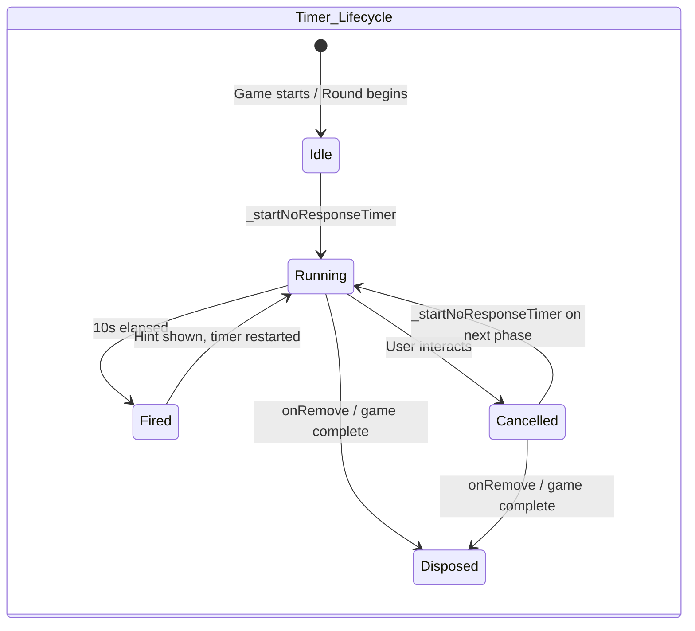
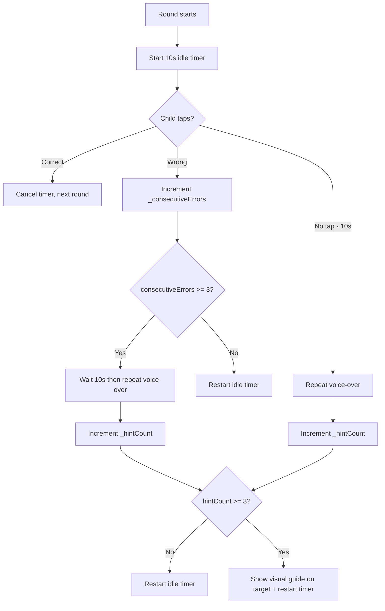
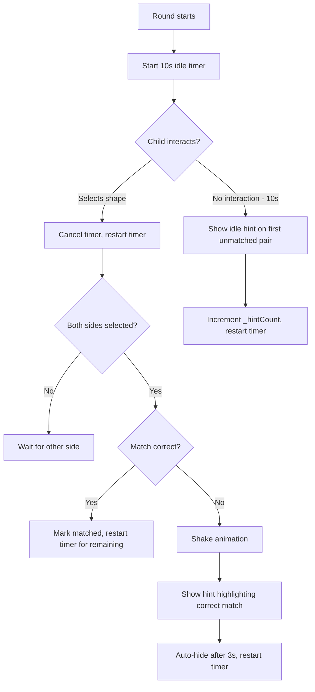

# Game Hints & Fixes Design Document

**Date:** 2026-04-25
**Status:** Draft
**Scope:** My Turn Your Turn, Do What I Say, Match It

---

## 1. Overview

This document specifies fixes and new hint/idle-timer features for three Flame-based games. The reference implementation is the Copy Me game, which already has a working idle timer, visual guide system, consecutive error tracking, and `analyticsRecordHint()` integration.

### Reference Pattern Summary — Copy Me

| Concept | Copy Me Implementation |
|---|---|
| Idle timer | `_noResponseTimer` — 10 s `Timer`, fires `_showSequentialVisualGuide()` |
| Timer start | `_startNoResponseTimer()` — cancels previous, creates new 10 s timer |
| Timer cancel | `_cancelNoResponseTimer()` — cancels timer + hides hints |
| Consecutive errors | `_consecutiveErrors` int, resets on success or after showing guide |
| Hint count | `analyticsRecordHint(hintType: ...)` called each time a hint fires |
| Visual hint | `SequenceShape.isHint` — orange pulsing ring via `render()` |
| Cleanup | `onRemove()` calls `_cancelNoResponseTimer()` |

---

## 2. Game 1 — My Turn, Your Turn

**File:** [`my_turn_your_turn_game.dart`](packages/game_core/lib/src/games/my_turn_your_turn/my_turn_your_turn_game.dart)
**Component:** [`TurnSlot`](packages/game_core/lib/src/games/my_turn_your_turn/components/turn_slot.dart)

### 2.1 Current Issues

1. **Early tap recording gap** — Only taps on `TurnSlot` components during buddy turn are caught as errors. Taps on empty canvas areas during buddy turn are not recorded as impulse-control errors.
2. **Fixed buddy turn duration** — Always 1200 ms, which does not adequately test impulse control across varying wait times.
3. **No idle timer / hint system** — If the child does not respond during their turn, nothing happens.

### 2.2 Required Changes

#### 2.2.1 Catch All Taps During Buddy Turn

**Problem:** The game-level [`onTapDown()`](packages/game_core/lib/src/games/my_turn_your_turn/my_turn_your_turn_game.dart:350) records all touches via `analyticsRecordTouch()` but does not check `_isBuddyTurn`. Only [`_onSlotTapped()`](packages/game_core/lib/src/games/my_turn_your_turn/my_turn_your_turn_game.dart:231) catches early taps, and only when the tap lands on an unfilled slot.

**Solution:** Modify `onTapDown()` in `MyTurnYourTurnGame` to detect buddy-turn taps regardless of where they land.

**Changes to [`onTapDown()`](packages/game_core/lib/src/games/my_turn_your_turn/my_turn_your_turn_game.dart:350):**

```dart
@override
void onTapDown(TapDownEvent event) {
  super.onTapDown(event);
  analyticsRecordTouch(
    Offset(event.canvasPosition.x, event.canvasPosition.y),
    isValid: event.handled,
  );

  // NEW: Record ANY tap during buddy turn as impulse control error
  if (_isBuddyTurn && !event.handled) {
    _earlyTaps++;
    _errorCount++;
    onPlayWrongSfx?.call();
    analyticsRecordOffTaskAction(actionType: 'early_tap_during_buddy_turn_canvas');
    analyticsRecordWrong(extraData: {
      'error_type': 'impulse_control',
      'turn_phase': 'buddy_turn',
      'tap_location': 'canvas',
      'x': event.canvasPosition.x,
      'y': event.canvasPosition.y,
    });
  }
}
```

**Key detail:** We check `!event.handled` to avoid double-counting taps that already hit a `TurnSlot` and were processed by `_onSlotTapped()`. Taps on filled slots during buddy turn are also caught here since `TurnSlot.onTapDown()` returns early when `isFilled` is true without marking the event as handled — but `inputEnabled` is `false` during buddy turn, so `TurnSlot.onTapDown()` returns early without calling `onTapped`. We need to verify that `TurnSlot` does NOT mark the event as handled when it returns early. Looking at the current code, `TurnSlot.onTapDown()` has an early return guard `if (!inputEnabled || isFilled) return;` — since it extends `TapCallbacks` mixin, the event IS still marked as handled by Flame's component system when the tap lands within the component bounds. Therefore, we should also handle the `event.handled` case when `_isBuddyTurn` is true:

```dart
// Revised approach: catch ALL taps during buddy turn
if (_isBuddyTurn) {
  // Only count if not already counted by _onSlotTapped
  // _onSlotTapped only fires for unfilled slots, so we catch:
  // 1. Taps on canvas (not handled)
  // 2. Taps on filled slots (handled by component but not by _onSlotTapped)
  if (!event.handled) {
    _earlyTaps++;
    _errorCount++;
    onPlayWrongSfx?.call();
    analyticsRecordOffTaskAction(actionType: 'early_tap_canvas_buddy_turn');
    analyticsRecordWrong(extraData: {
      'error_type': 'impulse_control',
      'turn_phase': 'buddy_turn',
      'tap_target': 'canvas',
    });
  }
}
```

> **Note:** Taps on unfilled slots during buddy turn are already caught by `_onSlotTapped()`. Taps on filled slots and empty canvas are the gap — this change fills it.

#### 2.2.2 Variable Buddy Turn Duration

**Problem:** [`_startBuddyTurn()`](packages/game_core/lib/src/games/my_turn_your_turn/my_turn_your_turn_game.dart:176) uses a fixed `Duration(milliseconds: 1200)`.

**Solution:** Randomize the delay between 1000–5000 ms.

**New field:**

```dart
final math.Random _rng = math.Random();
```

**Changes to [`_startBuddyTurn()`](packages/game_core/lib/src/games/my_turn_your_turn/my_turn_your_turn_game.dart:176):**

```dart
void _startBuddyTurn() {
  _isBuddyTurn = true;
  onTurnChanged(true);
  onPlayMyTurnVo?.call();
  onPlayWaitVo?.call();

  for (final s in _slots) {
    s.inputEnabled = false;
  }

  // NEW: Variable delay between 1000-5000ms to test impulse control
  final delayMs = 1000 + _rng.nextInt(4001); // 1000..5000
  analyticsAddRoundData('buddy_turn_delay_ms', delayMs);

  Future.delayed(Duration(milliseconds: delayMs), () {
    if (!isMounted) return;
    _buddyPlays();
  });
}
```

**Analytics integration:** Record the actual delay used per turn so XGBoost can correlate wait duration with early-tap frequency.

#### 2.2.3 Idle Timer + Visual Guide During Child Turn

**New fields in `MyTurnYourTurnGame`:**

```dart
Timer? _noResponseTimer;
int _hintCount = 0;
```

**New methods:**

```dart
void _startNoResponseTimer() {
  _cancelNoResponseTimer();
  _noResponseTimer = Timer(const Duration(seconds: 10), () {
    if (!isMounted || _isBuddyTurn) return;
    _showVisualGuide();
  });
}

void _cancelNoResponseTimer() {
  _noResponseTimer?.cancel();
  _noResponseTimer = null;
  _hideVisualHints();
}

void _showVisualGuide() {
  // Find first empty slot and highlight it
  final emptySlots = _slots.where((s) => !s.isFilled).toList();
  if (emptySlots.isEmpty) return;

  final targetSlot = emptySlots.first;
  targetSlot.showHint();

  _hintCount++;
  analyticsRecordHint(hintType: 'idle_visual_guide');
  analyticsRecordPrompt(promptType: 'visual_guide_idle_slot');

  // Restart timer for repeated hints
  _startNoResponseTimer();
}

void _hideVisualHints() {
  for (final s in _slots) {
    s.hideHint();
  }
}
```

**Changes to [`_startChildTurn()`](packages/game_core/lib/src/games/my_turn_your_turn/my_turn_your_turn_game.dart:215):**

```dart
void _startChildTurn() {
  _isBuddyTurn = false;
  onTurnChanged(false);
  onPlayYourTurnVo?.call();
  _turnStartTime = DateTime.now();

  analyticsShowStimulus();
  analyticsRecordPrompt(promptType: 'your_turn_indicator');

  for (final s in _slots) {
    s.inputEnabled = true;
  }

  _startNoResponseTimer(); // NEW
}
```

**Changes to [`_onSlotTapped()`](packages/game_core/lib/src/games/my_turn_your_turn/my_turn_your_turn_game.dart:231):**

Add `_cancelNoResponseTimer()` at the start of the child-turn branch, after the buddy-turn guard:

```dart
void _onSlotTapped(int index) {
  final slot = _slots[index];
  if (slot.isFilled) return;

  if (_isBuddyTurn) {
    // ... existing early tap logic ...
    return;
  }

  _cancelNoResponseTimer(); // NEW: cancel idle timer on valid tap

  // ... rest of existing child turn logic ...
}
```

**Changes to `onRemove()`:** Add override:

```dart
@override
void onRemove() {
  _cancelNoResponseTimer();
  super.onRemove();
}
```

**Changes to [`_setupRound()`](packages/game_core/lib/src/games/my_turn_your_turn/my_turn_your_turn_game.dart:132):**

Add `_cancelNoResponseTimer()` at the start to clean up from previous round.

**Analytics at game complete:** Add `_hintCount` to game-specific metrics:

```dart
analyticsAddGameSpecificMetric('hint_count', _hintCount);
```

### 2.3 TurnSlot Component Changes

**File:** [`turn_slot.dart`](packages/game_core/lib/src/games/my_turn_your_turn/components/turn_slot.dart)

**New fields:**

```dart
bool isHint = false;
```

**New methods:**

```dart
void showHint() {
  isHint = true;
}

void hideHint() {
  isHint = false;
}
```

**Changes to [`render()`](packages/game_core/lib/src/games/my_turn_your_turn/components/turn_slot.dart:69):**

Add hint rendering in the empty slot branch, before the existing border drawing. This mirrors the pattern from [`SequenceShape.render()`](packages/game_core/lib/src/games/copy_me/components/sequence_shape.dart:127):

```dart
// Inside the `else` branch (empty slot rendering), before the subtle border:
if (isHint) {
  final pulseAlpha = (128 + 127 * (DateTime.now().millisecond % 1000) / 1000)
      .round()
      .clamp(0, 255);
  final hintPaint = Paint()
    ..color = const Color(0xFFFFA726).withAlpha(pulseAlpha)
    ..style = PaintingStyle.stroke
    ..strokeWidth = 4;
  canvas.drawRRect(
    RRect.fromRectAndRadius(
      Rect.fromLTWH(-8, -8, size.x + 16, size.y + 16),
      const Radius.circular(_cornerRadius + 4),
    ),
    hintPaint,
  );
}
```

### 2.4 Summary of All Changes — My Turn, Your Turn

| File | Change Type | Description |
|---|---|---|
| `my_turn_your_turn_game.dart` | New field | `Timer? _noResponseTimer` |
| `my_turn_your_turn_game.dart` | New field | `int _hintCount = 0` |
| `my_turn_your_turn_game.dart` | New field | `final math.Random _rng = math.Random()` |
| `my_turn_your_turn_game.dart` | New method | `_startNoResponseTimer()` |
| `my_turn_your_turn_game.dart` | New method | `_cancelNoResponseTimer()` |
| `my_turn_your_turn_game.dart` | New method | `_showVisualGuide()` |
| `my_turn_your_turn_game.dart` | New method | `_hideVisualHints()` |
| `my_turn_your_turn_game.dart` | New override | `onRemove()` |
| `my_turn_your_turn_game.dart` | Modified | `onTapDown()` — add buddy-turn canvas tap detection |
| `my_turn_your_turn_game.dart` | Modified | `_startBuddyTurn()` — variable delay 1000-5000ms |
| `my_turn_your_turn_game.dart` | Modified | `_startChildTurn()` — start idle timer |
| `my_turn_your_turn_game.dart` | Modified | `_onSlotTapped()` — cancel idle timer |
| `my_turn_your_turn_game.dart` | Modified | `_setupRound()` — cancel idle timer |
| `my_turn_your_turn_game.dart` | Modified | `_checkRoundComplete()` — add `_hintCount` metric |
| `turn_slot.dart` | New field | `bool isHint = false` |
| `turn_slot.dart` | New method | `showHint()` |
| `turn_slot.dart` | New method | `hideHint()` |
| `turn_slot.dart` | Modified | `render()` — add orange pulsing ring for hint state |

---

## 3. Game 2 — Do What I Say

**File:** [`do_what_i_say_game.dart`](packages/game_core/lib/src/games/do_what_i_say/do_what_i_say_game.dart)
**Component:** [`InstructionShape`](packages/game_core/lib/src/games/do_what_i_say/components/instruction_shape.dart)

### 3.1 Current Issues

1. **Duplicate shape+color combinations** — [`_setupRound()`](packages/game_core/lib/src/games/do_what_i_say/do_what_i_say_game.dart:130) picks random shapes and colors independently, allowing two shapes with the same shape+color to appear, making the instruction ambiguous.
2. **No idle timer** — No response detection or voice-over repeat.
3. **No consecutive error handling** — Wrong taps have no escalation behavior.
4. **No visual hint system** — No pulsing highlight on the target shape.

### 3.2 Required Changes

#### 3.2.1 Fix Duplicate Shape+Color Combinations

**Problem:** In [`_setupRound()`](packages/game_core/lib/src/games/do_what_i_say/do_what_i_say_game.dart:130), lines 141-146 pick random shape types and colors independently:

```dart
// Current (buggy):
for (var i = 0; i < count; i++) {
  final shapeType = _shapeTypes[rng.nextInt(_shapeTypes.length)];
  final colorData = _colorOptions[rng.nextInt(_colorOptions.length)];
  items.add((shapeType, colorData.$1, colorData.$2));
}
```

This can produce e.g. two "red circles", making "Tap the red circle" ambiguous.

**Solution:** Generate all possible shape+color combinations, shuffle, and take the first `count`:

```dart
// Fixed:
// Build all unique shape+color combos (4 shapes x 6 colors = 24 combos)
final allCombos = <(String, Color, String)>[];
for (final shapeType in _shapeTypes) {
  for (final colorData in _colorOptions) {
    allCombos.add((shapeType, colorData.$1, colorData.$2));
  }
}
allCombos.shuffle(rng);

// Take first `count` — guaranteed unique since we drew from a set
final items = allCombos.take(count).toList();
```

This guarantees every shape on screen has a unique shape+color combination, so the instruction is always unambiguous. With 4 shapes × 6 colors = 24 possible combinations and only 4-6 needed per round, collisions are impossible.

#### 3.2.2 Voice-Over Repeat on Idle (10 seconds)

**New fields:**

```dart
Timer? _noResponseTimer;
int _hintCount = 0;
int _consecutiveErrors = 0;
```

**New methods:**

```dart
void _startNoResponseTimer() {
  _cancelNoResponseTimer();
  _noResponseTimer = Timer(const Duration(seconds: 10), () {
    if (!isMounted) return;
    _onIdleTimeout();
  });
}

void _cancelNoResponseTimer() {
  _noResponseTimer?.cancel();
  _noResponseTimer = null;
  _hideVisualHints();
}

void _onIdleTimeout() {
  // Repeat the instruction voice-over
  final target = _shapes[_targetIndex];
  onPlayInstructionVoiceOver?.call('tap', target.colorName, target.shapeType);

  _hintCount++;
  analyticsRecordHint(hintType: 'idle_voice_over_repeat');
  analyticsRecordPrompt(promptType: 'voice_over_repeat_idle');

  // If hint count >= 3, also show visual guide
  if (_hintCount >= 3) {
    _showVisualGuide();
  }

  // Restart timer for further repeats
  _startNoResponseTimer();
}
```

**Changes to [`_setupRound()`](packages/game_core/lib/src/games/do_what_i_say/do_what_i_say_game.dart:130):**

Add at end of method, after shapes are laid out and instruction is set:

```dart
_hintCount = 0;          // Reset per round
_consecutiveErrors = 0;  // Reset per round
_startNoResponseTimer();
```

**Changes to [`_onShapeTapped()`](packages/game_core/lib/src/games/do_what_i_say/do_what_i_say_game.dart:212):**

Add `_cancelNoResponseTimer()` at the top of the method.

#### 3.2.3 Voice-Over Repeat on 3 Consecutive Errors

**Changes to the wrong-tap branch in [`_onShapeTapped()`](packages/game_core/lib/src/games/do_what_i_say/do_what_i_say_game.dart:304):**

```dart
} else {
  // Wrong - tapped wrong shape
  _errorCount++;
  _consecutiveErrors++; // NEW

  onPlayWrongSfx?.call();
  onPlayWrongVo?.call();

  final tappedShape = _shapes[index];

  analyticsRecordWrong(extraData: {
    'tapped_shape': tappedShape.shapeType,
    'tapped_color': tappedShape.colorName,
    'target_shape': target.shapeType,
    'target_color': target.colorName,
    'consecutive_errors': _consecutiveErrors, // NEW
    'error_type': tappedShape.shapeType == target.shapeType
      ? 'color_error'
      : tappedShape.colorName == target.colorName
        ? 'shape_error'
        : 'both_error',
  });

  _shapes[index].showWrong();

  // NEW: After 3 consecutive errors, repeat voice-over after delay
  if (_consecutiveErrors >= 3) {
    _consecutiveErrors = 0; // Reset counter

    // Wait then repeat instruction
    Future.delayed(const Duration(seconds: 10), () {
      if (!isMounted) return;
      final t = _shapes[_targetIndex];
      onPlayInstructionVoiceOver?.call('tap', t.colorName, t.shapeType);

      _hintCount++;
      analyticsRecordHint(hintType: 'consecutive_error_voice_over_repeat');
      analyticsRecordPrompt(promptType: 'voice_over_repeat_errors');

      // If hint count >= 3, also show visual guide
      if (_hintCount >= 3) {
        _showVisualGuide();
      }
    });
  }

  // Restart idle timer after wrong tap
  _startNoResponseTimer();
}
```

**Changes to the correct-tap branch:** Reset `_consecutiveErrors`:

```dart
if (index == _targetIndex) {
  _score++;
  _consecutiveErrors = 0; // NEW: reset on correct
  // ... rest of existing correct logic ...
}
```

#### 3.2.4 Visual Guide After 3+ Hints

**New method:**

```dart
void _showVisualGuide() {
  if (_targetIndex < 0 || _targetIndex >= _shapes.length) return;

  // Show pulsing hint on the correct target shape
  _shapes[_targetIndex].showHint();

  analyticsRecordPrompt(promptType: 'visual_guide_target_highlight');
}

void _hideVisualHints() {
  for (final s in _shapes) {
    s.hideHint();
  }
}
```

This is called from `_onIdleTimeout()` and the consecutive-error handler when `_hintCount >= 3`.

#### 3.2.5 Cleanup

**New override:**

```dart
@override
void onRemove() {
  _cancelNoResponseTimer();
  super.onRemove();
}
```

**Analytics at game complete:** Add hint metrics:

```dart
analyticsAddGameSpecificMetric('hint_count', _hintCount);
analyticsAddGameSpecificMetric('consecutive_error_resets', /* track if needed */);
```

### 3.3 InstructionShape Component Changes

**File:** [`instruction_shape.dart`](packages/game_core/lib/src/games/do_what_i_say/components/instruction_shape.dart)

**New field:**

```dart
bool isHint = false;
```

**New methods:**

```dart
void showHint() {
  isHint = true;
}

void hideHint() {
  isHint = false;
}
```

**Changes to [`render()`](packages/game_core/lib/src/games/do_what_i_say/components/instruction_shape.dart:72):**

Add hint state to alpha and border logic, plus the pulsing ring. Insert before the `ShapePainter3D.drawCard3D()` call:

```dart
@override
void render(Canvas canvas) {
  final rect = Rect.fromLTWH(0, 0, size.x, size.y);

  int bgAlpha = 40;
  if (showingCorrect) bgAlpha = 120;
  if (showingWrong) bgAlpha = 100;
  if (isHint) bgAlpha = 80; // NEW

  Color? borderColor;
  if (showingCorrect) borderColor = AppColors.mint;
  if (showingWrong) borderColor = const Color(0xFFE88888);
  if (isHint) borderColor = const Color(0xFFFFA726); // NEW

  // NEW: Hint pulsing ring (same pattern as SequenceShape)
  if (isHint) {
    final pulseAlpha = (128 + 127 * (DateTime.now().millisecond % 1000) / 1000)
        .round()
        .clamp(0, 255);
    final hintPaint = Paint()
      ..color = const Color(0xFFFFA726).withAlpha(pulseAlpha)
      ..style = PaintingStyle.stroke
      ..strokeWidth = 4;
    canvas.drawRRect(
      RRect.fromRectAndRadius(
        Rect.fromLTWH(-8, -8, size.x + 16, size.y + 16),
        const Radius.circular(_cornerRadius + 4),
      ),
      hintPaint,
    );
  }

  ShapePainter3D.drawCard3D(
    canvas,
    rect,
    color: shapeColor,
    cornerRadius: _cornerRadius,
    alpha: bgAlpha,
    showBorder: showingCorrect || showingWrong || isHint, // MODIFIED
    borderColor: borderColor,
  );

  ShapePainter3D.drawByName(
    canvas, shapeType, size.x / 2, size.y / 2, size.x * 0.3, shapeColor,
  );
}
```

### 3.4 Summary of All Changes — Do What I Say

| File | Change Type | Description |
|---|---|---|
| `do_what_i_say_game.dart` | New field | `Timer? _noResponseTimer` |
| `do_what_i_say_game.dart` | New field | `int _hintCount = 0` |
| `do_what_i_say_game.dart` | New field | `int _consecutiveErrors = 0` |
| `do_what_i_say_game.dart` | New method | `_startNoResponseTimer()` |
| `do_what_i_say_game.dart` | New method | `_cancelNoResponseTimer()` |
| `do_what_i_say_game.dart` | New method | `_onIdleTimeout()` |
| `do_what_i_say_game.dart` | New method | `_showVisualGuide()` |
| `do_what_i_say_game.dart` | New method | `_hideVisualHints()` |
| `do_what_i_say_game.dart` | New override | `onRemove()` |
| `do_what_i_say_game.dart` | Modified | `_setupRound()` — fix duplicate combos, reset counters, start timer |
| `do_what_i_say_game.dart` | Modified | `_onShapeTapped()` — cancel timer, track consecutive errors, escalate hints |
| `do_what_i_say_game.dart` | Modified | Game complete block — add `_hintCount` metric |
| `do_what_i_say_game.dart` | New import | `dart:async` for `Timer` |
| `instruction_shape.dart` | New field | `bool isHint = false` |
| `instruction_shape.dart` | New method | `showHint()` |
| `instruction_shape.dart` | New method | `hideHint()` |
| `instruction_shape.dart` | Modified | `render()` — add hint alpha, border, pulsing ring |

---

## 4. Game 3 — Match It

**File:** [`match_it_game.dart`](packages/game_core/lib/src/games/match_it/match_it_game.dart)
**Component:** [`MatchableShape`](packages/game_core/lib/src/games/match_it/components/matchable_shape.dart)

### 4.1 Current Issues

1. **No hint on incorrect match** — When the child makes a wrong match, only a shake animation plays. No visual guidance toward the correct answer.
2. **No idle timer** — If the child does not interact, nothing happens.

### 4.2 Required Changes

#### 4.2.1 Visual Hint on Incorrect Match

**New fields:**

```dart
int _hintCount = 0;
Timer? _noResponseTimer;
```

**New methods:**

```dart
void _showMatchHint(int leftIndex) {
  // Highlight the correct right-side match for the selected left shape
  final leftShape = _leftShapes[leftIndex];

  // Find the matching right shape by shape type + color
  for (final rightShape in _rightShapes) {
    if (!rightShape.isMatched &&
        rightShape.shapeType == leftShape.shapeType &&
        rightShape.shapeColor.value == leftShape.shapeColor.value) {
      rightShape.showHint();
      break;
    }
  }

  // Also highlight the left shape
  leftShape.showHint();

  _hintCount++;
  analyticsRecordHint(hintType: 'incorrect_match_visual_guide');
  analyticsRecordPrompt(promptType: 'visual_guide_correct_match');
}

void _showIdleHint() {
  // Find the first unmatched left shape and its correct right match
  for (final leftShape in _leftShapes) {
    if (leftShape.isMatched) continue;

    // Highlight this left shape
    leftShape.showHint();

    // Find and highlight its correct right match
    for (final rightShape in _rightShapes) {
      if (!rightShape.isMatched &&
          rightShape.shapeType == leftShape.shapeType &&
          rightShape.shapeColor.value == leftShape.shapeColor.value) {
        rightShape.showHint();
        break;
      }
    }

    break; // Only hint one pair at a time
  }

  _hintCount++;
  analyticsRecordHint(hintType: 'idle_visual_guide');
  analyticsRecordPrompt(promptType: 'visual_guide_idle_match');

  // Restart timer for repeated hints
  _startNoResponseTimer();
}

void _hideAllHints() {
  for (final s in _leftShapes) {
    s.hideHint();
  }
  for (final s in _rightShapes) {
    s.hideHint();
  }
}

void _startNoResponseTimer() {
  _cancelNoResponseTimer();
  _noResponseTimer = Timer(const Duration(seconds: 10), () {
    if (!isMounted) return;
    _showIdleHint();
  });
}

void _cancelNoResponseTimer() {
  _noResponseTimer?.cancel();
  _noResponseTimer = null;
  _hideAllHints();
}
```

#### 4.2.2 Changes to Existing Methods

**Changes to [`_setupRound()`](packages/game_core/lib/src/games/match_it/match_it_game.dart:188):**

Add at end of method:

```dart
_hintCount = 0; // Reset per round (or keep cumulative — design choice)
_startNoResponseTimer();
```

Add at start of method:

```dart
_cancelNoResponseTimer();
```

**Changes to [`_onLeftSelected()`](packages/game_core/lib/src/games/match_it/match_it_game.dart:298):**

```dart
void _onLeftSelected(int index) {
  _cancelNoResponseTimer(); // NEW: cancel timer + hide hints on interaction
  // ... existing deselect + select logic ...
  _startNoResponseTimer(); // NEW: restart timer after selection
}
```

**Changes to [`_onRightSelected()`](packages/game_core/lib/src/games/match_it/match_it_game.dart:309):**

```dart
void _onRightSelected(int index) {
  _cancelNoResponseTimer(); // NEW: cancel timer + hide hints on interaction
  // ... existing deselect + select logic ...
  _startNoResponseTimer(); // NEW: restart timer after selection
}
```

**Changes to [`_checkMatch()`](packages/game_core/lib/src/games/match_it/match_it_game.dart:322) — wrong match branch:**

In the wrong-match `else` block, after the existing error recording and shake animation, add the hint call:

```dart
} else {
  // Wrong match
  _errorCount++;

  onPlayWrongSfx?.call();
  onPlayWrongVo?.call();

  analyticsRecordWrong(extraData: {
    'left_shape': leftShape.shapeType.name,
    'right_shape': rightShape.shapeType.name,
    'color_mismatch': leftShape.shapeColor.value != rightShape.shapeColor.value,
    'shape_mismatch': leftShape.shapeType != rightShape.shapeType,
  });

  analyticsRecordRetry();

  leftShape.showError();
  rightShape.showError();

  // NEW: Show visual hint highlighting the correct match
  Future.delayed(const Duration(milliseconds: 500), () {
    if (!isMounted) return;
    _selectedLeftIndex = null;
    _selectedRightIndex = null;
    _roundStartTime = DateTime.now();
    _firstInputRecorded = false;
    analyticsShowStimulus();

    // Show hint for the left shape that was selected
    _showMatchHint(leftShape.index);

    // Auto-hide hints after 3 seconds
    Future.delayed(const Duration(seconds: 3), () {
      if (isMounted) _hideAllHints();
    });

    _startNoResponseTimer();
  });
}
```

**Changes to correct match branch in [`_checkMatch()`](packages/game_core/lib/src/games/match_it/match_it_game.dart:322):**

After a correct match, restart the idle timer for the remaining pairs:

```dart
if (isMatch) {
  // ... existing correct match logic ...

  // After partial match (not all matched yet):
  if (!allMatched) {
    _startNoResponseTimer(); // NEW: restart timer for next pair
  }
}
```

#### 4.2.3 Cleanup

**New override:**

```dart
@override
void onRemove() {
  _cancelNoResponseTimer();
  super.onRemove();
}
```

**New import:**

```dart
import 'dart:async'; // for Timer
```

**Analytics at game complete:** Add hint metrics:

```dart
analyticsAddGameSpecificMetric('hint_count', _hintCount);
```

### 4.3 MatchableShape Component Changes

**File:** [`matchable_shape.dart`](packages/game_core/lib/src/games/match_it/components/matchable_shape.dart)

**New field:**

```dart
bool isHint = false;
```

**New methods:**

```dart
void showHint() {
  isHint = true;
}

void hideHint() {
  isHint = false;
}
```

**Changes to [`render()`](packages/game_core/lib/src/games/match_it/components/matchable_shape.dart:98):**

Add hint rendering. The full modified `render()`:

```dart
@override
void render(Canvas canvas) {
  final rect = Rect.fromLTWH(0, 0, size.x, size.y);

  // Card background
  final bgAlpha = isMatched ? 30 : (isHint ? 80 : (isSelected ? 80 : 40)); // MODIFIED
  Color? borderColor;
  if (_showError) borderColor = const Color(0xFFE88888);
  if (isSelected && !_showError) {
    borderColor = const Color(0xFF9B82C4).withAlpha(140);
  }
  if (isHint) borderColor = const Color(0xFFFFA726); // NEW

  // NEW: Hint pulsing ring (same pattern as SequenceShape)
  if (isHint) {
    final pulseAlpha = (128 + 127 * (DateTime.now().millisecond % 1000) / 1000)
        .round()
        .clamp(0, 255);
    final hintPaint = Paint()
      ..color = const Color(0xFFFFA726).withAlpha(pulseAlpha)
      ..style = PaintingStyle.stroke
      ..strokeWidth = 4;
    canvas.drawRRect(
      RRect.fromRectAndRadius(
        Rect.fromLTWH(-8, -8, size.x + 16, size.y + 16),
        const Radius.circular(_cornerRadius + 4),
      ),
      hintPaint,
    );
  }

  ShapePainter3D.drawCard3D(
    canvas,
    rect,
    color: shapeColor,
    cornerRadius: _cornerRadius,
    alpha: bgAlpha,
    showBorder: isSelected || _showError || isHint, // MODIFIED
    borderColor: borderColor,
    borderWidth: _borderWidth,
  );

  // 3D shape icon in center
  final drawColor = isMatched ? shapeColor.withAlpha(80) : shapeColor;
  final shapeName = shapeType.name;
  ShapePainter3D.drawByName(
    canvas, shapeName, size.x / 2, size.y / 2, size.x * 0.3, drawColor,
  );
}
```

### 4.4 Summary of All Changes — Match It

| File | Change Type | Description |
|---|---|---|
| `match_it_game.dart` | New field | `int _hintCount = 0` |
| `match_it_game.dart` | New field | `Timer? _noResponseTimer` |
| `match_it_game.dart` | New method | `_showMatchHint(int leftIndex)` |
| `match_it_game.dart` | New method | `_showIdleHint()` |
| `match_it_game.dart` | New method | `_hideAllHints()` |
| `match_it_game.dart` | New method | `_startNoResponseTimer()` |
| `match_it_game.dart` | New method | `_cancelNoResponseTimer()` |
| `match_it_game.dart` | New override | `onRemove()` |
| `match_it_game.dart` | New import | `dart:async` for `Timer` |
| `match_it_game.dart` | Modified | `_setupRound()` — cancel timer at start, start timer at end |
| `match_it_game.dart` | Modified | `_onLeftSelected()` — cancel/restart timer |
| `match_it_game.dart` | Modified | `_onRightSelected()` — cancel/restart timer |
| `match_it_game.dart` | Modified | `_checkMatch()` wrong branch — show match hint after error |
| `match_it_game.dart` | Modified | `_checkMatch()` correct branch — restart timer for remaining pairs |
| `match_it_game.dart` | Modified | Game complete block — add `_hintCount` metric |
| `matchable_shape.dart` | New field | `bool isHint = false` |
| `matchable_shape.dart` | New method | `showHint()` |
| `matchable_shape.dart` | New method | `hideHint()` |
| `matchable_shape.dart` | Modified | `render()` — add hint alpha, border, pulsing ring |

---

## 5. Timer Management Strategy

All three games follow the same timer lifecycle pattern established by Copy Me:



### Timer Cancellation Points

| Game | Cancel Points |
|---|---|
| My Turn Your Turn | `_onSlotTapped` child branch, `_setupRound`, `onRemove` |
| Do What I Say | `_onShapeTapped`, `_setupRound`, `onRemove` |
| Match It | `_onLeftSelected`, `_onRightSelected`, `_setupRound`, `onRemove` |

### Memory Leak Prevention

- Every `Timer?` field is cancelled in `onRemove()`
- `_cancelNoResponseTimer()` always nulls the reference after cancel
- `_startNoResponseTimer()` always cancels any existing timer before creating a new one
- No `Timer.periodic` is used — only one-shot timers that are manually restarted

---

## 6. Analytics Integration Points

### Hint Recording Pattern

All games use the same analytics calls when a hint fires:

```dart
analyticsRecordHint(hintType: '<specific_hint_type>');
analyticsRecordPrompt(promptType: '<specific_prompt_type>');
```

### Hint Types by Game

| Game | Hint Type | Trigger |
|---|---|---|
| My Turn Your Turn | `idle_visual_guide` | 10s idle during child turn |
| Do What I Say | `idle_voice_over_repeat` | 10s idle |
| Do What I Say | `consecutive_error_voice_over_repeat` | 3 consecutive wrong taps |
| Do What I Say | `visual_guide_target_highlight` | `_hintCount >= 3` |
| Match It | `incorrect_match_visual_guide` | Wrong match attempt |
| Match It | `idle_visual_guide` | 10s idle |

### Game-Specific Metrics Added

| Game | Metric Key | Type | Description |
|---|---|---|---|
| My Turn Your Turn | `hint_count` | int | Total hints shown |
| My Turn Your Turn | `buddy_turn_delay_ms` | int | Per-round buddy delay |
| Do What I Say | `hint_count` | int | Total hints shown |
| Match It | `hint_count` | int | Total hints shown |

---

## 7. Visual Hint Specification

All three games use the same orange pulsing ring visual, matching the existing [`SequenceShape`](packages/game_core/lib/src/games/copy_me/components/sequence_shape.dart:157) implementation:

| Property | Value |
|---|---|
| Color | `0xFFFFA726` — orange |
| Style | `PaintingStyle.stroke` |
| Stroke width | 4.0 |
| Offset | -8px on all sides from component bounds |
| Corner radius | Component corner radius + 4 |
| Animation | Pulse alpha: `128 + 127 * millisecond_fraction` |
| Background alpha | Elevated to 80-120 when hint is active |

The pulse animation uses `DateTime.now().millisecond % 1000` for a smooth ~1 Hz oscillation. This is a simple approach that works because Flame re-renders every frame.

---

## 8. New Callbacks for Flutter Wrapper Layer

No new callbacks are required for the Flutter wrapper layer. The existing callback patterns are sufficient:

| Callback | Used By | Purpose |
|---|---|---|
| `onPlayInstructionVoiceOver` | Do What I Say | Already exists — reused for voice-over repeat |
| `onPlayWrongSfx` | My Turn Your Turn | Already exists — reused for canvas early taps |

The hint system is entirely self-contained within the Flame game layer. The Flutter wrapper does not need to know about hints — they are rendered directly by the Flame components and recorded via the analytics mixin.

---

## 9. Implementation Checklist

### My Turn, Your Turn
- [ ] Add `dart:async` import
- [ ] Add `_noResponseTimer`, `_hintCount`, `_rng` fields
- [ ] Add `_startNoResponseTimer()`, `_cancelNoResponseTimer()`, `_showVisualGuide()`, `_hideVisualHints()` methods
- [ ] Add `onRemove()` override
- [ ] Modify `onTapDown()` for canvas early-tap detection
- [ ] Modify `_startBuddyTurn()` for variable delay
- [ ] Modify `_startChildTurn()` to start idle timer
- [ ] Modify `_onSlotTapped()` to cancel idle timer
- [ ] Modify `_setupRound()` to cancel idle timer
- [ ] Modify `_checkRoundComplete()` to add hint metrics
- [ ] Add `isHint`, `showHint()`, `hideHint()` to `TurnSlot`
- [ ] Add pulsing ring rendering to `TurnSlot.render()`

### Do What I Say
- [ ] Add `dart:async` import
- [ ] Add `_noResponseTimer`, `_hintCount`, `_consecutiveErrors` fields
- [ ] Add `_startNoResponseTimer()`, `_cancelNoResponseTimer()`, `_onIdleTimeout()`, `_showVisualGuide()`, `_hideVisualHints()` methods
- [ ] Add `onRemove()` override
- [ ] Fix `_setupRound()` duplicate shape+color generation
- [ ] Add timer start and counter resets to `_setupRound()`
- [ ] Modify `_onShapeTapped()` for timer cancel, consecutive errors, hint escalation
- [ ] Add hint metrics to game complete
- [ ] Add `isHint`, `showHint()`, `hideHint()` to `InstructionShape`
- [ ] Add pulsing ring rendering to `InstructionShape.render()`

### Match It
- [ ] Add `dart:async` import
- [ ] Add `_hintCount`, `_noResponseTimer` fields
- [ ] Add `_showMatchHint()`, `_showIdleHint()`, `_hideAllHints()`, `_startNoResponseTimer()`, `_cancelNoResponseTimer()` methods
- [ ] Add `onRemove()` override
- [ ] Modify `_setupRound()` for timer management
- [ ] Modify `_onLeftSelected()` for timer cancel/restart
- [ ] Modify `_onRightSelected()` for timer cancel/restart
- [ ] Modify `_checkMatch()` wrong branch for hint display
- [ ] Modify `_checkMatch()` correct branch for timer restart
- [ ] Add hint metrics to game complete
- [ ] Add `isHint`, `showHint()`, `hideHint()` to `MatchableShape`
- [ ] Add pulsing ring rendering to `MatchableShape.render()`

---

## 10. Hint Escalation Flow Diagrams

### Do What I Say — Hint Escalation



### Match It — Hint Flow

